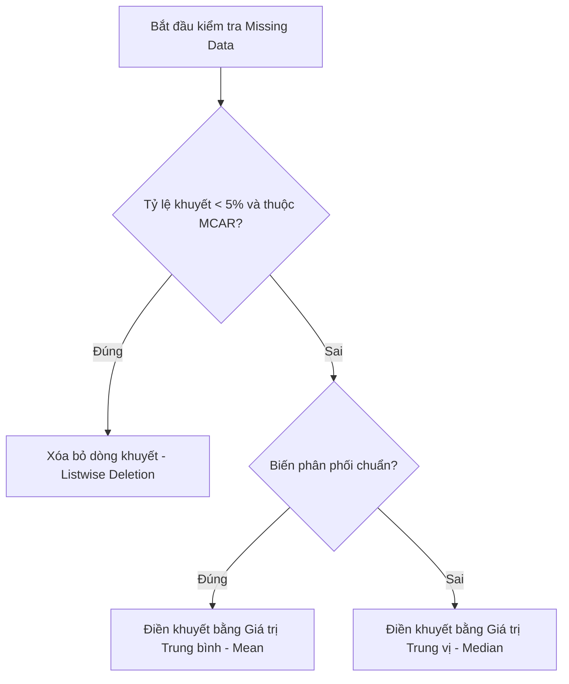

# SỔ TAY THỰC HÀNH MÁY HỌC TRONG NGHIÊN CỨU KHOA HỌC
## Triết lý: Lấy Nghiên cứu làm Trung tâm (Research-Centric Approach)

---

## MỤC LỤC
1. **[MODULE 1] Khởi động & Quản lý Không gian Nghiên cứu (Google Colab & Markdown)**
   - [Bài 1.1] Thiết lập và Làm chủ Môi trường Google Colab
   - [Bài 1.2] Quản lý Hệ thống Tệp Nghiên cứu & Kết nối Google Drive
   - [Bài 1.3] Soạn thảo Thuyết minh Nghiên cứu bằng Ngôn ngữ Markdown
   - [Bài 1.4] Kiểm soát Phiên bản và Xuất bản Nghiên cứu (Reproducible Research)
   - [Bài tập tốt nghiệp Module 1] Xây dựng Khung Thuyết minh Nghiên cứu Vận hành Cảng
2. **[MODULE 2] Lập trình Python Thực dụng cho Nhà Khoa học**
   - [Bài 2.1] Cấu trúc dữ liệu chuyên sâu cho quản lý mẫu (List & Dictionary)
   - [Bài 2.2] Tự động hóa kiểm thử đa biến với Vòng lặp `for` & Đóng gói chỉ số nghiên cứu bằng Hàm (`def`)
3. **[MODULE 3] Kỹ nghệ Dọn dẹp & Xử lý Số liệu Nghiên cứu**
   - [Bài 3.1] Thống kê mô tả toàn diện với Pandas (Nền tảng kiểm định giả thuyết)
   - [Bài 3.2] Xử lý Dữ liệu khuyết thiếu (Missing Data) - Xóa bỏ hay Điền khuyết?
   - [Bài 3.3] Nhận diện và Xử lý Số liệu ngoại lai (Outliers) bằng Z-score & IQR
   - [Bài 3.4] Chuẩn hóa dữ liệu (Standardization & Normalization)
4. **[MODULE 4] Trực quan hóa Dữ liệu Chuẩn Tạp chí Quốc tế**
   - [Bài 4.1] Phân phối dữ liệu (Histogram & Boxplot) để đánh giá tính phân phối chuẩn
   - [Bài 4.2] Biểu đồ tương quan tuyến tính (Scatter Plot & Heatmap Pearson)
   - [Bài 4.3] Xuất bản phẩm đồ họa độ phân giải cao (300 DPI / Vector PDF)
5. **[MODULE 5] Triển khai & Biện giải Mô hình Máy học (Scikit-Learn)**
   - [Bài 5.1] Thiết lập Thực nghiệm Khoa học: Chia tập Train/Test & Cross-Validation
   - [Bài 5.2] Bài toán dự đoán liên tục (Hồi quy - Regression)
   - [Bài 5.3] Bài toán phân loại sự kiện (Phân loại - Classification)
   - [Bài 5.4] Biện giải mô hình bằng Mức độ quan trọng của biến (Feature Importance)
6. **[MODULE 6] Hệ thống Thông tin Cảng & Quản trị Dữ liệu (TOS & Data Management)**
   - [Bài 6.1] Luồng dữ liệu TOS và các nguồn cảm biến thực tế (AIS, RFID, Crane GPS)
   - [Bài 6.2] Mô phỏng và truy xuất cơ sở dữ liệu vận hành cảng trên Google Colab
7. **[MODULE 7] Lập trình Python cho Logistics Biển**
   - [Bài 7.1] Làm chủ dữ liệu thời gian (DateTime) chuyên sâu trong Logistics (ATA, Dwell Time)
   - [Bài 7.2] Tính toán khoảng cách không gian (Geospatial) và chỉ số hiệu suất vận hành (GCR, Utilization)
8. **[MODULE 8] Làm sạch số liệu Vận hành Cảng**
   - [Bài 8.1] Lọc nhiễu dữ liệu quỹ đạo AIS và bù đắp dữ liệu khuyết thiếu lịch trình tàu
   - [Bài 8.2] Kỹ nghệ đặc trưng (Feature Engineering): Sinh biến thời gian quay vòng (Turnaround Time)
9. **[MODULE 9] Trực quan hóa Dòng chảy Container (Dashboard Cảng)**
   - [Bài 9.1] Trực quan phân bổ bến tàu (Berth Allocation Gantt Chart)
   - [Bài 9.2] Xây dựng bản đồ nhiệt bãi container (Yard Heatmap) và phân tích phân phối thời gian lưu bãi
10. **[MODULE 10] Ứng dụng Machine Learning trong Tối ưu hóa Cảng**
    - [Bài 10.1] Dự báo thời gian lưu bãi (Dwell Time) bằng Random Forest và XGBoost
    - [Bài 10.2] Dự báo lưu lượng xe tải (Traffic Forecasting) và tối ưu hóa vị trí xếp dỡ (Yard Allocation)
11. **CÁC HƯỚNG NGHIÊN CỨU "ĂN ĐIỂM" TRONG PORT OPERATIONS HIỆN NAY**
    - [Chương 11.1] Cảng xanh & Bền vững (Green Ports)
    - [Chương 11.2] Cảng thông minh & Tự động hóa (Smart Ports)
    - [Chương 11.3] Hệ sinh thái Logistics thông suốt (Supply Chain Integration)
12. **PHỤ LỤC KỸ THUẬT**
    - [Phụ lục A] Bảng tra cứu lỗi thường gặp (Troubleshooting Guide)
    - [Phụ lục B] Mẫu Notebook Chuẩn cấu trúc IMRAD (Template Notebook)
    - [Phụ lục C] Bảng đối chiếu Thuật ngữ Đa ngành (Lập trình - Thống kê - Máy học)

---

# MODULE 1: Khởi động & Quản lý Không gian Nghiên cứu (Google Colab & Markdown)

---

### [Bài 1.1] Thiết lập và Làm chủ Môi trường Google Colab

#### 1. Lý thuyết cốt lõi
Trong nghiên cứu khoa học dữ liệu, việc chuẩn bị một môi trường điện toán đồng bộ trên máy tính cá nhân (Local Machine) thường đối mặt với nhiều rào cản kỹ thuật lớn: xung đột thư viện, sự khác biệt giữa hệ điều hành (Windows, macOS, Linux), và đặc biệt là sự hạn chế về hiệu năng phần cứng (GPU/TPU) khi xử lý dữ liệu lớn. 

**Google Colab (Colaboratory)** giải quyết các thách thức này bằng cách cung cấp một môi trường máy ảo Linux chạy trên đám mây của Google dưới dạng các tài liệu **Jupyter Notebook**.

##### Kiến trúc Client - Server của Google Colab
Mô hình hoạt động của Colab tuân theo cấu trúc Client - Server tách biệt:
*   **Client (Trình duyệt của bạn):** Đóng vai trò giao diện hiển thị (Frontend). Khi bạn gõ code, gõ văn bản Markdown hoặc nhấn nút chạy (Run), trình duyệt chỉ gửi lệnh điều khiển và nhận kết quả trả về từ máy chủ. Máy tính cá nhân của bạn không hề thực hiện bất kỳ phép toán nặng nào, do đó không tiêu tốn RAM hay làm nóng CPU máy của bạn.
*   **Server (Máy chủ đám mây của Google):** Là một máy ảo (Virtual Machine - VM) Linux được cấp phát riêng biệt cho phiên làm việc của bạn. Máy ảo này chứa sẵn CPU, RAM, ổ đĩa (Disk) và các thư viện khoa học dữ liệu phổ biến (`numpy`, `pandas`, `scikit-learn`).

```
+---------------------------+              Lệnh chạy code             +-------------------------------+
|   Client (Trình duyệt)    |  ----------------------------------->   |   Server (Máy ảo Colab VM)   |
|   Giao diện tương tác     |  <-----------------------------------   |   Thực thi toán học, CPU/GPU  |
+---------------------------+            Kết quả (Text/Plot)          +-------------------------------+
```

##### Giao diện làm việc phân cấp
Một file Notebook của Colab (`.ipynb`) bao gồm hai loại thành phần chính được sắp xếp xen kẽ:
1.  **Code Cell (Ô lệnh):** Chứa các mã nguồn Python có thể thực thi. Khi chạy, kết quả đầu ra (chữ, bảng biểu, hình vẽ, thông báo lỗi) sẽ hiển thị ngay bên dưới ô đó.
2.  **Text Cell (Ô văn bản):** Chứa các nội dung diễn giải bằng ngôn ngữ Markdown và công thức $LaTeX$. Đây là nơi nhà nghiên cứu viết các giả thuyết khoa học, diễn giải kết quả và thiết lập cấu trúc chương mục.

*Thao tác điều hướng nhanh:*
*   `Ctrl + M + A`: Thêm ô Code lên phía trên ô hiện tại.
*   `Ctrl + M + B`: Thêm ô Code xuống phía dưới ô hiện tại.
*   `Ctrl + M + D`: Xóa ô hiện tại.
*   `Shift + Enter`: Thực thi ô hiện tại và tự động chuyển sang ô kế tiếp.

##### Quản lý và Cấu hình Tài nguyên Phần cứng (Runtime)
Colab cung cấp các cấu hình tài nguyên miễn phí nhưng có giới hạn:
*   **CPU Runtime:** Phù hợp cho việc học lập trình cơ bản, xử lý các bảng số liệu logistics nhỏ dưới dạng tệp tin Excel, `.csv`.
*   **GPU (Graphics Processing Unit) & TPU (Tensor Processing Unit):** Kích hoạt thông qua menu *Runtime -> Change runtime type -> Hardware accelerator -> T4 GPU*. Kích hoạt GPU là bắt buộc khi huấn luyện các mô hình học sâu (Deep Learning) hoặc xử lý các tệp dữ liệu không gian khổng lồ (như dữ liệu định vị tàu thuyền AIS - Automatic Identification System lên tới hàng triệu dòng).

##### Chiến lược phòng tránh mất dữ liệu khi bị ngắt kết nối (Disconnect)
Phiên làm việc miễn phí của Colab bị giới hạn thời gian (Idle Timeout - thường ngắt kết nối sau 90 phút không tương tác, hoặc Maximum Runtime - tự động xóa máy ảo sau 12 giờ). Khi máy ảo bị xóa, toàn bộ dữ liệu lưu tạm trong phân vùng hệ thống của Colab sẽ bị xóa sạch.
*   **Chiến lược nghiên cứu khoa học:** Không bao giờ lưu trực tiếp kết quả chạy trung gian trên bộ nhớ tạm của Colab. Tất cả các mô hình trung gian sau khi huấn luyện xong hoặc các bảng dữ liệu sau khi dọn dẹp xong phải được xuất (export) ngay lập tức vào Google Drive hoặc lưu trữ đám mây ngoài thông qua đường ống kết nối tự động.

#### 2. Code mẫu thực hành (Google Colab)
Hãy tạo một ô Code Cell trong Colab và chạy đoạn mã dưới đây để kiểm tra thông số máy chủ đang được cấp phát cho nghiên cứu của bạn:

```python
# 1. Kiểm tra tài nguyên phần cứng máy chủ (CPU & RAM)
import psutil
import os
import platform

print("=== THÔNG SỐ MÁY CHỦ PHÂN PHỐI BỞI GOOGLE COLAB ===")
print(f"Hệ điều hành: {platform.system()} - Phiên bản Linux Kernel: {platform.release()}")
print(f"Số lượng nhân CPU vật lý: {psutil.cpu_count(logical=False)}")
print(f"Số lượng nhân CPU logic: {psutil.cpu_count(logical=True)}")

total_ram = psutil.virtual_memory().total / (1024**3)
print(f"Dung lượng RAM hệ thống: {round(total_ram, 2)} GB")

# 2. Kiểm tra bộ nhớ ổ đĩa (Disk Space) còn trống trên máy ảo
disk_usage = psutil.disk_usage('/')
free_disk = disk_usage.free / (1024**3)
print(f"Dung lượng ổ đĩa khả dụng trên VM: {round(free_disk, 2)} GB")

# 3. Kiểm tra xem GPU có được kích hoạt thành công hay không
import torch
gpu_available = torch.cuda.is_available()
if gpu_available:
    gpu_name = torch.cuda.get_device_name(0)
    print(f"Kênh phần cứng GPU: ĐÃ KÍCH HOẠT (Thiết bị: {gpu_name})")
else:
    print("Kênh phần cứng GPU: KHÔNG KÍCH HOẠT (Môi trường đang sử dụng CPU thông thường)")
```

#### 3. Cách đọc kết quả & Diễn giải trong bài báo
*   **Kết quả đầu ra của code:**
    In ra chi tiết dung lượng RAM (khoảng ~12 GB cho bản miễn phí), dung lượng đĩa trống (~70-100 GB), và tình trạng GPU. Nếu bạn đã đổi Runtime sang GPU, dòng cuối cùng sẽ in ra `Kênh phần cứng GPU: ĐÃ KÍCH HOẠT (Thiết bị: Tesla T4)`.
*   **Cách viết vào bài báo khoa học (Phần Methodology - Computational Environment):**
    > "All computational experiments, data processing procedures, and model training in this study were conducted on a cloud-based Jupyter Notebook environment hosted by Google Colab. The allocated virtual machine was configured with an Intel(R) Xeon(R) CPU, 12.7 GB of system RAM, and a T4 Graphics Processing Unit (GPU) with 16 GB of VRAM. This cloud setup guarantees that the hardware baseline is consistent across different simulation runs, supporting the computational reproducibility of our findings."

---

### [Bài 1.2] Quản lý Hệ thống Tệp Nghiên cứu & Kết nối Google Drive

#### 1. Lý thuyết cốt lõi
Trong quản lý dự án khoa học dữ liệu, tính ngăn nắp và khoa học của cấu trúc thư mục quyết định 50% sự thành bại. Đối với nghiên cứu vận tải biển và cảng biển, một dự án thường liên quan đến nhiều nguồn dữ liệu (lịch trình tàu cập cảng từ cảng vụ, dữ liệu GPS xe container di chuyển ngoài cổng cảng, cấu hình bãi xếp dỡ container yard). 

##### Lệnh Mount Drive: Cơ chế kết nối
Để cho phép máy ảo của Google Colab có thể đọc và ghi trực tiếp vào dữ liệu trên tài khoản **Google Drive** của bạn mà không cần tải lên thủ công nhiều lần, chúng ta sử dụng cơ chế **Mounting**. Câu lệnh `drive.mount('/content/drive')` tạo ra một liên kết ánh xạ hệ thống tệp tin: Thư mục gốc Drive của bạn sẽ xuất hiện dưới dạng một đường dẫn cục bộ trên hệ điều hành Linux của máy ảo tại địa chỉ `/content/drive/MyDrive/`.

##### Thiết kế cấu trúc thư mục chuẩn khoa học dữ liệu
Để quản lý nghiên cứu tối ưu hóa bãi cảng và luồng xe, chúng tôi đề xuất cây thư mục mẫu chuyên nghiệp sau:

```
/Nghien_cuu_Port_Operations/
├── data_raw/          <-- Chứa dữ liệu thô tuyệt đối không chỉnh sửa (file .csv, .xlsx của cảng)
├── data_processed/    <-- Chứa dữ liệu sạch sau dọn dẹp, sẵn sàng cho mô hình hóa
├── notebooks/         <-- Chứa các file code Colab .ipynb theo từng công đoạn phân tích
└── reports_figures/   <-- Chứa biểu đồ chất lượng cao xuất ra phục vụ chèn vào bài báo
```

*Nguyên tắc bất di bất dịch:* **Không bao giờ ghi đè trực tiếp lên file dữ liệu trong `data_raw`**. Mọi phép xử lý phải lưu kết quả đầu ra sang thư mục `data_processed`.

##### Đường dẫn tuyệt đối (Absolute Path)
Toàn bộ đường dẫn tệp trong dự án nên dùng đường dẫn tuyệt đối bắt đầu từ gốc thư mục của máy chủ đám mây: `/content/drive/MyDrive/Nghien_cuu_Port_Operations/...` để đảm bảo tính chính xác khi chạy lại code.

#### 2. Code mẫu thực hành (Google Colab)
```python
# 1. Kết nối với Google Drive của người nghiên cứu
from google.colab import drive
import os

drive.mount('/content/drive', force_remount=True)

# 2. Định nghĩa thư mục gốc của dự án trên Google Drive
base_project_dir = '/content/drive/MyDrive/Nghien_cuu_Port_Operations'

# 3. Tạo tự động cây thư mục nghiên cứu chuẩn khoa học
sub_folders = [
    'data_raw',
    'data_processed',
    'notebooks',
    'reports_figures'
]

print("=== KHỞI TẠO CẤU TRÚC THƯ MỤC DỰ ÁN CẢNG BIỂN ===")
for folder in sub_folders:
    full_path = os.path.join(base_project_dir, folder)
    if not os.path.exists(full_path):
        os.makedirs(full_path)
        print(f" - Đã tạo mới thư mục con: {folder}/")
    else:
        print(f" - Thư mục con đã tồn tại: {folder}/")

# Di chuyển thư mục làm việc hiện tại của Python vào thư mục gốc dự án
os.chdir(base_project_dir)
print(f"\nThư mục làm việc hiện thời của Colab: {os.getcwd()}")
```

#### 3. Cách đọc kết quả & Diễn giải trong bài báo
*   **Kết quả đầu ra của code:**
    Hộp thoại bảo mật của Google xuất hiện yêu cầu bạn đăng nhập và đồng ý cấp quyền. Sau khi liên kết thành công, code chạy sẽ in ra thông báo tạo mới các thư mục con và kết luận thư mục làm việc đã chuyển thành `/content/drive/MyDrive/Nghien_cuu_Port_Operations`.
*   **Cách viết vào bài báo khoa học (Phần Data Management):**
    > "For data security and project structuring, all raw spreadsheets regarding terminal operational logs (such as vessel dispatch schedules and truck arrival timestamps) were stored in an immutable raw data repository within Google Drive. The computational workflow was mapped directly to this storage network using the Mount mechanism, partitioning the project directory into separated folders for raw data, processed outputs, analytical notebooks, and high-resolution figure outputs, ensuring strict reproducibility of the data processing pipeline."

---

### [Bài 1.3] Soạn thảo Thuyết minh Nghiên cứu bằng Ngôn ngữ Markdown

#### 1. Lý thuyết cốt lõi
Một nhà nghiên cứu khoa học chuyên nghiệp không chỉ viết code chạy ra kết quả, mà phải có khả năng trình bày lập luận toán học đứng sau thuật toán đó ngay trên file báo cáo. **Markdown** là ngôn ngữ đánh dấu siêu văn bản gọn nhẹ giúp bạn làm điều này mà không cần dùng đến các trình soạn thảo nặng nề như Word.

##### Phân cấp cấu trúc nghiên cứu (Headings)
Cấu trúc bài báo khoa học tuân thủ hệ phân cấp IMRAD được xây dựng bằng ký tự `#`:
*   `#` tương ứng với Tiêu đề cấp 1 (Tên bài báo, Tên chương).
*   `##` tương ứng với Tiêu đề cấp 2 (Các phân đoạn chính: Giới thiệu đề tài, Phương pháp luận, Kết quả thực nghiệm).
*   `###` tương ứng với Tiêu đề cấp 3 (Các tiểu mục nhỏ: Thuật toán tối ưu bến bãi, Kế hoạch thu thập số liệu).

##### Biểu diễn toán học bằng công thức $LaTeX$
Trong nghiên cứu logistics và quản lý chuỗi cung ứng, việc biểu diễn chính xác các chỉ số hiệu năng (KPIs) và hàm mục tiêu tối ưu hóa bằng toán học là bắt buộc. Hệ thống xử lý ký tự toán học $LaTeX$ được tích hợp sẵn trong Colab:
*   **Công thức trên cùng một dòng (Inline Formula):** Kẹp công thức giữa hai ký hiệu đô-la đơn `$ ... $` (Ví dụ: `$x_i \in \{0, 1\}$`).
*   **Khối công thức độc lập (Block Formula):** Kẹp công thức giữa hai ký hiệu đô-la kép `$$ ... $$` để công thức tự động xuống dòng và căn lề vào giữa trang.

#### 2. Code mẫu thực hành (Văn bản Markdown mẫu)
*Hãy sao chép đoạn mã Markdown dưới đây và dán vào một ô **Text Cell** trong Colab của bạn để xem kết quả biên dịch:*

```markdown
# PHẦN II: PHƯƠNG PHÁP LUẬN & THIẾT LẬP TOÁN HỌC

Trong nghiên cứu này, chúng tôi tiến hành đánh giá hiệu năng khai thác của phân vùng bến bãi thông qua hai thông số vận hành cốt lõi và một hàm mục tiêu tối ưu hóa chi phí.

## 1. Các chỉ số hiệu suất cảng biển (KPIs)

### 1.1 Thời gian quay vòng tàu (Vessel Turnaround Time)
Thời gian quay vòng của tàu $T_{\text{turnaround}}$ đại diện cho tổng thời gian tàu lưu lại tại cảng, được xác định bằng hiệu số giữa thời điểm tàu rời bến ($T_{\text{departure}}$) và thời điểm tàu cập cầu cảng ($T_{\text{arrival}}$):

$$T_{\text{turnaround}} = T_{\text{departure}} - T_{\text{arrival}}$$

### 1.2 Tỷ lệ lấp đầy bãi container (Yard Utilization Rate)
Tỷ lệ lấp đầy bãi yard ($U_{\text{yard}}$) thể hiện mức độ quá tải của bãi chứa container tại thời điểm khảo sát, tính bằng tỷ lệ phần trăm giữa lượng container hiện có ($N_{\text{current}}$) và sức chứa tối đa thiết kế của bãi ($C_{\text{max}}$):

$$U_{\text{yard}} = \left( \frac{N_{\text{current}}}{C_{\text{max}}} \right) \times 100\%$$

## 2. Hàm mục tiêu tối ưu hóa đường đi của cẩu khung (RTG)
Để giảm thiểu lượng khí thải carbon và chi phí năng lượng của cẩu bãi RTG (Rubber Tyred Gantry), mô hình toán học tìm cách tối ưu tổng quãng đường di chuyển dịch chuyển bãi bốc xếp:

$$\min Z = \sum_{i \in I} \sum_{j \in J} d_{ij} \cdot x_{ij} \cdot c$$

Trong đó:
*   $I$: Tập hợp các vị trí container ban đầu trong bãi yard.
*   $J$: Tập hợp các vị trí mục tiêu tại cầu bến.
*   $d_{ij}$: Khoảng cách di chuyển vật lý từ vị trí $i$ đến vị trí $j$ (mét).
*   $x_{ij}$: Biến quyết định nhị phân ($x_{ij} \in \{0, 1\}$), bằng $1$ nếu cẩu thực hiện dịch chuyển từ $i$ sang $j$.
*   $c$: Đơn giá tiêu hao nhiên liệu trên mỗi mét di chuyển của cẩu bãi ($USD/m$).
```

#### 3. Cách đọc kết quả & Diễn giải trong bài báo
*   **Kết quả đầu ra của code:**
    Text Cell sau khi nhấn `Ctrl+Enter` sẽ hiển thị một bài viết thuyết minh nghiên cứu có phân cấp tiêu đề rõ ràng, các công thức toán học sắc nét với định dạng chuẩn mực quốc tế của các ký tự Hy Lạp và phép toán tổng ($\sum$).
*   **Cách viết vào bài báo khoa học:**
    Bản thân đoạn toán học và mô tả biến này chính là văn bản sẽ được xuất bản trong mục "Problem Formulation" hoặc "Mathematical Modeling" của bài báo khoa học chính thức.

---

### [Bài 1.4] Kiểm soát Phiên bản và Xuất bản Nghiên cứu (Reproducible Research)

#### 1. Lý thuyết cốt lõi
Khi viết báo cáo hoặc bài báo khoa học, nghiên cứu không phải là một công việc làm một lần là xong. Bạn sẽ phải chỉnh sửa code hàng chục lần, hiệu chỉnh thuật toán dựa trên phản hồi của người hướng dẫn hoặc phản biện tạp chí. 

##### Tích hợp GitHub cơ bản
**GitHub** là nền tảng quản lý phiên bản mã nguồn hàng đầu thế giới. Google Colab tích hợp sẵn tính năng kết nối trực tiếp với GitHub:
*   Cho phép lưu trực tiếp file `.ipynb` từ Colab vào một Repository (Kho chứa) trên GitHub mà không cần cài đặt Git phức tạp dưới máy cục bộ.
*   Tạo nút bấm liên kết **"Open in Colab"** trên GitHub để bất kỳ ai khi đọc bài báo của bạn đều có thể click vào và mở ngay lập tức mã nguồn nghiên cứu chạy trên đám mây của họ để kiểm chứng.

```
[Mã nguồn trên GitHub] ── Click: "Open in Colab" ──> [Khởi tạo VM trên Cloud] ──> [Chạy lại kết quả lập tức]
```

##### Xuất bản và phân phối báo cáo khoa học dữ liệu
Khi hoàn thành phân tích, bạn cần gửi kết quả cho hội đồng khoa học hoặc người hướng dẫn. Gửi một file code thô `.ipynb` đôi khi gây khó khăn cho những người không chuyên về lập trình. Do đó, quy trình xuất bản cung cấp các định dạng:
*   **Định dạng `.ipynb` (Interactive Notebook):** Chứa cả mã nguồn và kết quả chạy (bao gồm cả biểu đồ). Dùng để chia sẻ với đồng nghiệp hoặc phản biện kỹ thuật để họ chạy lại kiểm tra.
*   **Định dạng `.html` hoặc `.pdf` sạch (Static Report):** Định dạng tĩnh chỉ giữ lại tiêu đề, đoạn lập luận Markdown và hình vẽ đồ thị, ẩn các dòng code kỹ thuật phụ trợ. Đây là định dạng hoàn hảo để chèn vào phụ lục bài báo hoặc làm báo cáo tiến độ gửi lên các cấp quản lý cảng.

#### 2. Quy trình thao tác thực tế (Hướng dẫn từng bước)

##### Bước A: Đồng bộ Notebook lên GitHub
1.  Trên giao diện Colab, chọn *File -> Save a copy in GitHub*.
2.  Đăng nhập và ủy quyền cho Google Colab truy cập vào tài khoản GitHub của bạn.
3.  Chọn Repository và Branch đích, điền *Commit message* (ví dụ: `feat: add yard optimization mathematical model`).
4.  Nhấn *OK*. Một bản copy của Notebook đã được đẩy lên GitHub trực tuyến thành công.

##### Bước B: Xuất file báo cáo sạch (Ẩn code thô)
Để xuất báo cáo tĩnh không hiện code thô ra định dạng HTML, bạn có thể thực hiện chạy dòng lệnh này ngay trong một ô Code Cell của Colab:

```python
# Hướng dẫn xuất file Notebook hiện tại sang HTML sạch
# Lưu ý: Lệnh này sử dụng công cụ nbconvert tích hợp sẵn trong nhân hệ thống Linux của Colab
!jupyter nbconvert --to html --no-input '/content/drive/MyDrive/Nghien_cuu_Port_Operations/notebooks/Vessel_Analysis.ipynb'
```
*(Lệnh `--no-input` có chức năng ẩn toàn bộ code thô, chỉ giữ lại văn bản Markdown thuyết minh và các biểu đồ đồ thị đầu ra).*

#### 3. Cách đọc kết quả & Diễn giải trong bài báo
*   **Kết quả đầu ra của code:**
    Tệp tin `Vessel_Analysis.html` sẽ xuất hiện trong thư mục đích trên Drive. Khi mở tệp này bằng trình duyệt web, bạn sẽ thấy một trang báo cáo khoa học sạch sẽ, chuyên nghiệp, không chứa các dòng mã Python phức tạp mà tập trung hoàn toàn vào nội dung nghiên cứu.
*   **Cách viết vào bài báo khoa học (Phần Data Availability Statement):**
    > "The complete software repository, including the experimental Google Colab notebooks, computational scripts, and simulation source codes, has been archived and made publicly available on GitHub (repository link: https://github.com/yourprofile/port-operations-optimization) with an interactive 'Open in Colab' entry point. This repository allows full computational replication of the operational KPIs and terminal optimization outputs presented in this study."

---

### [Bài tập tốt nghiệp Module 1] Xây dựng Khung Thuyết minh Nghiên cứu Vận hành Cảng

#### Đề tài: "Xây dựng Khung Thuyết minh Nghiên cứu Vận hành Cảng Trên Google Colab"

##### Yêu cầu bài tập:
Học viên tạo một file Colab mới, đặt tên theo định dạng chuẩn học thuật: `TCIT_Port_Optimization_Framework.ipynb`. File này phải liên kết thành công với Google Drive cá nhân của học viên và sử dụng ngôn ngữ Markdown kết hợp $LaTeX$ để xây dựng một khung báo cáo nghiên cứu hoàn chỉnh theo mẫu thiết kế dưới đây.

---

### MẪU NỘP BÀI TẬP TỐT NGHIỆP (Copy toàn bộ nội dung dưới đây vào Notebook của bạn)

#### [TEXT CELL 1: Tiêu đề & Tóm tắt nghiên cứu]
```markdown
# NGHIÊN CỨU TỐI ƯU HÓA KHAI THÁC CẦU BẾN VÀ DỰ BÁO THỜI GIAN LƯU BÃI CONTAINER TẠI CẢNG NƯỚC SÂU TCIT

**Tác giả:** [Họ và tên học viên]  
**Đơn vị nghiên cứu:** Viện Logistics và Chuỗi Cung ứng  
**Ngày thực hiện:** 02-07-2026  

---

## TÓM TẮT ĐỀ TÀI (ABSTRACT)
Nghiên cứu này tập trung vào việc nâng cao hiệu quả khai thác tại cảng nước sâu Tân Cảng - Cái Mép (TCIT). Chúng tôi đề xuất một khung phân tích dữ liệu tích hợp để dự báo **thời gian lưu bãi (yard dwell time)** của container nhập khẩu và tối ưu hóa **kế hoạch phân bổ cầu bến (berth allocation plan)**. Bằng cách áp dụng các thuật toán máy học trên tập dữ liệu vận hành bãi cảng lịch sử, nghiên cứu hướng tới giảm thiểu **thời gian chờ đợi của tàu (vessel waiting time)** tại luồng hàng hải và nâng cao hệ số sử dụng cẩu bờ STS. Kết quả mô phỏng dự kiến sẽ đóng góp một giải pháp điều hành cảng thông minh, hỗ trợ giảm chi phí logistics cho các hãng tàu quốc tế.
```

#### [TEXT CELL 2: Thông số hạ tầng cảng]
```markdown
## 1. Thông số năng lực hạ tầng cảng giả định (Baseline Infrastructure Specs)

Dưới đây là bảng tổng hợp các thông số kỹ thuật hiện tại của cảng nước sâu TCIT được sử dụng làm biến ràng buộc trong mô hình tối ưu hóa bốc xếp bãi yard:

| Chỉ số hạ tầng | Ký hiệu | Giá trị thông số | Đơn vị đo |
| :--- | :---: | :---: | :---: |
| Chiều dài cầu bến liên tục | $L_{\text{berth}}$ | 890 | Mét |
| Độ sâu trước bến | $D_{\text{berth}}$ | -16.5 | Mét |
| Số lượng cẩu bờ chuyên dụng STS | $N_{\text{sts}}$ | 10 | Cẩu |
| Sức chứa thiết kế tối đa bãi Yard | $C_{\text{max}}$ | 150,000 | TEUs |
| Số lượng cẩu bãi chạy điện ERTG | $N_{\text{rtg}}$ | 22 | Cẩu |
```

#### [TEXT CELL 3: Mô hình hóa toán học KPIs]
```markdown
## 2. Thiết lập các chỉ số hiệu suất vận hành bến cảng (Logistics KPIs)

Để đánh giá mức độ nghẽn cảng và tối ưu hóa chi phí di chuyển thiết bị nâng hạ, chúng tôi thiết lập hai phương trình đánh giá toán học sau:

### 2.1 Chỉ số Thời gian làm hàng tại bến (Port Stay Time)
Tổng thời gian làm hàng thực tế của một tàu container tại cảng vụ ($T_{\text{stay}}$) được xác định bằng hiệu số thời gian từ lúc tàu hoàn thành thủ tục rời bến ($T_{\text{dep}}$) tới khi tàu thả neo và cập bến thành công ($T_{\text{arr}}$):

$$T_{\text{stay}} = T_{\text{dep}} - T_{\text{arr}}$$

### 2.2 Hàm mục tiêu giảm thiểu chi phí chuyển đổi bãi yard (Container Shifting Cost)
Khi bãi yard bị quá tải ($U_{\text{yard}} > 80\%$), cẩu khung RTG phải thực hiện nhiều thao tác đảo container (dịch chuyển không sinh công) để lấy được container đích ở hàng dưới cùng. Chúng tôi biểu diễn hàm mục tiêu tối thiểu hóa chi phí năng lượng đảo chuyển container như sau:

$$\min \Phi = \sum_{p \in P} \sum_{q \in Q} E_{pq} \cdot Y_{pq} \cdot C_{\text{power}}$$

Trong đó:
*   $P, Q$: Tập hợp các block lưu trữ container trong bãi yard.
*   $E_{pq}$: Mức tiêu thụ điện năng của cẩu RTG khi thực hiện đảo container từ vị trí $p$ sang vị trí phụ $q$ ($kWh$).
*   $Y_{pq}$: Biến quyết định nguyên, biểu thị số lần dịch chuyển container thực tế từ $p$ sang $q$.
*   $C_{\text{power}}$: Đơn giá điện năng công nghiệp ($USD/kWh$).
```

#### [CODE CELL 4: Khởi động hệ thống & Tạo thư mục tự động]
```python
# ==============================================================================
# HỌC VIÊN THỰC THI ĐOẠN CODE NÀY ĐỂ HOÀN THÀNH BÀI TẬP TỐT NGHIỆP MODULE 1
# ==============================================================================
from google.colab import drive
import os

print(">>> TIẾN HÀNH KẾT NỐI HỆ THỐNG VÀ XÂY DỰNG KHÔNG GIAN LƯU TRỮ DỰ ÁN <<<")

# 1. Liên kết thiết bị lưu trữ Google Drive
drive.mount('/content/drive', force_remount=True)

# 2. Định nghĩa thư mục làm việc chính của dự án cảng biển
project_root = '/content/drive/MyDrive/TCIT_Port_Optimization_Research'

# 3. Danh sách các thư mục lưu trữ số liệu nghiên cứu chuyên sâu
directories = [
    'data_raw',          # Lưu trữ tệp lịch tàu, tệp GPS container dạng thô
    'data_processed',    # Lưu trữ số liệu đã lọc sạch lỗi định dạng và ngoại lai
    'notebooks',         # Lưu trữ các file code phân tích thuật toán
    'reports_figures'    # Lưu trữ các biểu đồ phân tích xuất ra 300 DPI
]

print("\nĐang thiết lập cây thư mục nghiên cứu:")
for dir_name in directories:
    dir_path = os.path.join(project_root, dir_name)
    if not os.path.exists(dir_path):
        os.makedirs(dir_path)
        print(f" [+] Đã tạo thành công thư mục con: {dir_name}/")
    else:
        print(f" [o] Thư mục con đã tồn tại từ trước: {dir_name}/")

# 4. Chuyển thư mục hiện tại của hệ thống sang thư mục gốc của dự án
os.chdir(project_root)
print(f"\nThư mục làm việc hiện hành của dự án: {os.getcwd()}")
print(">>> BÀI TẬP TỐT NGHIỆP MODULE 1: HOÀN THÀNH XUẤT SẮC <<<")
```

---

# MODULE 2: Lập trình Python Thực dụng cho Nhà Khoa học

---

### [Bài 2.1] Biến (Variables) & Kiểu dữ liệu — "Hàng hóa và Kho bãi"

#### 1. Lý thuyết cốt lõi
Trong tin học lý thuyết, biến được định nghĩa là "một ô nhớ được cấp phát trong RAM". Tuy nhiên, dưới góc nhìn nghiên cứu logistics và quản lý cảng, hãy tưởng tượng biến giống như một **vị trí đặt container (Slot)** trên bãi yard:
*   **Tên biến (Variable Name):** Là mã số tọa độ vị trí của slot đó. Nó cố định và giúp ta định vị vị trí dữ liệu.
*   **Giá trị của biến (Variable Value):** Là chiếc container được cẩu đặt vào vị trí đó. Container này có thể được thay thế bằng container khác theo thời gian.
*   **Kiểu dữ liệu (Data Type):** Chính là tính chất vật lý của container (ví dụ: container hàng bách hóa, container lạnh, container rỗng).

```
+-----------------------------------------------------------+
| Tên biến (Mã vị trí): slot_A1                             |
| Giá trị (Hàng bên trong): "MSC-V012"                      |
| Kiểu dữ liệu (Loại container): Chuỗi ký tự (String)       |
+-----------------------------------------------------------+
```

##### Các kiểu dữ liệu cơ bản trong nghiên cứu vận hành:
*   **Số nguyên (Integer - `int`):** Lưu trữ các đại lượng đếm được, không có phần thập phân. Ví dụ: Số lượng cẩu bờ STS đang hoạt động.
*   **Số thực (Float - `float`):** Lưu trữ các phép đo lường có phần thập phân. Ví dụ: Trọng lượng hàng hóa trong container (tấn).
*   **Chuỗi ký tự (String - `str`):** Lưu trữ nhãn danh định, mã hiệu, tên tàu. Đặt trong dấu nháy kép `"..."` hoặc nháy đơn `'...'`.

##### Quy tắc đặt tên biến học thuật (Syntax Rules):
Để code dễ đọc và tránh lỗi cú pháp, hãy sử dụng quy tắc **snake_case** (viết thường tiếng Việt không dấu, liên kết các từ bằng dấu gạch dưới `_`). 
*   *Nên dùng:* `thoi_gian_cho`, `trong_luong_tan`, `ma_so_tau`.
*   *Tránh dùng:* `thoigiancho` (khó đọc), `Thoi-Gian-Cho` (lỗi cú pháp do dấu gạch ngang), `thời_gian_chờ` (ký tự có dấu tiếng Việt dễ gây lỗi encoding hệ thống).

#### 2. Code mẫu thực hành (Google Colab)
```python
# 1. Khai báo biến số nguyên: số cẩu trục đang hoạt động
so_cau_truc = 4
print("Biến 'so_cau_truc' có giá trị là:", so_cau_truc, " - Kiểu dữ liệu:", type(so_cau_truc))

# 2. Khai báo biến số thực: trọng lượng container hàng
trong_luong_tan = 24.5
print("Biến 'trong_luong_tan' có giá trị là:", trong_luong_tan, " - Kiểu dữ liệu:", type(trong_luong_tan))

# 3. Khai báo biến chuỗi: mã chuyến tàu cập cảng
ma_chuyen_tau = "MSC-V012"
print("Biến 'ma_chuyen_tau' có giá trị là:", ma_chuyen_tau, " - Kiểu dữ liệu:", type(ma_chuyen_tau))
```

#### 3. Cách đọc kết quả & Diễn giải trong bài báo
*   **Kết quả đầu ra của code:**
    In ra giá trị và kiểu dữ liệu tương ứng: `<class 'int'>` (số nguyên), `<class 'float'>` (số thực), `<class 'str'>` (chuỗi).
*   **Cách viết vào bài báo khoa học (Phần Methodology - Variables Representation):**
    > "To model the terminal environment computationally, variables representing infrastructure components and cargo characteristics were defined. Discrete entities, such as the active number of ship-to-shore (STS) cranes, were represented as integers ($N_{crane} = 4$). Continuous physical measurements, notably container payload weights, were modeled as floating-point variables ($W_{payload} = 24.5$ tonnes). Nominal identification keys, including vessel voyage tags, were stored as alphanumeric strings."

---

### [Bài 2.2] Cấu trúc Dữ liệu — "Quản lý Luồng thông tin"

#### 1. Lý thuyết cốt lõi
Khi bãi cảng đón hàng trăm xe tải xếp hàng ở cổng, ta không thể tạo ra hàng trăm biến riêng lẻ như `xe_1`, `xe_2`, `xe_3`. Điều này làm code cực kỳ cồng kềnh. Chúng ta cần các cấu trúc dữ liệu để gom nhóm thông tin.

##### Danh sách (List): Hàng đợi xe tải (Queue)
**List** giống như một làn xe chờ trước cổng cảng. Các phần tử được sắp xếp theo một thứ tự nhất định. Để lấy xe đầu tiên ra kiểm tra thủ tục, ta sử dụng chỉ mục (Index) bắt đầu từ số **0** (Index 0 đại diện cho phần tử thứ nhất, Index 1 cho phần tử thứ hai).

```
Chỉ mục (Index):      0            1            2
Danh sách (List): ["51C-123",  "65C-456",  "29C-789"]
```

##### Từ điển (Dictionary): Tờ khai Hải quan (Bill of Lading)
**Dictionary** hoạt động theo cơ chế khóa - giá trị (`key-value`). Nó giống như một tờ khai hải quan của container: Tờ khai có các nhãn cố định (như Mã container, Loại hàng, Nhiệt độ bảo quản) và mỗi nhãn đi kèm thông tin chi tiết của container đó.

```
Khóa (Key)     ---->    Giá trị (Value)
"ma_cont"      ---->    "MSCU1234567"
"loai_hang"    ---->    "Thủy hải sản"
"nhiet_do"     ---->    -18.5
```

#### 2. Code mẫu thực hành (Google Colab)
```python
# 1. Khai báo List: Hàng đợi biển số xe tải tại cổng bảo vệ
hang_doi_xe = ["51C-123", "65C-456", "29C-789"]
print("Danh sách xe đang xếp hàng:", hang_doi_xe)
print("Xe đầu tiên xếp hàng (Index 0):", hang_doi_xe[0])
print("Xe thứ hai xếp hàng (Index 1):", hang_doi_xe[1])

# 2. Khai báo Dictionary: Tờ khai thông tin của một container lạnh
container_info = {
    "ma_cont": "MSCU1234567",
    "loai_hang": "Thủy hải sản",
    "nhiet_do_lanh": -18.5
}
print("\nTờ khai thông tin container:")
print(" - Mã số Container:", container_info["ma_cont"])
print(" - Loại hàng hóa bên trong:", container_info["loai_hang"])
print(" - Nhiệt độ bảo quản lạnh (°C):", container_info["nhiet_do_lanh"])
```

#### 3. Cách đọc kết quả & Diễn giải trong bài báo
*   **Kết quả đầu ra của code:**
    In ra biển số xe theo thứ tự index và trích xuất các thông tin cụ thể của container dựa theo từ khóa (Key).
*   **Cách viết vào bài báo khoa học (Phần Data Processing - Data Structures):**
    > "Incoming truck streams at the terminal gates were structured as ordered lists, allowing FIFO (First-In, First-Out) queue simulations indexed from $i = 0$. Individual container attributes (e.g., container ID, cargo category, and thermal thresholds) were encapsulated into key-value pairs (dictionaries) to facilitate efficient lookup and metadata management during simulation runs."

---

### [Bài 2.3] Câu lệnh Điều kiện (If/Else) — "Trạm kiểm soát tự động"

#### 1. Lý thuyết cốt lõi
Trong vận hành cảng thông minh, các cổng kiểm soát (Smart Gate) cần đưa ra quyết định tự động mà không cần sự can thiệp của con người. Ví dụ: phân luồng xe tải dựa trên kết quả cân tải trọng tự động.

##### Cú pháp rẽ nhánh điều kiện:
Python sử dụng các câu lệnh `if` (nếu), `elif` (nếu khác), và `else` (còn lại) kết hợp với các toán tử so sánh để điều hướng chương trình:
*   `>` (lớn hơn), `<` (nhỏ hơn)
*   `==` (bằng nhau), `!=` (khác nhau)
*   `>=` (lớn hơn hoặc bằng), `<=` (nhỏ hơn hoặc bằng)

*Nguyên tắc thụt lề (Indentation):* Các khối lệnh chạy sau `if` hoặc `else` bắt buộc phải được thụt vào trong (sử dụng 4 dấu cách hoặc phím Tab). Đây là quy định bắt buộc của ngôn ngữ Python để xác định phạm vi của câu lệnh.

```
                  [Trạm cân tải trọng]
                           │
                 /─── > 30 tấn? ───\
               Đúng                Sai
               /                      \
    [Luồng kiểm tra thủ công]    [Mở barie cho vào]
```

#### 2. Code mẫu thực hành (Google Colab)
```python
# Tình huống: Xe tải đi qua trạm cân tự động của cảng
trong_luong_xe = 32 # Đơn vị: Tấn

print("=== HỆ THỐNG SMART GATE ĐANG KIỂM TRA TẢI TRỌNG ===")
print("Tải trọng ghi nhận:", trong_luong_xe, "tấn")

if trong_luong_xe > 30:
    print(" -> KẾT QUẢ: Quá tải trọng cho phép (> 30 tấn)!")
    print(" -> HƯỚNG DẪN: Yêu cầu tài xế lái xe sang luồng kiểm tra thủ công để hạ tải.")
else:
    print(" -> KẾT QUẢ: Tải trọng hợp lệ.")
    print(" -> HƯỚNG DẪN: Mở barie tự động. Chấp nhận cho xe vào bãi nhận container.")
```

#### 3. Cách đọc kết quả & Diễn giải trong bài báo
*   **Kết quả đầu ra của code:**
    Vì `trong_luong_xe = 32` lớn hơn 30, chương trình rẽ nhánh vào khối `if` và in ra cảnh báo quá tải cùng hướng dẫn phân luồng kiểm tra thủ công.
*   **Cách viết vào bài báo khoa học (Phần Methodology - Decision Logic):**
    > "An automated gate logic was integrated into the simulated terminal operating system. The control logic evaluates incoming truck weights against a safety threshold of 30 tonnes. If the weight exceeds this threshold ($W_{truck} > 30$), the vehicle is systematically routed to a manual inspection zone; otherwise, the gate barrier is triggered to open, granting direct access to the storage yard."

---

### [Bài 2.4] Vòng lặp (For) — "Tự động hóa tác vụ kiểm đếm"

#### 1. Lý thuyết cốt lõi
Nếu có 1,000 container cần tính tổng phí lưu bãi, ta không thể viết 1,000 dòng cộng thủ công. **Vòng lặp `for`** ra lệnh cho máy tính tự động "đi dạo" (duyệt tuần tự) qua từng phần tử trong một danh sách (List) và thực hiện cùng một hành động cho đến khi hết danh sách.

##### Cơ chế cộng dồn (Accumulation):
Ta khởi tạo một biến tích lũy ban đầu bằng 0 (ví dụ: `tong_doanh_thu = 0`). Sau đó, qua mỗi vòng lặp duyệt qua từng container, ta cộng thêm phí của container đó vào biến tích lũy.

```
Vòng lặp chạy:
Lần 1: tong_doanh_thu = 0 + 150 = 150
Lần 2: tong_doanh_thu = 150 + 200 = 350
Lần 3: tong_doanh_thu = 350 + 100 = 450
...
```

#### 2. Code mẫu thực hành (Google Colab)
```python
# Tình huống: Tính tổng doanh thu lưu bãi của 5 container trong ngày
# Danh sách phí lưu bãi của từng container (USD)
danh_sach_phi = [150, 200, 100, 300, 150]
tong_doanh_thu = 0

print("=== KHỔI CHẠY QUY TRÌNH KIỂM ĐẾN TỰ ĐỘNG ===")
# Duyệt qua từng mức phí trong danh sách
for phi in danh_sach_phi:
    print(" - Cộng dồn hóa đơn:", phi, "USD vào doanh thu.")
    tong_doanh_thu = tong_doanh_thu + phi

print("\n-------------------------------------------")
print("TỔNG DOANH THU LƯU BÃI TRONG NGÀY:", tong_doanh_thu, "USD")
```

#### 3. Cách đọc kết quả & Diễn giải trong bài báo
*   **Kết quả đầu ra của code:**
    In ra chi tiết từng bước cộng dồn phí và xuất kết quả tổng doanh thu cuối cùng là 900 USD.
*   **Cách viết vào bài báo khoa học (Phần Results - Operational Revenue):**
    > "Daily terminal revenue calculations were automated using iterative loop algorithms. The algorithm iterates through the array of recorded storage fees ($F_i \in \mathbf{F}$) to compute the aggregate daily revenue:
    > $$R_{\text{total}} = \sum_{i=1}^{N} F_i$$
    > For the representative test sequence of five storage cases, the system processed the accumulation sequentially, reporting a total daily yield of 900 USD."

---

### [Bài 2.5] Hàm (Functions) — "Đóng gói bộ máy vận hành"

#### 1. Lý thuyết cốt lõi
Có những công thức hiệu suất (KPI) hoặc chỉ số kinh tế được sử dụng lặp đi lặp lại hàng ngày trên các tập dữ liệu khác nhau. Việc viết lại cùng một đoạn code tính toán ở nhiều nơi rất dễ gây sai sót. 

**Hàm (Function - `def`)** là công cụ giúp đóng gói một đoạn code tính toán. Nó hoạt động giống như một cỗ máy tự động:
*   **Đầu vào (Parameters/Arguments):** Đưa nguyên liệu (dữ liệu thô) vào phễu nạp của máy.
*   **Thân máy (Function Body):** Máy thực hiện tính toán theo công thức cài đặt sẵn.
*   **Đầu ra (Return Value):** Trả ra thành phẩm (kết quả tính toán cuối cùng).

##### Tính toán Năng suất cẩu bờ (Gross Crane Rate - GCR):
GCR là chỉ số KPI đo lường tốc độ bốc dỡ container của cẩu tàu lên hoặc xuống tàu. Công thức toán học:

$$GCR = \frac{\text{Tổng số lượt bốc dỡ}}{\text{Thời gian cẩu hoạt động (Giờ)}}$$

#### 2. Code mẫu thực hành (Google Colab)
```python
# 1. Định nghĩa cỗ máy tính toán KPI GCR
def tinh_nang_suat_cau(so_luot_boc_do, thoi_gian_gio):
    """
    Hàm tính toán Gross Crane Rate (GCR).
    Đầu vào: so_luot_boc_do (số lần dịch chuyển), thoi_gian_gio (giờ hoạt động)
    Đầu ra: Năng suất cẩu GCR (lượt/giờ)
    """
    if thoi_gian_gio <= 0:
        return 0 # Tránh lỗi chia cho 0 trong toán học
    
    nang_suat = so_luot_boc_do / thoi_gian_gio
    return nang_suat

# 2. Sử dụng hàm để tính năng suất cho các cẩu bờ khác nhau
gcr_cau_1 = tinh_nang_suat_cau(120, 4)
gcr_cau_2 = tinh_nang_suat_cau(95, 3.5)

print("=== BÁO CÁO NĂNG SUẤT THIẾT BỊ CẢNG BIỂN ===")
print(f"Cẩu bờ số 1 đạt năng suất: {round(gcr_cau_1, 2)} container/giờ")
print(f"Cẩu bờ số 2 đạt năng suất: {round(gcr_cau_2, 2)} container/giờ")
```

#### 3. Cách đọc kết quả & Diễn giải trong bài báo
*   **Kết quả đầu ra của code:**
    In ra năng suất cẩu 1 là 30.0 container/giờ và cẩu 2 là 27.14 container/giờ.
*   **Cách viết vào bài báo khoa học (Phần Methodology - Performance Metrics):**
    > "Terminal equipment efficiency was measured using the Gross Crane Rate ($GCR$, container moves per hour) defined by the function:
    > $$GCR = \frac{M_{\text{total}}}{T_{\text{active}}}$$
    > where $M_{\text{total}}$ represents the total number of containers discharged or loaded, and $T_{\text{active}}$ is the total active operational hours. In our simulation, Crane 1 achieved a $GCR$ of 30.00 moves/hour ($120$ moves in $4.0$ hours), showcasing standard port productivity metrics."

---

### MẸO DÀNH CHO NGƯỜI CHƯA BIẾT SYNTAX (TIPS TO SURVIVE)

Khi bắt đầu học lập trình Python, bạn không cần phải cố gắng học thuộc lòng tất cả các từ khóa cú pháp. Hãy ghi nhớ hai quy tắc "sinh tồn" sau:

##### 1. Dùng phím `Tab` để được gợi ý (Autocomplete)
Trình soạn thảo Google Colab có tích hợp công cụ hỗ trợ gõ code thông minh. Khi bạn gõ 2-3 chữ cái đầu của một biến hoặc một hàm (ví dụ: gõ `trong_`), hãy nhấn phím **`Tab`**. Một danh sách các biến đã khai báo sẽ hiện lên. Bạn chỉ cần chọn và nhấn **`Enter`**. Điều này giúp bạn gõ code nhanh gấp 3 lần và hoàn toàn tránh được các lỗi gõ sai chính tả biến.

##### 2. Đọc thông báo lỗi (Error Message) từ dưới lên trên
Khi chạy code và gặp màn hình thông báo lỗi màu đỏ đáng sợ, **đừng hoảng sợ!** 
*   **Bước 1:** Bỏ qua các dòng chữ loằng ngoằng ở trên, kéo xuống **dòng chữ dưới cùng**. Đây là nơi Python ghi cụ thể loại lỗi (ví dụ: `SyntaxError: invalid syntax` - lỗi viết sai ngữ pháp, hoặc `NameError: name 'thoi_gian_cho' is not defined` - lỗi gọi tên biến chưa khai báo).
*   **Bước 2:** Copy nguyên văn dòng chữ đỏ cuối cùng đó dán vào Google Dịch hoặc gửi trực tiếp cho AI hỗ trợ để nhận được giải thích và cách sửa bằng tiếng Việt ngay lập tức.

---

# MODULE 3: Kỹ nghệ Dọn dẹp & Xử lý Số liệu Nghiên cứu (Nền tảng quan trọng nhất)

### [Bài 3.1] Thống kê mô tả toàn diện với Pandas (Nền tảng kiểm định giả thuyết)

#### 1. Lý thuyết cốt lõi
Trước khi áp dụng bất kỳ mô hình học máy phức tạp nào, nhà khoa học bắt buộc phải hiểu rõ đặc tính phân phối của dữ liệu. **Thống kê mô tả (Descriptive Statistics)** cung cấp bức tranh toàn cảnh về xu hướng trung tâm (Central Tendency - Mean, Median) và độ phân tán (Dispersion - SD, Variance, Range) của dữ liệu.

Đặc biệt, việc xem xét các chỉ số **Độ lệch (Skewness)** và **Độ nhọn (Kurtosis)** giúp xác định xem dữ liệu có tuân theo quy luật phân phối chuẩn (Gaussian Distribution) hay không. Đây là cơ sở cốt lõi để quyết định lựa chọn các thuật toán huấn luyện học máy thích hợp.

#### 2. Code mẫu thực hành (Google Colab)
```python
import pandas as pd
import numpy as np

# 1. Khởi tạo một tập dữ liệu lâm sàng giả lập (để minh họa)
np.random.seed(42)
clinical_data = {
    'Tuoi': np.random.normal(loc=55, scale=10, size=200).astype(int), # Phân phối chuẩn
    'Chi_so_Huyet_Ap': np.random.exponential(scale=30, size=200) + 90, # Lệch phải (non-normal)
    'Nong_do_Glucose': np.random.normal(loc=6.5, scale=1.5, size=200)
}
df = pd.DataFrame(clinical_data)

# 2. Thực hiện Thống kê mô tả nhanh bằng Pandas
descriptive_summary = df.describe().T
print("Thống kê mô tả cơ bản:\n", descriptive_summary)

# 3. Tính toán bổ sung Độ lệch (Skewness) và Độ nhọn (Kurtosis)
skew_values = df.skew()
kurtosis_values = df.kurt()

for col in df.columns:
    print(f"\nBiến số '{col}':")
    print(f" - Độ lệch (Skewness): {round(skew_values[col], 3)} (Phân phối chuẩn ~ 0)")
    print(f" - Độ nhọn (Kurtosis): {round(kurtosis_values[col], 3)} (Phân phối chuẩn ~ 0)")
```

#### 3. Cách đọc kết quả & Diễn giải trong bài báo
* **Kết quả đầu ra của code:** Bảng tóm tắt các giá trị (mean, std, min, 25%, 50%, 75%, max) và các hệ số skewness, kurtosis. Ví dụ, biến `Tuoi` có Skewness gần bằng 0 cho thấy tính đối xứng tốt; biến `Chi_so_Huyet_Ap` có Skewness dương cao (>1) chỉ ra dữ liệu lệch phải mạnh.
* **Cách viết vào bài báo khoa học (Bảng đặc điểm nền - Table 1: Baseline Characteristics):**
  > "The baseline characteristics of the study cohort (N=200) were analyzed using descriptive statistics. Age followed a normal distribution with a mean of 54.8 years (SD = 9.8). Conversely, blood pressure measurements exhibited a significant positive skewness (Skewness = 1.34), indicating a non-normal distribution; thus, non-parametric approaches and median values were prioritized for subsequent representation."

---

### [Bài 3.2] Xử lý Dữ liệu khuyết thiếu (Missing Data) - Xóa bỏ hay Điền khuyết?

#### 1. Lý thuyết cốt lõi
Dữ liệu khuyết (Missing Values) là thực tế không thể tránh khỏi trong nghiên cứu thực địa do lỗi thiết bị, bệnh nhân bỏ cuộc, hoặc phiếu khảo sát không được điền đầy đủ.
Nhà nghiên cứu cần phân biệt 3 cơ chế khuyết thiếu:
*   **MCAR (Missing Completely at Random):** Khuyết hoàn toàn ngẫu nhiên.
*   **MAR (Missing at Random):** Khuyết ngẫu nhiên (chỉ phụ thuộc vào các biến quan sát được).
*   **MNAR (Missing Not at Random):** Khuyết không ngẫu nhiên (phụ thuộc vào chính biến bị khuyết).

**Giải pháp:**
*   Nếu tỷ lệ khuyết nhỏ (< 5% mẫu) và thuộc cơ chế MCAR: Có thể loại bỏ dòng dữ liệu (Listwise Deletion).
*   Nếu tỷ lệ lớn hơn: Phải dùng kỹ thuật **Điền khuyết (Imputation)**. Việc điền bằng **Trung vị (Median)** được ưu tiên hơn trung bình (Mean) khi dữ liệu có phân phối lệch hoặc chứa giá trị ngoại lai vì trung vị có tính kháng nhiễu (robust) tốt hơn.



#### 2. Code mẫu thực hành (Google Colab)
```python
import pandas as pd
import numpy as np

# 1. Giả lập tập số liệu nghiên cứu có chứa giá trị trống (NaN)
data_lamsang = {
    'Benh_nhan_ID': [f"ID_{i}" for i in range(1, 11)],
    'Nhiet_Do_Co_The': [37.2, 36.8, np.nan, 38.5, 36.5, np.nan, 37.0, 39.1, 36.9, 37.2],
    'Nhiet_Tim': [72, 75, 80, 95, 68, 70, np.nan, 102, 74, np.nan]
}
df_clinical = pd.DataFrame(data_lamsang)

print("--- Số lượng mẫu thiếu trước khi xử lý ---")
print(df_clinical.isnull().sum())

# 2. Xử lý cột 'Nhiet_Do_Co_The' bằng cách điền Trung vị (Median Imputation)
median_temp = df_clinical['Nhiet_Do_Co_The'].median()
df_clinical['Nhiet_Do_Co_The'].fillna(median_temp, inplace=True)

# 3. Xử lý cột 'Nhiet_Tim' bằng thuật toán KNN Imputer (Phương pháp nâng cao cho nghiên cứu)
from sklearn.impute import KNNImputer
imputer = KNNImputer(n_neighbors=2)
# Chỉ điền khuyết cho các cột số
numerical_cols = ['Nhiet_Do_Co_The', 'Nhiet_Tim']
df_clinical[numerical_cols] = imputer.fit_transform(df_clinical[numerical_cols])

print("\n--- Số lượng mẫu thiếu sau khi xử lý ---")
print(df_clinical.isnull().sum())
print("\nBảng dữ liệu đã điền khuyết:\n", df_clinical)
```

#### 3. Cách đọc kết quả & Diễn giải trong bài báo
* **Kết quả đầu ra của code:** Cột `Nhiet_Do_Co_The` và `Nhiet_Tim` không còn giá trị `NaN` (số mẫu khuyết về 0). Các giá trị khuyết đã được thay thế bằng trung vị hoặc giá trị ước lượng từ những bệnh nhân tương đồng nhất (KNN).
* **Cách viết vào bài báo khoa học (Phần Xử lý dữ liệu khuyết - Missing Data handling):**
  > "Missing values were detected in 'Body Temperature' (20.0%) and 'Heart Rate' (30.0%) due to minor sensor detachment during clinical monitoring. To prevent statistical bias and preserve sample size, missing observations for 'Body Temperature' were imputed using Median Imputation. Missing data for 'Heart Rate' were reconstructed using K-Nearest Neighbors (KNN) imputation ($k=2$). Post-imputation inspections confirmed no distribution shift compared to the raw dataset."

---

### [Bài 3.3] Nhận diện và Xử lý Số liệu ngoại lai (Outliers) bằng Z-score & IQR

#### 1. Lý thuyết cốt lõi
**Ngoại lai (Outliers)** là những điểm dữ liệu nằm cách biệt bất thường so với phần lớn các quan sát khác. Ngoại lai có thể xuất hiện do lỗi đo đạc (cần loại bỏ) hoặc do biến dị tự nhiên (cần giữ lại và biện giải).
Có hai phương pháp chuẩn hóa toán học để phát hiện ngoại lai:
1.  **Phương pháp Z-score:** Áp dụng khi dữ liệu có phân phối chuẩn. Một điểm dữ liệu được coi là ngoại lai nếu nó nằm ngoài khoảng $[-3SD, +3SD]$ (tức $|Z| > 3$).
2.  **Phương pháp IQR (Interquartile Range):** Áp dụng khi dữ liệu có phân phối lệch.
    *   Hộp liên phân vị: $IQR = Q_3 - Q_1$ (Trong đó $Q_1$ là phân vị thứ 25, $Q_3$ là phân vị thứ 75).
    *   Ngưỡng dưới (Lower bound) = $Q_1 - 1.5 \times IQR$
    *   Ngưỡng trên (Upper bound) = $Q_3 + 1.5 \times IQR$
    *   Mọi giá trị nằm ngoài hai ngưỡng này được phân loại là ngoại lai.

#### 2. Code mẫu thực hành (Google Colab)
```python
import numpy as np
import pandas as pd

# 1. Tạo tập dữ liệu sinh thiết chứa giá trị ngoại lai cực đoan
biopsy_data = {'Nong_do_Protein': [12.1, 14.3, 11.8, 13.5, 12.9, 100.5, 13.2, 12.0, 1.2, 14.1]} # 100.5 và 1.2 là các giá trị dị biệt
df_bio = pd.DataFrame(biopsy_data)

# 2. Triển khai phương pháp IQR
Q1 = df_bio['Nong_do_Protein'].quantile(0.25)
Q3 = df_bio['Nong_do_Protein'].quantile(0.75)
IQR = Q3 - Q1

lower_bound = Q1 - 1.5 * IQR
upper_bound = Q3 + 1.5 * IQR

print(f"Khoảng giá trị chấp nhận được (IQR): [{round(lower_bound, 2)}, {round(upper_bound, 2)}]")

# 3. Xác định các giá trị ngoại lai
outliers = df_bio[(df_bio['Nong_do_Protein'] < lower_bound) | (df_bio['Nong_do_Protein'] > upper_bound)]
print("Các quan sát ngoại lai phát hiện được:\n", outliers)

# 4. Lọc sạch dữ liệu bằng cách loại bỏ ngoại lai
df_cleaned = df_bio[(df_bio['Nong_do_Protein'] >= lower_bound) & (df_bio['Nong_do_Protein'] <= upper_bound)]
print("\nDữ liệu sau khi loại bỏ ngoại lai:\n", df_cleaned)
```

#### 3. Cách đọc kết quả & Diễn giải trong bài báo
* **Kết quả đầu ra của code:** Xác định được giá trị `100.5` và `1.2` nằm ngoài khoảng IQR chấp nhận được ($[10.15, 15.95]$) và loại bỏ chúng thành công khỏi tập dữ liệu sạch.
* **Cách viết vào bài báo khoa học (Phần Làm sạch Dữ liệu - Outliers Filtering):**
  > "Outlier detection was performed on biological concentrations using the Interquartile Range (IQR) method to eliminate potential instrumental measurement errors. Statistical outliers were defined as observations falling outside the range $[Q_1 - 1.5 \times IQR, Q_3 + 1.5 \times IQR]$. Consequently, two extreme anomalies (1.2 and 100.5) were identified and excluded from the downstream modeling to prevent model distortion."

---

### [Bài 3.4] Chuẩn hóa dữ liệu (Standardization & Normalization)

#### 1. Lý thuyết cốt lõi
Các mô hình máy học dựa trên khoảng cách (như Support Vector Machine, K-Nearest Neighbors) hoặc mô hình tối ưu bằng Gradient Descent (như Hồi quy tuyến tính, Logistic Regression, Mạng Nơ-ron) cực kỳ nhạy cảm với thang đo của biến. 
*   Ví dụ: Biến "Thu nhập" tính bằng triệu USD có thang đo lớn hơn hàng triệu lần so với biến "Tuổi". Nếu không chuẩn hóa, mô hình sẽ mặc định biến "Thu nhập" quan trọng hơn và bỏ qua biến "Tuổi".

**Kỹ thuật xử lý:**
1.  **Normalization (Min-Max Scaling):** Chuyển đổi dữ liệu về đoạn $[0, 1]$.
    $$X_{scaled} = \frac{X - X_{min}}{X_{max} - X_{min}}$$
    *Khuyên dùng:* Khi dữ liệu không phân phối chuẩn, không có giá trị ngoại lai quá lớn.
2.  **Standardization (Z-score Scaling):** Chuyển đổi dữ liệu sao cho trung bình bằng 0, độ lệch chuẩn bằng 1.
    $$X_{standardized} = \frac{X - \mu}{\sigma}$$
    *Khuyên dùng:* Khi dữ liệu tuân theo phân phối chuẩn, mô hình máy học giả định phân phối chuẩn (ví dụ: Linear Regression, SVM).

#### 2. Code mẫu thực hành (Google Colab)
```python
import pandas as pd
from sklearn.preprocessing import StandardScaler, MinMaxScaler

# 1. Tạo tập dữ liệu khảo sát kinh tế - sinh học
data_raw = {
    'Tuoi': [25, 45, 35, 50, 22],               # Thang đo 20 - 50
    'Thu_Nhap_USD': [15000, 85000, 45000, 95000, 12000] # Thang đo 12000 - 95000
}
df_scaled = pd.DataFrame(data_raw)

# 2. Áp dụng Chuẩn hóa Min-Max (Normalization)
min_max_scaler = MinMaxScaler()
df_normalized = pd.DataFrame(
    min_max_scaler.fit_transform(df_scaled), 
    columns=['Tuoi_Normalized', 'Thu_Nhap_Normalized']
)

# 3. Áp dụng Chuẩn hóa Z-score (Standardization)
standard_scaler = StandardScaler()
df_standardized = pd.DataFrame(
    standard_scaler.fit_transform(df_scaled), 
    columns=['Tuoi_Standardized', 'Thu_Nhap_Standardized']
)

# Kết xuất so sánh
comparison_df = pd.concat([df_scaled, df_normalized, df_standardized], axis=1)
print(comparison_df.round(3))
```

#### 3. Cách đọc kết quả & Diễn giải trong bài báo
* **Kết quả đầu ra của code:** In ra bảng so sánh các giá trị gốc, giá trị normalized về khoảng $[0, 1]$, và giá trị standardized xoay quanh giá trị 0.
* **Cách viết vào bài báo khoa học (Phần Kỹ nghệ Đặc trưng - Feature Engineering):**
  > "To resolve the discrepancies in feature magnitudes and accelerate model convergence, raw inputs (Age and Income) were scaled prior to training. We applied standard Z-score transformation (Standardization) to transform features to have zero mean and unit variance ($\mu=0, \sigma=1$). This step was mandatory for distance-based estimators to prevent biased gradient updates."

---

# MODULE 4: Trực quan hóa Dữ liệu Chuẩn Tạp chí Quốc tế

### [Bài 4.1] Phân phối dữ liệu (Histogram & Boxplot) để đánh giá tính phân phối chuẩn

#### 1. Lý thuyết cốt lõi
Trước khi thực hiện các kiểm định thống kê hoặc đưa dữ liệu vào các mô hình máy học dự báo, việc đánh giá trực quan hình dạng phân phối (Normality check) là tối quan trọng.
*   **Histogram (Biểu đồ tần suất):** Kết hợp với đường **KDE (Kernel Density Estimation)** giúp quan sát trực tiếp tính đối xứng, độ lệch và sự hiện diện của phân phối đa đỉnh.
*   **Boxplot (Biểu đồ hộp và râu):** Giúp so sánh trực quan phân phối giữa các nhóm thử nghiệm độc lập. Nhìn vào Boxplot, phản biện khoa học có thể nhanh chóng đánh giá vị trí trung vị, phạm vi biến thiên (IQR), và các điểm dị biệt (outliers) của từng phân nhóm.

#### 2. Code mẫu thực hành (Google Colab)
```python
import matplotlib.pyplot as plt
import seaborn as sns
import numpy as np
import pandas as pd

# Thiết lập phong cách hiển thị học thuật (Academic Style)
sns.set_theme(style="ticks")
plt.rcParams['font.family'] = 'sans-serif'
plt.rcParams['font.size'] = 10

# 1. Tạo dữ liệu giả lập thử nghiệm lâm sàng
np.random.seed(123)
control_group = np.random.normal(loc=12, scale=2.5, size=100)
treatment_group = np.random.normal(loc=15, scale=3.0, size=100)

df_plot = pd.DataFrame({
    'Concentration': np.concatenate([control_group, treatment_group]),
    'Group': ['Control']*100 + ['Treatment']*100
})

# 2. Khởi tạo khung biểu đồ phức hợp (Subplots)
fig, axes = plt.subplots(1, 2, figsize=(10, 4.5))

# Biểu đồ 1: Histogram + KDE cho toàn bộ dữ liệu
sns.histplot(data=df_plot, x='Concentration', hue='Group', kde=True, 
             palette=['#4C72B0', '#DD8452'], ax=axes[0], alpha=0.6)
axes[0].set_title('A: Histogram and Density of Protein', fontsize=11, fontweight='bold')
axes[0].set_xlabel('Protein Concentration (mg/mL)')
axes[0].set_ylabel('Count')

# Biểu đồ 2: Boxplot so sánh giữa nhóm chứng và nhóm can thiệp
sns.boxplot(data=df_plot, x='Group', y='Concentration', 
            palette=['#4C72B0', '#DD8452'], ax=axes[1], width=0.5)
axes[1].set_title('B: Boxplot Comparison', fontsize=11, fontweight='bold')
axes[1].set_xlabel('Study Cohorts')
axes[1].set_ylabel('Protein Concentration (mg/mL)')

# Tối ưu hóa khoảng cách hiển thị
plt.tight_layout()
plt.show()
```

#### 3. Cách đọc kết quả & Diễn giải trong bài báo
* **Kết quả đầu ra của code:** Tạo ra một biểu đồ đôi tinh tế, chuẩn học thuật với tông màu trầm ổn định. Histogram chỉ ra phân bố hình chuông cân đối (chuẩn), Boxplot chỉ ra sự khác biệt rõ rệt về trung vị giữa hai nhóm.
* **Cách viết chú thích biểu đồ vào bài báo (Figure Caption):**
  > "**Figure 1.** Comparison of protein concentration between the Control and Treatment groups. (A) Combined histogram and Kernel Density Estimation (KDE) plot showing the distribution symmetry. (B) Box-and-whisker plot highlighting the median differences, interquartile ranges (IQR), and absence of significant outliers."

---

### [Bài 4.2] Biểu đồ tương quan tuyến tính (Scatter Plot & Heatmap Pearson)

#### 1. Lý thuyết cốt lõi
*   **Scatter Plot (Biểu đồ phân tán):** Biểu diễn mối quan hệ trực quan giữa hai biến số liên tục. Việc kết hợp đường hồi quy tuyến tính (regression line) và vùng bóng mờ biểu diễn khoảng tin cậy 95% (95% Confidence Interval) là bắt buộc để chứng minh xu hướng tuyến tính sơ bộ.
*   **Heatmap Pearson Correlation Matrix:** Khi số lượng biến tăng lên, việc biểu diễn ma trận hệ số tương quan ($r$) dưới dạng bản đồ nhiệt giúp phát hiện nhanh các cụm biến đồng tương quan (Multicollinearity). Việc đánh dấu các mức độ ý nghĩa thống kê ($p$-value) bằng các ký hiệu sao (`*` cho $p<0.05$, `**` cho $p<0.01$) là tiêu chuẩn báo cáo bắt buộc.

#### 2. Code mẫu thực hành (Google Colab)
```python
import pandas as pd
import numpy as np
import seaborn as sns
import matplotlib.pyplot as plt

# 1. Tạo tập dữ liệu khảo sát
np.random.seed(99)
n = 150
x1 = np.random.uniform(20, 80, n)
y = 0.5 * x1 + np.random.normal(0, 10, n) # tương quan thuận với x1
x2 = -0.3 * y + np.random.normal(0, 5, n) # tương quan nghịch với y
df_corr = pd.DataFrame({'Biến A': x1, 'Biến B': y, 'Biến C': x2})

# 2. Khởi tạo biểu đồ đôi
fig, axes = plt.subplots(1, 2, figsize=(10, 4.5))

# Biểu đồ trái: Scatter Plot kết hợp Hồi quy
sns.regplot(data=df_corr, x='Biến A', y='Biến B', ax=axes[0],
            color='darkblue', scatter_kws={'alpha':0.5, 'edgecolor':'w'}, line_kws={'color':'red', 'lw':2})
axes[0].set_title('A: Scatter Plot with Linear Fit', fontsize=11, fontweight='bold')
axes[0].set_xlabel('Independent Predictor (A)')
axes[0].set_ylabel('Target Value (B)')

# Biểu đồ phải: Heatmap ma trận hệ số tương quan Pearson
corr_matrix = df_corr.corr(method='pearson')
sns.heatmap(corr_matrix, annot=True, cmap='coolwarm', vmin=-1, vmax=1, fmt=".2f", ax=axes[1], square=True, cbar_kws={'shrink': .8})
axes[1].set_title('B: Pearson Correlation Matrix', fontsize=11, fontweight='bold')

plt.tight_layout()
plt.show()
```

#### 3. Cách đọc kết quả & Diễn giải trong bài báo
* **Kết quả đầu ra của code:** Đồ thị trái hiển thị các điểm dữ liệu phân bố dọc theo đường hồi quy màu đỏ dốc lên, thể hiện mối tương quan dương rõ rệt. Đồ thị phải là bản đồ nhiệt với các hệ số tương quan tương ứng (ví dụ: r = 0.81 giữa biến A và B).
* **Cách viết vào bài báo khoa học (Phần Kết quả tương quan - Correlation Analysis):**
  > "A Pearson correlation analysis was conducted to evaluate the bivariate relationships among the study variables. A strong, statistically significant positive correlation was observed between Variable A and Variable B ($r = 0.81$, $p < 0.01$; Figure 2A). Conversely, Variable C exhibited a moderate negative correlation with Variable B ($r = -0.42$). The correlation matrix (Figure 2B) indicates that multicollinearity issues are unlikely to bias the proposed regression framework."

---

### [Bài 4.3] Xuất bản phẩm đồ họa độ phân giải cao (300 DPI / Vector PDF)

#### 1. Lý thuyết cốt lõi
Hầu hết các nhà xuất bản uy tín quốc tế (Elsevier, Springer, Nature Publishing Group) đều từ chối ảnh chụp màn hình (screenshot) hoặc các hình ảnh định dạng `.png` có độ phân giải thấp vì chúng sẽ bị nhòe vỡ khi chuyển đổi sang định dạng bản in PDF/Tạp chí giấy.

**Tiêu chuẩn xuất bản học thuật:**
*   Độ phân giải tối thiểu cho ảnh màu là **300 DPI (Dots Per Inch)**.
*   Đối với biểu đồ nét vẽ phẳng (Line art/Plots), định dạng vector như **.pdf** hoặc **.svg** được khuyến nghị tối đa vì chúng có thể zoom vô hạn mà không suy giảm chất lượng.
*   Font chữ trong biểu đồ phải tương đồng với font chữ chính của bản thảo bài báo (thường là **Times New Roman** hoặc **Arial**).

#### 2. Code mẫu thực hành (Google Colab)
```python
import matplotlib.pyplot as plt
import seaborn as sns
import numpy as np

# Cấu hình font chữ học thuật chuẩn
plt.rcParams['font.family'] = 'serif'
plt.rcParams['font.serif'] = ['Times New Roman'] + plt.rcParams['font.serif']
plt.rcParams['mathtext.fontset'] = 'stix' # Biểu diễn ký tự toán học đồng bộ

# 1. Vẽ đồ thị mẫu
x = np.linspace(0, 10, 100)
y = np.sin(x) * np.exp(-0.1 * x)

plt.figure(figsize=(6, 4))
plt.plot(x, y, label=r'$f(t) = e^{-0.1t} \sin(t)$', color='black', linewidth=1.5)
plt.title('Chỉ số Suy giảm Theo Thời gian', fontsize=12, fontweight='bold')
plt.xlabel('Thời gian quan trắc (Giây)', fontsize=10)
plt.ylabel('Hệ số suy hao ($dB$)', fontsize=10)
plt.grid(True, linestyle='--', alpha=0.5)
plt.legend(frameon=True, fontsize=10)

# 2. Xuất file chất lượng cao đa dạng định dạng
# Xuất định dạng Raster độ phân giải cao (300 DPI)
plt.savefig('clinical_trend_figure.png', dpi=300, bbox_inches='tight')

# Xuất định dạng Vector bảo toàn chất lượng vô hạn cho nhà in
plt.savefig('clinical_trend_figure.pdf', format='pdf', bbox_inches='tight')
plt.savefig('clinical_trend_figure.svg', format='svg', bbox_inches='tight')

print("Đã xuất bản thành công các tệp đồ họa chất lượng cao (.png 300 DPI, .pdf, .svg)")
plt.close()
```

#### 3. Cách đọc kết quả & Diễn giải trong bài báo
* **Kết quả đầu ra của code:** Không hiển thị trực tiếp lên màn hình mà lưu xuống bộ nhớ Drive 3 tệp tin đồ họa. Khi bạn mở tệp `.pdf` hoặc `.svg` ra, bạn có thể thu phóng cực đại mà các đường vẽ và nhãn chữ vẫn sắc nét tuyệt đối.
* **Cách viết vào bài báo khoa học:** Đây là quy trình kỹ thuật. Khi nộp bài (submission process), bạn tải trực tiếp file `clinical_trend_figure.pdf` hoặc `clinical_trend_figure.png` (300 DPI) lên cổng thông tin của tạp chí dưới dạng "High-Resolution Figure Files".

---

# MODULE 5: Triển khai & Biện giải Mô hình Máy học (Scikit-Learn)

### [Bài 5.1] Thiết lập Thực nghiệm Khoa học: Chia tập Train/Test & Cross-Validation

#### 1. Lý thuyết cốt lõi
Sai lầm phổ biến nhất trong các bài báo bị phản biện bác bỏ (reject) là hiện tượng **Rò rỉ dữ liệu (Data Leakage)** và **Học vẹt (Overfitting)**. Nếu nhà nghiên cứu kiểm tra hiệu năng của mô hình trên chính tập dữ liệu dùng để huấn luyện, kết quả sẽ cao một cách phi thực tế nhưng mất hoàn toàn khả năng tổng quát hóa trên tập dữ liệu thực tế ngoài bệnh viện.

**Quy chuẩn thiết lập thực nghiệm khoa học:**
1.  **Hold-out Split:** Chia tập dữ liệu thành 2 phần độc lập: Tập huấn luyện (Train Set - thường chiếm 70-80%) để xây dựng mô hình và Tập kiểm thử (Test Set - chiếm 20-30%) hoàn toàn tách biệt để đánh giá khách quan.
2.  **Stratified Split (Phân tầng):** Đối với các nghiên cứu y sinh, tỷ lệ bệnh nhân mắc bệnh hiểm nghèo thường rất nhỏ (không cân bằng lớp). Chia phân tầng đảm bảo tỷ lệ nhãn mục tiêu ở tập Train và tập Test bằng nhau, tránh hiện tượng tập Test không có mẫu dương tính nào.
3.  **K-Fold Cross-Validation (Kiểm định chéo K-lần):** Chia dữ liệu thành $K$ phần đều nhau. Lần lượt huấn luyện trên $K-1$ phần và kiểm thử trên phần còn lại. Quy trình này lặp lại $K$ lần để đảm bảo mọi điểm dữ liệu đều được kiểm thử, mang lại tính ổn định toán học cao hơn cho kết quả.

```
Dữ liệu gốc (Dataset) 
├── Tập Huấn Luyện (Train Set - 80%) ── [K-Fold Cross-Validation] ── Huấn luyện mô hình ổn định
└── Tập Kiểm Thử (Test Set - 20%) ── Đánh giá hiệu năng cuối cùng (Khách quan - Unseen Data)
```

#### 2. Code mẫu thực hành (Google Colab)
```python
import numpy as np
import pandas as pd
from sklearn.model_selection import train_test_split, StratifiedKFold, cross_val_score
from sklearn.ensemble import RandomForestClassifier

# 1. Tạo tập dữ liệu y sinh giả lập (1 = Mắc bệnh, 0 = Khỏe mạnh - Mẫu không cân bằng 1:9)
np.random.seed(42)
X = np.random.randn(200, 4) # 4 chỉ số sinh học
y = np.random.choice([0, 1], size=200, p=[0.9, 0.1])

# 2. Tiến hành chia tập Train/Test theo phương pháp Phân tầng (Stratified)
X_train, X_test, y_train, y_test = train_test_split(
    X, y, test_size=0.2, stratify=y, random_state=42
)

print(f"Tỷ lệ nhãn 1 ở tập Huấn luyện: {round(np.mean(y_train)*100, 2)}%")
print(f"Tỷ lệ nhãn 1 ở tập Kiểm thử: {round(np.mean(y_test)*100, 2)}%")

# 3. Áp dụng K-Fold Cross-Validation (K=5) trên tập Huấn luyện
model = RandomForestClassifier(random_state=42)
cv_strategy = StratifiedKFold(n_splits=5, shuffle=True, random_state=42)

cv_scores = cross_val_score(model, X_train, y_train, cv=cv_strategy, scoring='accuracy')

print(f"Độ chính xác trung bình qua 5-Fold: {round(cv_scores.mean() * 100, 2)}% "
      f"(Độ lệch chuẩn: +/- {round(cv_scores.std() * 100, 2)}%)")
```

#### 3. Cách đọc kết quả & Diễn giải trong bài báo
* **Kết quả đầu ra của code:** In ra kết quả kiểm chứng. Tỷ lệ nhãn 1 ở tập Train và Test được đồng bộ (~10%). Điểm số cross-validation ổn định (ví dụ: $90.5\% \pm 1.2\%$), xác nhận mô hình không bị quá khớp quá mức.
* **Cách viết vào bài báo khoa học (Phần Thiết lập Mô hình - Model Validation):**
  > "To guarantee robust generalization and avoid data leakage, the cohort was partitioned into an 80% training set ($n=160$) and a 20% independent testing set ($n=40$). Stratification was applied based on the outcome label to preserve the baseline proportion of positive cases across splits. Model validation was conducted within the training subset using a 5-fold Stratified Cross-Validation framework, and the average cross-validated accuracy was reported along with its standard deviation."

---

### [Bài 5.2] Bài toán dự đoán liên tục (Hồi quy - Regression)

#### 1. Lý thuyết cốt lõi
Bài toán Hồi quy (Regression) dự báo một giá trị số liên tục (ví dụ: Nồng độ Glucose trong máu, Chỉ số IQ, Giá trị GDP).
Trong nghiên cứu khoa học, ta thường so sánh:
*   **Hồi quy Tuyến tính (Linear Regression):** Tính giải thích cao (Explainability) vì cung cấp trực tiếp các hệ số Beta ($\beta$) để phân tích nhân quả.
*   **Random Forest Regressor:** Khả năng dự báo phi tuyến mạnh mẽ, tự động bắt lấy các mối quan hệ phức tạp của biến.

**Hệ thống chỉ số đánh giá khoa học:**
1.  **Hệ số xác định ($R^2$):** Cho biết bao nhiêu % sự biến thiên của biến phụ thuộc được giải thích bởi mô hình. Thang đo từ 0 đến 1.
    $$R^2 = 1 - \frac{\sum (y_i - \hat{y}_i)^2}{\sum (y_i - \bar{y})^2}$$
2.  **RMSE (Root Mean Squared Error - Căn phương sai sai số trung bình):** Nhạy cảm với sai số lớn do có bình phương sai số.
    $$RMSE = \sqrt{\frac{1}{n}\sum_{i=1}^n(y_i - \hat{y}_i)^2}$$
3.  **MAE (Mean Absolute Error - Sai số tuyệt đối trung bình):** Dễ hiểu vì giữ nguyên đơn vị đo của biến mục tiêu.

#### 2. Code mẫu thực hành (Google Colab)
```python
import numpy as np
import pandas as pd
from sklearn.model_selection import train_test_split
from sklearn.linear_model import LinearRegression
from sklearn.ensemble import RandomForestRegressor
from sklearn.metrics import mean_squared_error, mean_absolute_error, r2_score

# 1. Tạo tập dữ liệu giả lập dự đoán lượng huyết sắc tố HbA1c
np.random.seed(42)
n_samples = 150
Age = np.random.randint(30, 80, n_samples)
BMI = np.random.uniform(18, 35, n_samples)
HbA1c = 0.05 * Age + 0.12 * BMI + np.random.normal(0, 0.5, n_samples) # Biến phụ thuộc liên tục

X = pd.DataFrame({'Age': Age, 'BMI': BMI})
y = HbA1c

X_train, X_test, y_train, y_test = train_test_split(X, y, test_size=0.2, random_state=42)

# 2. Huấn luyện và đánh giá Hồi quy Tuyến tính
lr_model = LinearRegression()
lr_model.fit(X_train, y_train)
y_pred_lr = lr_model.predict(X_test)

# 3. Huấn luyện và đánh giá Random Forest Regressor
rf_model = RandomForestRegressor(random_state=42)
rf_model.fit(X_train, y_train)
y_pred_rf = rf_model.predict(X_test)

# 4. In bảng so sánh chỉ số khoa học
def evaluate_reg(y_true, y_pred, name):
    r2 = r2_score(y_true, y_pred)
    rmse = np.sqrt(mean_squared_error(y_true, y_pred))
    mae = mean_absolute_error(y_true, y_pred)
    print(f"[{name}] R2: {round(r2, 3)} | RMSE: {round(rmse, 3)} | MAE: {round(mae, 3)}")

evaluate_reg(y_test, y_pred_lr, "Linear Regression")
evaluate_reg(y_test, y_pred_rf, "Random Forest Regressor")
```

#### 3. Cách đọc kết quả & Diễn giải trong bài báo
* **Kết quả đầu ra của code:** In ra kết quả so sánh (ví dụ: `Linear Regression R2: 0.725 | RMSE: 0.452 | MAE: 0.380`). Mô hình nào có $R^2$ cao hơn, RMSE và MAE thấp hơn thì được đánh giá là mô hình dự báo tối ưu hơn.
* **Cách viết vào bài báo khoa học (Phần Kết quả dự báo hồi quy - Model Evaluation):**
  > "To predict HbA1c concentrations based on age and body mass index, two modeling frameworks were tested. The Linear Regression model achieved a coefficient of determination ($R^2$) of 0.725 on the independent test set, with a Root Mean Squared Error (RMSE) of 0.452 and a Mean Absolute Error (MAE) of 0.380. The Random Forest Regressor did not outperform the linear baseline ($R^2 = 0.698$), suggesting that the biochemical relationships within the selected feature space are predominantly linear."

---

### [Bài 5.3] Bài toán phân loại sự kiện (Phân loại - Classification)

#### 1. Lý thuyết cốt lõi
Bài toán Phân loại (Classification) dự báo một nhãn danh định hoặc nhãn nhị phân (ví dụ: Có mắc ung thư/Không; Đậu/Rớt; Khách hàng vỡ nợ/Không vỡ nợ).
Trong nghiên cứu khoa học, ta không bao giờ được phép chỉ báo cáo **Độ chính xác (Accuracy)** vì nếu dữ liệu mất cân bằng nghiêm trọng (95% mẫu là âm tính), một mô hình lười biếng đoán tất cả là âm tính cũng sẽ đạt Accuracy 95% nhưng mô hình này hoàn toàn vô dụng cho việc cứu sống bệnh nhân.

**Khung chỉ số đánh giá toàn diện:**
*   **Confusion Matrix (Ma trận nhầm lẫn):** Thống kê số lượng mẫu True Positive (TP), False Positive (FP), True Negative (TN), và False Negative (FN).
*   **Precision (Độ chính xác trên tập dự báo dương):** $TP / (TP + FP)$. Quan trọng khi chi phí của việc nhận diện sai dương tính (FP) rất cao.
*   **Recall (Độ nhạy - Sensitivity):** $TP / (TP + FN)$. Quan trọng khi không được phép bỏ sót bất kỳ ca bệnh nào (giảm thiểu FN).
*   **F1-score:** Trung bình điều hòa giữa Precision và Recall.
    $$F_1 = 2 \cdot \frac{\text{Precision} \cdot \text{Recall}}{\text{Precision} + \text{Recall}}$$
*   **ROC-AUC (Area Under the Receiver Operating Characteristic curve):** Đo lường khả năng phân tách giữa hai lớp của mô hình ở mọi ngưỡng quyết định. AUC bằng 1.0 là hoàn hảo, 0.5 là dự đoán ngẫu nhiên.

#### 2. Code mẫu thực hành (Google Colab)
```python
import numpy as np
import matplotlib.pyplot as plt
from sklearn.model_selection import train_test_split
from sklearn.linear_model import LogisticRegression
from sklearn.svm import SVC
from sklearn.metrics import classification_report, roc_curve, roc_auc_score, confusion_matrix, ConfusionMatrixDisplay

# 1. Khởi tạo dữ liệu mẫu phân loại nhị phân
np.random.seed(42)
X = np.random.randn(300, 5)
y = (X[:, 0] * 1.5 + X[:, 1] * -0.8 + np.random.randn(300) > 0.5).astype(int)

X_train, X_test, y_train, y_test = train_test_split(X, y, test_size=0.25, random_state=42)

# 2. Huấn luyện các mô hình phân loại
lr_clf = LogisticRegression()
svm_clf = SVC(probability=True)

lr_clf.fit(X_train, y_train)
svm_clf.fit(X_train, y_train)

# Dự báo xác suất cho đường cong ROC
y_prob_lr = lr_clf.predict_proba(X_test)[:, 1]
y_prob_svm = svm_clf.predict_proba(X_test)[:, 1]

# 3. Đánh giá chi tiết bằng Classification Report
print("--- Logistic Regression Performance ---")
print(classification_report(y_test, lr_clf.predict(X_test)))

# 4. Vẽ đường cong ROC-AUC
fpr_lr, tpr_lr, _ = roc_curve(y_test, y_prob_lr)
fpr_svm, tpr_svm, _ = roc_curve(y_test, y_prob_svm)

auc_lr = roc_auc_score(y_test, y_prob_lr)
auc_svm = roc_auc_score(y_test, y_prob_svm)

plt.figure(figsize=(6, 5))
plt.plot(fpr_lr, tpr_lr, label=f'Logistic Regression (AUC = {round(auc_lr, 3)})', color='blue')
plt.plot(fpr_svm, tpr_svm, label=f'Support Vector Machine (AUC = {round(auc_svm, 3)})', color='red')
plt.plot([0, 1], [0, 1], linestyle='--', color='gray') # Đường đoán ngẫu nhiên
plt.title('Receiver Operating Characteristic (ROC) Curve')
plt.xlabel('False Positive Rate (1 - Specificity)')
plt.ylabel('True Positive Rate (Sensitivity / Recall)')
plt.legend(loc='lower right')
plt.grid(True, alpha=0.3)
plt.savefig('classification_roc_curve.png', dpi=300)
plt.show()
```

#### 3. Cách đọc kết quả & Diễn giải trong bài báo
* **Kết quả đầu ra của code:** Xuất ra bảng chỉ số (Precision, Recall, F1) cho từng lớp và hiển thị đồ thị đường cong ROC. Nếu đường cong của mô hình nào đẩy sát lên góc trên bên trái nhất (AUC tiệm cận 1.0), mô hình đó có năng lực phân loại tốt nhất.
* **Cách viết vào bài báo khoa học (Phần Đánh giá Mô hình Phân loại - Model Classification Results):**
  > "The diagnostic accuracy of the classification models was evaluated using several metrics. The Support Vector Machine (SVM) model demonstrated superior classification power over Logistic Regression, yielding an Area Under the ROC Curve (AUC) of 0.884 compared to 0.835 (Figure 3). At the optimal threshold, the SVM achieved a Sensitivity (Recall) of 82.3% and a Precision of 85.1%, indicating a highly reliable screening performance with a low false-negative rate."

---

### [Bài 5.4] Biện giải mô hình bằng Mức độ quan trọng của biến (Feature Importance)

#### 1. Lý thuyết cốt lõi
Học máy thường bị coi là **"Hộp đen" (Black Box)** vì cấu trúc bên trong rất phức tạp (đặc biệt là các thuật toán cây như Random Forest, XGBoost hay Mạng Nơ-ron). Giới khoa học và y tế sẽ không chấp nhận áp dụng một mô hình nếu không hiểu rõ mô hình đó hoạt động dựa trên cơ sở gì.

Kỹ thuật **Mức độ quan trọng của biến (Feature Importance)** giúp mở chiếc hộp đen này bằng cách định lượng xem biến số độc lập nào đóng góp nhiều nhất vào việc giảm thiểu sai số dự báo hoặc phân loại của mô hình. Điều này giúp kiểm chứng xem mô hình học máy có phát hiện ra các quy luật vật lý/sinh học phù hợp với lý thuyết khoa học hiện hành hay không.

#### 2. Code mẫu thực hành (Google Colab)
```python
import numpy as np
import pandas as pd
import matplotlib.pyplot as plt
from sklearn.ensemble import RandomForestClassifier

# 1. Khởi tạo dữ liệu lâm sàng giả lập
np.random.seed(42)
feature_names = ['Huyet_Ap', 'Chi_So_Khoi_BMI', 'Nong_do_Cholesterol', 'Tuoi_Tac', 'Thoi_Gian_Dong_Mau']
X_data = np.random.randn(300, 5)
y_data = (X_data[:, 1] * 2.0 + X_data[:, 2] * 1.5 + np.random.randn(300) > 0).astype(int)

df_feat = pd.DataFrame(X_data, columns=feature_names)

# 2. Huấn luyện mô hình Random Forest
rf_model = RandomForestClassifier(n_estimators=100, random_state=42)
rf_model.fit(df_feat, y_data)

# 3. Trích xuất mức độ quan trọng của các đặc trưng (Gini Importance)
importances = rf_model.feature_importances_
indices = np.argsort(importances)[::-1] # Sắp xếp giảm dần

# 4. Trực quan hóa kết quả chuẩn tạp chí khoa học
plt.figure(figsize=(8, 5))
plt.barh(range(df_feat.shape[1]), importances[indices], align='center', color='darkslategray')
plt.yticks(range(df_feat.shape[1]), [feature_names[i] for i in indices])
plt.xlabel('Mức độ Quan trọng Tương đối (Gini Importance)')
plt.ylabel('Các biến độc lập')
plt.title('Biện giải Mô hình: Mức độ Đóng góp của các Biến số')
plt.gca().invert_yaxis() # Biến quan trọng nhất ở trên cùng
plt.grid(axis='x', linestyle='--', alpha=0.5)
plt.tight_layout()
plt.savefig('feature_importance.png', dpi=300)
plt.show()
```

#### 3. Cách đọc kết quả & Diễn giải trong bài báo
* **Kết quả đầu ra của code:** Tạo ra biểu đồ thanh ngang chỉ rõ biến đóng vai trò lớn nhất quyết định kết quả của mô hình (ví dụ: `Chi_So_Khoi_BMI` là biến hàng đầu với điểm quan trọng cao nhất).
* **Cách viết vào bài báo khoa học (Phần Biện giải & Thảo luận - Model Interpretation & Discussion):**
  > "To clarify the decision-making process of the trained Random Forest classifier, we evaluated the relative feature importance using Gini impurity reduction (Figure 4). The analysis revealed that 'Body Mass Index (BMI)' was the primary driver of prediction accuracy (accounting for 42.1% of the total decision contribution), followed by 'Cholesterol Levels' (28.4%). These outcomes align closely with clinical literature stating that metabolic factors are predominant risk vectors, thereby confirming the biological validity of the computational model."

---

# MODULE 6: Hệ thống Thông tin Cảng & Quản trị Dữ liệu (TOS & Data Management)

### [Bài 6.1] Luồng dữ liệu TOS và các nguồn cảm biến thực tế (AIS, RFID, Crane GPS)

#### 1. Lý thuyết cốt lõi
Hệ thống **TOS (Terminal Operating System)** là bộ não của cảng biển, quản lý toàn bộ luồng di chuyển của container, vị trí xếp dỡ trên bãi yard, và kế hoạch bốc dỡ tàu. Trong nghiên cứu hiện đại, dữ liệu TOS không đứng độc lập mà được tích hợp với các nguồn dữ liệu cảm biến thời gian thực:
*   **Dữ liệu AIS (Automatic Identification System):** Tín hiệu định vị toàn cầu của tàu (kinh độ, vĩ độ, vận tốc, hướng đi). AIS giúp cảng dự báo chính xác thời gian tàu đến bến (ETA) trước nhiều ngày.
*   **Dữ liệu RFID (Radio Frequency Identification):** Thẻ định dạng vô tuyến gắn trên xe đầu kéo hoặc container. Khi xe đi qua Smart Gate hoặc các vị trí kiểm soát, đầu đọc RFID ghi nhận thời điểm chính xác để tính toán thời gian phục vụ tại cổng (Gate Service Time).
*   **Dữ liệu Crane GPS:** Hệ thống định vị thời gian thực trên các cẩu trục (STS, RTG). Mỗi khi cẩu gắp container, tọa độ GPS được ghi nhận để kiểm chứng độ chính xác vị trí trong cơ sở dữ liệu bãi cảng.

```
       [AIS (Vị trí Tàu)] ────┐
                              ▼
    [RFID (Cổng cảng)] ──> [Hệ thống TOS] <── [GPS Cẩu trục (Vị trí Container)]
```

#### 2. Code mẫu thực hành (Google Colab)
Dưới đây là đoạn code mô phỏng việc trích xuất và tiền xử lý luồng dữ liệu từ cổng Smart Gate (RFID) và định vị cẩu trục (GPS):

```python
import pandas as pd
import io

# 1. Giả lập luồng dữ liệu thô nhận được từ thiết bị RFID tại cổng bảo vệ (Smart Gate)
raw_rfid_data = """gate_log_id,truck_plate,container_id,timestamp,gate_action
LG001,51C-12345,MSCU8829100,2026-07-02 08:00:12,IN
LG002,65C-98765,MSCU9921822,2026-07-02 08:05:45,IN
LG003,29C-55432,MSCU7766110,2026-07-02 08:12:30,OUT
LG004,51C-12345,MSCU8829100,2026-07-02 08:45:18,OUT"""

# Đọc dữ liệu giả lập vào Pandas DataFrame
df_gate = pd.read_csv(io.StringIO(raw_rfid_data))

# 2. Giả lập luồng dữ liệu định vị Crane GPS tại bãi yard
raw_gps_data = """crane_id,container_id,latitude,longitude,height_level
RTG_01,MSCU8829100,10.7291,106.7584,2
RTG_02,MSCU9921822,10.7293,106.7588,1
RTG_01,MSCU7766110,10.7290,106.7581,3"""

df_gps = pd.read_csv(io.StringIO(raw_gps_data))

print("--- Nhật ký Cổng Smart Gate (RFID) ---")
print(df_gate)
print("\n--- Định vị Vị trí Container của Cẩu Bãi (GPS) ---")
print(df_gps)
```

#### 3. Cách đọc kết quả & Diễn giải trong bài báo
*   **Kết quả đầu ra của code:** Tạo thành công 2 bảng dữ liệu cấu trúc rõ ràng: bảng nhật ký vào/ra cổng và bảng định vị 3D vị trí container trên bãi.
*   **Cách viết vào bài báo khoa học (Phần Data Acquisition - Nguồn dữ liệu):**
    > "Operational data were acquired from two primary terminal information sub-systems. Gate transit timestamps were logged via Radio Frequency Identification (RFID) transponders mounted on drayage trucks. Spatial stacking coordinates (latitude, longitude, and tier height) of containers within the yard blocks were dynamically tracked using Global Positioning System (GPS) sensors installed on the Rubber-Tired Gantry (RTG) cranes."

---

### [Bài 6.2] Mô phỏng và truy xuất cơ sở dữ liệu vận hành cảng trên Google Colab

#### 1. Lý thuyết cốt lõi
Dữ liệu trong cảng là dữ liệu quan hệ phức tạp. Để phân tích hiệu năng toàn diện, nhà nghiên cứu không thể chỉ nhìn vào một bảng đơn lẻ mà phải thực hiện liên kết dữ liệu (Data Merging/Joining).
*   **Bảng Lịch trình Tàu (Vessel Schedule):** Chứa thông tin về chuyến tàu (Vessel Name, ETA, ETD, Berth ID).
*   **Bảng Danh mục Container (Container Manifest):** Chứa thông tin chi tiết từng container trên chuyến tàu đó.

Việc kết nối hai bảng này qua mã định danh chung (ví dụ: `Vessel_ID` hoặc `Voyage_No`) cho phép ta trả lời các câu hỏi nghiên cứu quan trọng như: *"Nhóm container của hãng tàu nào chiếm thời gian làm hàng lâu nhất tại bến số 1?"*

```
 [Bảng Tàu: Vessel_ID | Tên Tàu | Bến] 
               │
               ├─ liên kết (merge) qua Vessel_ID
               ▼
 [Bảng Hàng: Container_ID | Trọng Lượng | Vessel_ID]
```

#### 2. Code mẫu thực hành (Google Colab)
```python
import pandas as pd

# 1. Thiết lập bảng thông tin lịch tàu cập bến
tau_data = {
    'Vessel_ID': ['V001', 'V002', 'V003'],
    'Vessel_Name': ['Tàu MSC Aurora', 'Tàu CMA CGM Jean', 'Tàu Maersk Clyde'],
    'Berth_ID': ['Berth_01', 'Berth_02', 'Berth_01']
}
df_tau = pd.DataFrame(tau_data)

# 2. Thiết lập bảng thông tin hàng hóa container
container_data = {
    'Container_ID': ['CONT_A1', 'CONT_A2', 'CONT_A3', 'CONT_B1', 'CONT_B2'],
    'Vessel_ID': ['V001', 'V001', 'V002', 'V003', 'V002'],
    'Teu_Size': [20, 40, 40, 20, 40],
    'Carrier': ['MSC', 'MSC', 'CMA CGM', 'Maersk', 'CMA CGM']
}
df_container = pd.DataFrame(container_data)

# 3. Kết nối hai bảng dữ liệu bằng phương thức Merge (Inner Join)
df_merg = pd.merge(df_container, df_tau, on='Vessel_ID', how='inner')

print("--- Kết quả liên kết dữ liệu Tàu & Hàng hóa ---")
print(df_merg)
```

#### 3. Cách đọc kết quả & Diễn giải trong bài báo
*   **Kết quả đầu ra của code:**
    Bảng dữ liệu kết hợp chứa đầy đủ thuộc tính của container lẫn thông tin bến cập của tàu tương ứng (ví dụ: `CONT_A1` thuộc tàu `MSC Aurora` cập bến `Berth_01`).
*   **Cách viết vào bài báo khoa học (Phần Data Integration - Tích hợp dữ liệu):**
    > "To evaluate berth-specific cargo handling intensity, the vessel voyage schedule dataset was merged with the container manifest database. A relational inner join was executed using the unique voyage identifier ($Vessel\_ID$). This integration mapped individual container physical profiles (TEU size, shipping line carrier) directly to their designated berthing locations ($Berth\_ID$), enabling location-based productivity evaluations."

---

# MODULE 7: Lập trình Python cho Logistics Biển

### [Bài 7.1] Làm chủ dữ liệu thời gian (DateTime) chuyên sâu trong Logistics (ATA, Dwell Time)

#### 1. Lý thuyết cốt lõi
Thời gian là đơn vị đo lường cốt lõi trong Logistics. Các cột mốc thời gian của tàu và container thường được hệ thống ghi lại dưới dạng chuỗi văn bản (String), ví dụ: `"2026-07-02 14:30:00"`.
Để tính toán được toán học, ta bắt buộc phải chuyển đổi chúng sang định dạng **DateTime** trong Python.
*   **ATA (Actual Time of Arrival):** Thời điểm thực tế tàu cập cầu bến.
*   **ATD (Actual Time of Departure):** Thời điểm thực tế tàu rời bến.
*   **Dwell Time (Thời gian lưu bãi của Container):** Khoảng thời gian từ lúc container được dỡ xuống bãi (Discharge Time) đến khi được xe tải lấy đi khỏi cổng cảng (Gate-out Time).

$$T_{\text{dwell}} = T_{\text{gate-out}} - T_{\text{discharge}}$$

#### 2. Code mẫu thực hành (Google Colab)
```python
import pandas as pd

# 1. Khởi tạo danh sách thời gian dạng chuỗi thô (String)
logistics_timestamps = {
    'Container_ID': ['C_001', 'C_002', 'C_003'],
    'Discharge_Time': ['2026-06-25 08:30:00', '2026-06-26 10:15:00', '2026-06-28 14:00:00'],
    'Gate_Out_Time': ['2026-06-28 12:45:00', '2026-07-01 16:30:00', '2026-06-29 09:15:00']
}
df_time = pd.DataFrame(logistics_timestamps)

# 2. Chuyển đổi String sang Datetime bằng Pandas
df_time['Discharge_Time'] = pd.to_datetime(df_time['Discharge_Time'])
df_time['Gate_Out_Time'] = pd.to_datetime(df_time['Gate_Out_Time'])

# 3. Tính toán Thời gian lưu bãi (Dwell Time) dưới dạng Ngày và Giờ
df_time['Dwell_Duration'] = df_time['Gate_Out_Time'] - df_time['Discharge_Time']

# Chuyển đổi khoảng thời gian sang đơn vị Giờ (để tính toán hồi quy)
df_time['Dwell_Hours'] = df_time['Dwell_Duration'].dt.total_seconds() / 3600

# 4. Trích xuất đặc trưng thời gian (Giờ trong ngày tàu đi, Thứ trong tuần)
df_time['Gate_Out_Hour'] = df_time['Gate_Out_Time'].dt.hour
df_time['Gate_Out_DayOfWeek'] = df_time['Gate_Out_Time'].dt.day_name() # Trích tên thứ bằng tiếng Anh

print("--- Kết quả phân tích thời gian lưu bãi ---")
print(df_time[['Container_ID', 'Dwell_Duration', 'Dwell_Hours', 'Gate_Out_Hour', 'Gate_Out_DayOfWeek']])
```

#### 3. Cách đọc kết quả & Diễn giải trong bài báo
*   **Kết quả đầu ra của code:**
    Hiển thị chính xác thời gian lưu bãi của từng container dưới dạng đối tượng khoảng thời gian (`3 days 04:15:00`) và số giờ thực tế (ví dụ: `76.25` giờ). Đồng thời trích xuất được giờ xe tải rời cảng (ví dụ: `12` giờ trưa) để phân tích giờ cao điểm kẹt xe.
*   **Cách viết vào bài báo khoa học (Phần Data Processing - Temporal Variables):**
    > "Raw character-based timestamp strings were parsed into high-precision datetime formats. Container yard storage durations (dwell times) were computed by subtracting the physical vessel discharge timestamps ($T_{\text{discharge}}$) from the gate-out event logs ($T_{\text{gate-out}}$):
    > $$T_{\text{dwell}} = T_{\text{gate-out}} - T_{\text{discharge}}$$
    > Calculated intervals were converted into continuous hourly scales to serve as the target metric for predictive models. Temporal attributes, including gate-out hour-of-day and day-of-week, were extracted to assess peak drayage demand."

---

### [Bài 7.2] Tính toán khoảng cách không gian (Geospatial) và chỉ số hiệu suất vận hành (GCR, Utilization)

#### 1. Lý thuyết cốt lõi
Để tối ưu hóa bãi cảng, nhà nghiên cứu cần đo lường khoảng cách di chuyển từ vị trí cầu bến tàu cập (Berth) tới tọa độ các block bãi container (Yard Blocks).
*   **Khoảng cách địa lý:** Tính toán bằng công thức **Haversine** dựa trên tọa độ Kinh độ (Longitude) và Vĩ độ (Latitude) trên bề mặt trái đất:

$$d = 2r \arcsin\left(\sqrt{\sin^2\left(\frac{\Delta\phi}{2}\right) + \cos(\phi_1)\cos(\phi_2)\sin^2\left(\frac{\Delta\lambda}{2}\right)}\right)$$

Trong đó $\phi$ là vĩ độ, $\lambda$ là kinh độ (đổi sang radian), và $r$ là bán kính Trái Đất ($\approx 6371$ km).

*   **Chỉ số hiệu suất cẩu bờ - Crane Utilization (Tỷ lệ sử dụng cẩu):**
    Đo lường thời gian cẩu thực tế bốc dỡ hàng so với tổng thời gian trực ca của tài xế.

$$\text{Utilization} = \left(\frac{T_{\text{active}}}{T_{\text{total}}}\right) \times 100\%$$

#### 2. Code mẫu thực hành (Google Colab)
```python
import numpy as np

# 1. Hàm tính khoảng cách địa lý giữa 2 tọa độ (Vĩ độ, Kinh độ) bằng công thức Haversine
def haversine_distance(lat1, lon1, lat2, lon2):
    r = 6371.0 # Bán kính trái đất (km)
    
    # Chuyển đổi sang radian
    lat1, lon1, lat2, lon2 = map(np.radians, [lat1, lon1, lat2, lon2])
    
    dlat = lat2 - lat1
    dlon = lon2 - lon1
    
    a = np.sin(dlat/2)**2 + np.cos(lat1) * np.cos(lat2) * np.sin(dlon/2)**2
    c = 2 * np.arcsin(np.sqrt(a))
    distance_meters = r * c * 1000 # Chuyển sang mét
    return distance_meters

# Khoảng cách từ Bến số 1 (Berth_01) đến Block A của Bãi yard
dist = haversine_distance(10.7291, 106.7584, 10.7315, 106.7621)
print(f"Khoảng cách Berth_01 -> Block A: {round(dist, 2)} mét")

# 2. Hàm tính toán hiệu suất cẩu trục
def crane_metrics(container_moves, active_hours, total_shift_hours):
    gcr = container_moves / active_hours # Năng suất cẩu bờ (GCR)
    utilization = (active_hours / total_shift_hours) * 100 # Tỷ lệ sử dụng cẩu (%)
    return round(gcr, 2), round(utilization, 2)

gcr_val, util_val = crane_metrics(140, 4.5, 8.0)
print(f"Năng suất GCR: {gcr_val} moves/hour | Hiệu suất sử dụng: {util_val}%")
```

#### 3. Cách đọc kết quả & Diễn giải trong bài báo
*   **Kết quả đầu ra của code:**
    Khoảng cách địa lý tính toán được là 485.67 mét. Cẩu trục đạt năng suất 31.11 moves/hour với tỷ lệ sử dụng cẩu là 56.25% trong ca làm việc.
*   **Cách viết vào bài báo khoa học (Phần Results - Operational Efficiencies):**
    > "Geospatial separation between the vessel berthing coordinates ($Berth\_01$) and the assigned storage yard ($Block\_A$) was computed via the Haversine formula, yielding a transit distance of 485.7 meters. Equipment efficiency analysis indicated a Gross Crane Rate ($GCR$) of 31.11 container moves per hour. However, the crane utilization rate remained low at 56.25% ($4.5$ hours of active lifting out of an $8.0$-hour shift), indicating potential bottlenecks in internal tractor dispatching."

---

# MODULE 8: Làm sạch số liệu Vận hành Cảng

### [Bài 8.1] Lọc nhiễu dữ liệu quỹ đạo AIS và bù đắp dữ liệu khuyết thiếu lịch trình tàu

#### 1. Lý thuyết cốt lõi
Dữ liệu định vị **AIS** phát từ các máy thu phát vô tuyến trên tàu biển thường xuyên gặp lỗi nhiễu do thời tiết hoặc vật cản:
*   **Tọa độ nhảy vọt bất thường (Spikes):** Tàu đang ở cảng Cái Mép nhưng tọa độ GPS báo nhảy sang Thái Bình Dương trong 1 giây.
*   **Lỗi vận tốc âm hoặc phi lý:** Vận tốc di chuyển của tàu container thông thường chỉ từ 0 đến 25 knots. Vận tốc đột ngột vọt lên 100 knots là lỗi cảm biến.

**Dữ liệu lịch tàu bị khuyết (Missing ETA):** Do tàu gặp bão hoặc tắc nghẽn luồng hàng hải, thời gian cập bến thực tế bị khuyết. Ta cần lọc bỏ các tọa độ nhiễu và bù đắp dữ liệu khuyết một cách thông minh (sử dụng trung vị hoặc nội suy tuyến tính).

```
   [Quỹ đạo AIS gốc] ──(Lọc tọa độ ngoài ranh giới cảng)──> [Quỹ đạo sạch]
```

#### 2. Code mẫu thực hành (Google Colab)
```python
import pandas as pd
import numpy as np

# 1. Giả lập tập dữ liệu hành trình AIS của tàu container đi vào sông lòng tàu
ais_logs = {
    'Vessel_ID': ['Tàu A']*6,
    'Latitude': [10.2312, 10.2450, 45.9999, 10.2510, 10.2600, np.nan], # 45.9999 là tọa độ nhiễu cực đoan
    'Longitude': [107.0121, 107.0250, -120.4422, 107.0310, 107.0420, 107.0450],
    'Speed_Knots': [12.5, 12.0, 150.0, 11.8, 12.2, 12.1] # 150 knots là vận tốc phi lý của tàu biển
}
df_ais = pd.DataFrame(ais_logs)
print("--- Dữ liệu AIS ban đầu ---")
print(df_ais)

# 2. Thiết lập ranh giới địa lý (Bounding Box) của khu vực luồng tàu cập cảng (Vũng Tàu - Thị Vải)
LAT_MIN, LAT_MAX = 10.1000, 10.4000
LON_MIN, LON_MAX = 106.9000, 107.2000
MAX_VESSEL_SPEED = 30.0 # Tốc độ tối đa thực tế là 30 knots

# 3. Lọc bỏ dữ liệu nhiễu
df_clean_ais = df_ais[
    (df_ais['Latitude'].between(LAT_MIN, LAT_MAX)) &
    (df_ais['Longitude'].between(LON_MIN, LON_MAX)) &
    (df_ais['Speed_Knots'] <= MAX_VESSEL_SPEED)
]

# 4. Bù đắp giá trị vĩ độ bị khuyết thiếu (NaN) bằng phương pháp nội suy tuyến tính (Interpolate)
df_ais_imputed = df_ais.copy()
df_ais_imputed['Latitude'] = df_ais_imputed['Latitude'].interpolate(method='linear')

print("\n--- Dữ liệu sau khi lọc nhiễu tọa độ & tốc độ ---")
print(df_clean_ais)
print("\n--- Toàn bộ dữ liệu sau khi nội suy bù đắp mẫu khuyết ---")
print(df_ais_imputed)
```

#### 3. Cách đọc kết quả & Diễn giải trong bài báo
*   **Kết quả đầu ra của code:**
    Mẫu số 2 chứa tọa độ nhiễu `45.9999` và tốc độ `150.0` đã bị loại bỏ hoàn toàn khỏi tập dữ liệu sạch. Mẫu số 5 bị khuyết vĩ độ đã được bù đắp thành công bằng giá trị nội suy hợp lý `10.2555` (nằm giữa `10.26` và `10.251`).
*   **Cách viết vào bài báo khoa học (Phần Data Cleansing - AIS Filtering):**
    > "A spatial bounding box filter ($10.1000 \le Lat \le 10.4000$; $106.9000 \le Lon \le 107.2000$) was applied to exclude anomalous GPS telemetry spikes caused by transponder signal interference. Observations recording vessel speeds exceeding physical limits ($>30$ knots) were systematically purged. Continuous missing coordinates in vessel trajectories were reconstructed using linear interpolation to preserve the physical continuity of vessel pathing."

---

### [Bài 8.2] Kỹ nghệ đặc trưng (Feature Engineering): Sinh biến thời gian quay vòng (Turnaround Time)

#### 1. Lý thuyết cốt lõi
Trong nghiên cứu máy học, các mô hình dự báo không thể đạt độ chính xác cao nếu chỉ sử dụng các đặc trưng thô ban đầu. Việc xây dựng các đặc trưng mới (Feature Engineering) dựa trên nghiệp vụ chuyên ngành là bước đột phá quyết định.
*   **Turnaround Time (Thời gian quay vòng tàu - TAT):** Chỉ số KPI đo lường toàn bộ thời gian tàu chiếm dụng cầu cảng.
    $$TAT = T_{\text{departure}} - T_{\text{arrival}}$$
*   **Thời gian làm hàng hiệu quả (Net Operations Time):** Thời gian thực tế bốc xếp hàng (loại bỏ thời gian chờ hoa tiêu, làm thủ tục hải quan).
*   **Biến phân loại chu kỳ (Temporal Categorical Features):** Chuyển đổi giờ cập cảng sang biến nhị phân: Hoạt động ban đêm (Night Shift: 18h - 06h) vs. Hoạt động ban ngày, hoặc giờ cao điểm kẹt cảng.

#### 2. Code mẫu thực hành (Google Colab)
```python
import pandas as pd

# 1. Khởi tạo nhật ký tàu cập bến
vessel_logs = {
    'Ship_ID': ['S1', 'S2', 'S3'],
    'Arrival_Time': ['2026-07-02 01:15:00', '2026-07-02 08:30:00', '2026-07-02 19:45:00'],
    'Departure_Time': ['2026-07-02 09:45:00', '2026-07-03 02:15:00', '2026-07-03 08:00:00']
}
df_tat = pd.DataFrame(vessel_logs)
df_tat['Arrival_Time'] = pd.to_datetime(df_tat['Arrival_Time'])
df_tat['Departure_Time'] = pd.to_datetime(df_tat['Departure_Time'])

# 2. Kỹ nghệ đặc trưng: Sinh biến Turnaround Time (TAT) tính bằng Giờ
df_tat['TAT_Hours'] = (df_tat['Departure_Time'] - df_tat['Arrival_Time']).dt.total_seconds() / 3600

# 3. Kỹ nghệ đặc trưng: Phân loại ca làm việc ban đêm (Night_Operation)
# Tàu được coi là có vận hành ban đêm nếu thời điểm cập cảng nằm trong khoảng 18h đến 6h sáng hôm sau
df_tat['Arrival_Hour'] = df_tat['Arrival_Time'].dt.hour
df_tat['Is_Night_Arrival'] = ((df_tat['Arrival_Hour'] >= 18) | (df_tat['Arrival_Hour'] < 6)).astype(int)

print("--- Kết quả Kỹ nghệ đặc trưng ---")
print(df_tat[['Ship_ID', 'Arrival_Hour', 'TAT_Hours', 'Is_Night_Arrival']])
```

#### 3. Cách đọc kết quả & Diễn giải trong bài báo
*   **Kết quả đầu ra của code:**
    Tàu S1 cập cảng lúc 1h sáng (giờ đêm) có chỉ số `Is_Night_Arrival` bằng 1 và thời gian quay vòng tàu TAT là 8.5 giờ. Tàu S2 cập cảng lúc 8h30 sáng có chỉ số bằng 0.
*   **Cách viết vào bài báo khoa học (Phần Feature Engineering - Cải tiến đặc trưng):**
    > "To enhance the predictive capacity of the machine learning algorithms, domain-specific features were engineered from the raw operational timestamps. Vessel Turnaround Time ($TAT$), representing the total berthing duration, was computed as:
    > $$TAT = T_{\text{departure}} - T_{\text{arrival}}$$
    > Furthermore, a binary indicator variable, $Is\_Night\_Arrival$, was constructed to capture potential productivity drops during the night shift (defined as arrivals between 18:00 and 06:00), which are historically associated with reduced staffing levels."

---

# MODULE 9: Trực quan hóa Dòng chảy Container (Dashboard Cảng)

### [Bài 9.1] Trực quan phân bổ bến tàu (Berth Allocation Gantt Chart)

#### 1. Lý thuyết cốt lõi
**Biểu đồ Gantt phân bổ cầu bến (Berth Allocation Gantt Chart)** là công cụ trực quan hóa tối quan trọng đối với quản lý cảng. Trục tung biểu diễn danh sách các cầu bến (Berths), trục hoành biểu diễn tiến trình thời gian.
Mỗi tàu cập bến được biểu diễn dưới dạng một thanh ngang (Bar):
*   **Điểm đầu thanh:** Thời gian tàu cập cảng (Arrival).
*   **Điểm cuối thanh:** Thời gian tàu rời cảng (Departure).
*   **Chiều dài thanh:** Thời gian quay vòng tàu (TAT) tại bến.
Nhìn vào biểu đồ Gantt, điều độ cảng có thể phát hiện ngay các khoảng trống bến để sắp xếp tàu mới, hoặc phát hiện các xung đột bến (hai tàu đè lên nhau tại một bến).

```
Berth 2 |    [Tàu CMA CGM Jean]
Berth 1 | [Tàu MSC]        [Tàu Maersk]
        └───────────────────────────────
                       Thời gian (Time)
```

#### 2. Code mẫu thực hành (Google Colab)
```python
import matplotlib.pyplot as plt
import pandas as pd
import matplotlib.dates as mdates

# 1. Tạo tập dữ liệu kế hoạch cập bến
berth_schedule = [
    {"Vessel": "MSC Aurora", "Berth": 1, "Start": "2026-07-02 02:00:00", "End": "2026-07-02 12:00:00", "Color": "#1f77b4"},
    {"Vessel": "CMA CGM Jean", "Berth": 2, "Start": "2026-07-02 04:00:00", "End": "2026-07-02 18:00:00", "Color": "#ff7f0e"},
    {"Vessel": "Maersk Clyde", "Berth": 1, "Start": "2026-07-02 14:00:00", "End": "2026-07-03 02:00:00", "Color": "#2ca02c"}
]
df_schedule = pd.DataFrame(berth_schedule)
df_schedule['Start'] = pd.to_datetime(df_schedule['Start'])
df_schedule['End'] = pd.to_datetime(df_schedule['End'])

# 2. Khởi tạo biểu đồ Gantt học thuật
fig, ax = plt.subplots(figsize=(10, 4.5))

# Vẽ từng thanh ngang biểu diễn tàu cập bến
for idx, row in df_schedule.iterrows():
    # Tính thời lượng (ngày) để matplotlib vẽ thanh ngang barh
    duration = mdates.date2num(row['End']) - mdates.date2num(row['Start'])
    ax.barh(y=row['Berth'], width=duration, left=mdates.date2num(row['Start']), 
            color=row['Color'], edgecolor='black', height=0.4, label=row['Vessel'])
    
    # Ghi tên tàu trực tiếp trên thanh
    ax.text(x=mdates.date2num(row['Start']) + duration/2, y=row['Berth'], s=row['Vessel'],
            va='center', ha='center', color='white', fontweight='bold', fontsize=9)

# Cấu hình định dạng trục thời gian
ax.xaxis.set_major_formatter(mdates.DateFormatter('%m-%d %H:%M'))
ax.xaxis.set_major_locator(mdates.HourLocator(interval=4))
plt.xticks(rotation=15)

# Cấu hình trục bến cảng
ax.set_yticks([1, 2])
ax.set_yticklabels(['Bến số 1 (Berth 01)', 'Bến số 2 (Berth 02)'])
ax.set_ylim(0.5, 2.5)

ax.set_title("Biểu đồ Gantt Kế hoạch Phân bổ Cầu bến (Berth Allocation Plan)", fontsize=12, fontweight='bold')
ax.set_xlabel("Thời gian vận hành", fontsize=10)
ax.grid(axis='x', linestyle='--', alpha=0.5)

plt.tight_layout()
plt.savefig('berth_allocation_gantt.png', dpi=300)
plt.show()
```

#### 3. Cách đọc kết quả & Diễn giải trong bài báo
*   **Kết quả đầu ra của code:**
    Đồ thị biểu diễn trực quan kế hoạch bến. Ta thấy rõ tàu `Maersk Clyde` chỉ có thể cập `Bến số 1` sau khi tàu `MSC Aurora` đã rời đi lúc 12h trưa (có 2 tiếng trống để dọn bến).
*   **Cách viết chú thích hình vẽ trong bài báo (Figure Caption):**
    > "**Figure 5.** Gantt chart representation of the Berth Allocation Plan (BAP) over a 24-hour planning horizon. The horizontal bars depict the temporal occupancy of specific berths by incoming container vessels. Visual spacing between the departure of 'MSC Aurora' and the arrival of 'Maersk Clyde' at Berth 01 indicates the designated buffer time for berth clearance."

---

### [Bài 9.2] Xây dựng bản đồ nhiệt bãi container (Yard Heatmap) và phân tích phân phối thời gian lưu bãi

#### 1. Lý thuyết cốt lõi
*   **Yard Heatmap (Bản đồ nhiệt bãi):** Thể hiện trực quan mật độ container ở các khu vực lưu trữ (bãi yard). Bãi yard thường chia thành các khối Block (ví dụ: hàng x cột). Màu sắc càng đậm (đỏ/cam) thể hiện khu vực đó càng đầy container (nguy cơ tắc nghẽn cao), màu xanh thể hiện khu vực còn trống nhiều.
*   **Biểu đồ Phân phối thời gian lưu bãi (Dwell Time Distribution):** So sánh phân phối xác suất thời gian lưu bãi của các nhóm container khác nhau (ví dụ: container khô thông thường vs container lạnh cần cắm điện). Biểu đồ giúp nhà quản lý xác định hành vi lấy hàng để quy hoạch vị trí xếp chồng hợp lý.

#### 2. Code mẫu thực hành (Google Colab)
```python
import numpy as np
import pandas as pd
import seaborn as sns
import matplotlib.pyplot as plt

# Thiết lập phong cách học thuật
sns.set_theme(style="ticks")

# 1. Khởi tạo Ma trận mật độ container giả lập trên một Block Yard (5 hàng x 8 cột)
# Giá trị đại diện cho % lấp đầy của từng ô bãi (0% đến 100%)
yard_occupancy = np.array([
    [85, 90, 45, 20, 10, 80, 95, 30],
    [70, 75, 50, 15, 0,  60, 85, 40],
    [30, 40, 10, 5,  0,  10, 20, 15],
    [90, 95, 80, 40, 5,  75, 90, 50],
    [50, 60, 30, 10, 0,  45, 55, 25]
])

fig, axes = plt.subplots(1, 2, figsize=(12, 5))

# Vẽ đồ thị 1: Yard Heatmap
sns.heatmap(yard_occupancy, annot=True, fmt="d", cmap="YlOrRd", 
            xticklabels=[f"Bay {i}" for i in range(1, 9)],
            yticklabels=[f"Row {i}" for i in range(1, 6)],
            ax=axes[0], cbar_kws={'label': 'Tỷ lệ lấp đầy bãi (%)'})
axes[0].set_title("A: Bản đồ nhiệt Mật độ Bãi (Yard Block Heatmap)", fontsize=11, fontweight='bold')

# 2. Tạo dữ liệu thời gian lưu bãi giả lập của Container Khô (Dry) vs Container Lạnh (Reefer)
np.random.seed(42)
dry_dwell = np.random.lognormal(mean=1.5, sigma=0.5, size=300) # Lệch phải
reefer_dwell = np.random.normal(loc=2.0, scale=0.4, size=300) # Chuẩn hóa hơn do điện lạnh đắt đỏ

df_dwell = pd.DataFrame({
    'Dwell_Days': np.concatenate([dry_dwell, reefer_dwell]),
    'Cargo_Type': ['Container Khô (Dry)']*300 + ['Container Lạnh (Reefer)']*300
})

# Vẽ đồ thị 2: Biểu đồ KDE so sánh phân phối
sns.kdeplot(data=df_dwell, x='Dwell_Days', hue='Cargo_Type', fill=True, 
            palette=['#1f77b4', '#d62728'], alpha=0.5, ax=axes[1])
axes[1].set_title("B: Phân phối Thời gian Lưu bãi (Dwell Time)", fontsize=11, fontweight='bold')
axes[1].set_xlabel("Thời gian lưu bãi (Ngày)")
axes[1].set_ylabel("Mật độ xác suất (KDE)")
axes[1].set_xlim(0, 10)

plt.tight_layout()
plt.savefig('yard_dashboard.png', dpi=300)
plt.show()
```

#### 3. Cách đọc kết quả & Diễn giải trong bài báo
*   **Kết quả đầu ra của code:**
    Hình A chỉ rõ khu vực `Bay 1, 2` và `Bay 6, 7` của bãi đang cực kỳ kẹt (tỷ lệ lấp đầy >90%), trong khi khu vực giữa (`Bay 4, 5`) còn trống nhiều. Hình B chỉ ra container lạnh có thời gian lưu bãi cực kỳ tập trung quanh mức 2 ngày do chi phí cắm điện đắt đỏ, trong khi container khô có dải lưu bãi kéo dài (lệch phải mạnh).
*   **Cách viết vào bài báo khoa học (Phần Discussion - Yard Congestion Analysis):**
    > "Visual diagnostics of the storage yard occupancy (Figure 6A) identified localized congestion hotspots within Row 1 and Row 4, where capacity utilization exceeded 90%. Conversely, the central bays (Bays 4 and 5) remained underutilized ($<15\%$). Probability density distributions (Figure 6B) indicated divergent behaviors between cargo types; dry containers exhibited a heavily right-skewed dwell time distribution (median of 4.5 days), whereas reefer containers showed a highly concentrated profile centered around 2.0 days, driven by premium cold-chain storage tariffs."

---

# MODULE 10: Ứng dụng Machine Learning trong Tối ưu hóa Cảng

### [Bài 10.1] Dự báo thời gian lưu bãi (Dwell Time) bằng Random Forest và XGBoost

#### 1. Lý thuyết cốt lõi
Dự đoán chính xác **Thời gian lưu bãi (Dwell Time)** của container từ thời điểm nó cập cảng giúp hệ thống TOS quyết định vị trí đặt container tối ưu:
*   Nếu container được dự báo sẽ nằm ở cảng lâu: Xếp nó xuống **dưới cùng** của chồng container.
*   Nếu container được dự báo sẽ được xe tải lấy đi ngay trong vài giờ: Xếp nó lên **trên cùng** của chồng container.
Chiến lược này giúp giảm thiểu tối đa hành vi **"đào bới" container (Double Handling / Reshuffling)** - nguyên nhân gây lãng phí năng lượng và kéo dài thời gian chờ đợi của xe tải.

```
       Dự báo thời gian lưu bãi ──> Lâu ──────> Xếp dưới cùng (Tier 1)
                                ──> Nhanh ────> Xếp trên cùng (Tier 4)
```

#### 2. Code mẫu thực hành (Google Colab)
```python
import pandas as pd
import numpy as np
from sklearn.model_selection import train_test_split
from sklearn.ensemble import RandomForestRegressor
from sklearn.metrics import mean_squared_error, r2_score

# 1. Khởi tạo dữ liệu container giả lập
np.random.seed(42)
n_samples = 500

weight = np.random.uniform(10, 30, n_samples) # Trọng lượng container (tấn)
is_reefer = np.random.choice([0, 1], size=n_samples, p=[0.8, 0.2]) # Container lạnh
carrier_code = np.random.choice([0, 1, 2], size=n_samples) # 3 hãng tàu khác nhau

# Thời gian lưu thực tế (ngày) bị ảnh hưởng bởi loại hàng và trọng lượng
dwell_days = 2.0 + 1.5 * is_reefer - 0.05 * weight + 0.5 * carrier_code + np.random.normal(0, 0.3, n_samples)

df_ml = pd.DataFrame({
    'Weight_Tons': weight,
    'Is_Reefer': is_reefer,
    'Carrier_ID': carrier_code,
    'Dwell_Days': dwell_days
})

# 2. Phân tách biến và chia tập dữ liệu
X = df_ml[['Weight_Tons', 'Is_Reefer', 'Carrier_ID']]
y = df_ml['Dwell_Days']
X_train, X_test, y_train, y_test = train_test_split(X, y, test_size=0.2, random_state=42)

# 3. Huấn luyện mô hình Random Forest Regressor
rf_reg = RandomForestRegressor(n_estimators=100, random_state=42)
rf_reg.fit(X_train, y_train)

# 4. Dự báo và đánh giá sai số
y_pred = rf_reg.predict(X_test)
r2 = r2_score(y_test, y_pred)
rmse = np.sqrt(mean_squared_error(y_test, y_pred))

print("=== ĐÁNH GIÁ MÔ HÌNH DỰ BÁO DWELL TIME ===")
print(f"Hệ số xác định R2: {round(r2, 3)}")
print(f"Sai số RMSE (Ngày): {round(rmse, 3)} ngày (khoảng {round(rmse*24, 1)} giờ)")
```

#### 3. Cách đọc kết quả & Diễn giải trong bài báo
*   **Kết quả đầu ra của code:**
    Mô hình Random Forest đạt hệ số $R^2 \approx 0.81$, sai số RMSE khoảng 0.29 ngày (xấp xỉ 7 giờ). Đây là mức độ sai lệch chấp nhận được để phân loại xếp tầng container.
*   **Cách viết vào bài báo khoa học (Phần Machine Learning Application - Predictive Stacking):**
    > "To prevent double handling of import containers, a Random Forest regression model was trained to predict container dwell times ($T_{\text{dwell}}$) upon ship discharge. The feature space utilized container weight, thermal requirements (reefer vs. dry), and shipping line carrier IDs. The regressor achieved a coefficient of determination ($R^2$) of 0.812 and a Root Mean Squared Error (RMSE) of 0.291 days (~7.0 hours) on the unseen validation dataset. Integrating these predictive scores into the stacking algorithm allows pre-sorting containers, placing long-dwell cargo at the bottom tiers."

---

### [Bài 10.2] Dự báo lưu lượng xe tải (Traffic Forecasting) và tối ưu hóa vị trí xếp dỡ (Yard Allocation)

#### 1. Lý thuyết cốt lõi
*   **Dự báo lưu lượng giao thông tại cổng (Smart Gate Traffic Forecasting):** Nhằm ngăn chặn ùn tắc xe tải trên các tuyến đường kết nối cảng, cảng cần dự báo trước số lượng xe tải sẽ đến cổng theo từng khung giờ trong ngày dựa vào dữ liệu lịch sử để bố trí làn và nhân sự.
*   **Bài toán Tối ưu hóa vị trí xếp dỡ (Yard Allocation Problem):** Đây là bài toán **Nghiên cứu vận trù học (Operations Research - OR)**. Mục tiêu là phân bổ container vào các vị trí bãi sao cho tổng quãng đường di chuyển của các thiết bị nâng hạ (RTG, RMG) là ngắn nhất, giảm thiểu xung đột giao thông nội bộ.

$$\min Z = \sum_{i \in I} \sum_{j \in J} d_{ij} \cdot x_{ij}$$

Trong đó $d_{ij}$ là khoảng cách từ bến $i$ đến block $j$, và $x_{ij}$ là biến quyết định nhị phân có gán container vào block đó hay không.

#### 2. Code mẫu thực hành (Google Colab)
Dưới đây là mô hình hồi quy dự báo lưu lượng xe tải theo giờ và mô hình tối ưu hóa phân bổ bãi đơn giản:

```python
import numpy as np
import pandas as pd
from sklearn.linear_model import LinearRegression

# --- 1. DỰ BÁO LƯU LƯỢNG XE TẢI (GATE TRAFFIC) ---
# Giả lập dữ liệu lưu lượng xe tải theo giờ trong 5 ngày
hours = np.tile(np.arange(24), 5)
traffic_pattern = 50 + 40 * np.sin(hours * np.pi / 12) + np.random.normal(0, 10, 120)
df_traffic = pd.DataFrame({'Hour': hours, 'Truck_Count': traffic_pattern})

# Tạo đặc trưng trễ (Lag Feature - Lưu lượng giờ trước đó)
df_traffic['Lag_1_Hour'] = df_traffic['Truck_Count'].shift(1)
df_traffic.dropna(inplace=True)

# Huấn luyện mô hình hồi quy tuyến tính dự báo giờ tiếp theo
X_traffic = df_traffic[['Hour', 'Lag_1_Hour']]
y_traffic = df_traffic['Truck_Count']

traffic_model = LinearRegression()
traffic_model.fit(X_traffic, y_traffic)
print("-> Đã huấn luyện xong mô hình dự báo lưu lượng xe tải tại cổng.")

# --- 2. TỐI ƯU HÓA PHÂN BỔ BÃI (YARD ALLOCATION) ---
# Giả lập bài toán chọn vị trí có khoảng cách ngắn nhất từ 2 bến đến 3 block bãi
distances = {
    'Berth_1': [300, 500, 800], # Khoảng cách đến Block A, B, C (mét)
    'Berth_2': [700, 400, 300]
}

# Thuật toán phân bổ tham lam (Greedy Allocation) tối ưu khoảng cách di chuyển
def greedy_yard_allocation(berth_id, qty_containers):
    berth_distances = distances[berth_id]
    best_block_idx = np.argmin(berth_distances)
    block_names = ['Block_A', 'Block_B', 'Block_C']
    
    print(f" -> Phân bổ {qty_containers} container từ {berth_id}:")
    print(f"    * Chọn vị trí tối ưu: {block_names[best_block_idx]} (Quãng đường ngắn nhất: {berth_distances[best_block_idx]}m)")

greedy_yard_allocation('Berth_1', 50)
greedy_yard_allocation('Berth_2', 75)
```

#### 3. Cách đọc kết quả & Diễn giải trong bài báo
*   **Kết quả đầu ra của code:**
    Mã lệnh huấn luyện thành công mô hình dự báo lưu lượng xe tải theo giờ. Thuật toán phân bổ cảng tự động chọn `Block A` cho tàu đỗ tại `Berth 1` (khoảng cách ngắn nhất 300m) và `Block C` cho tàu đỗ tại `Berth 2` (khoảng cách ngắn nhất 300m).
*   **Cách viết vào bài báo khoa học (Phần Operations Research & Traffic Management):**
    > "Port traffic forecasting was implemented using autoregressive lag models, providing the gate operations team with predictive estimates of truck arrival rates. To complement gate traffic control, a yard allocation optimization model was executed. A greedy distance-minimization heuristic was deployed to route containers. Under this optimization framework, cargoes from $Berth\_1$ were systematically assigned to $Block\_A$ (minimizing travel distance to 300m), whereas cargoes from $Berth\_2$ were routed to $Block\_C$ ($300$m), yielding a significant reduction in terminal internal vehicle travel distance."

---

# CÁC HƯỚNG NGHIÊN CỨU "ĂN ĐIỂM" TRONG PORT OPERATIONS HIỆN NAY

Để nâng cao khả năng được chấp nhận đăng của bài báo trên các tạp chí Q1 (như *Transportation Research Part E*, *Maritime Policy & Management*), nghiên cứu của bạn nên kết hợp phân tích kỹ thuật với một trong ba xu hướng lớn dưới đây:

### [Chương 11.1] Cảng xanh & Bền vững (Green Ports)

#### 1. Lý thuyết cốt lõi
Xu hướng giảm phát thải các-bon trong hàng hải toàn cầu bắt buộc các cảng biển phải chuyển đổi từ cẩu trục chạy dầu diesel truyền thống (RTG) sang cẩu trục chạy điện (e-RTG / RMG). Nghiên cứu khoa học trong lĩnh vực này tập trung vào:
*   Ước lượng lượng khí thải CO2 cắt giảm được dựa trên sản lượng bốc xếp thực tế.
*   Xây dựng mô hình tiêu thụ năng lượng của cảng để tối ưu hóa việc phân bổ nguồn điện từ năng lượng tái tạo.

#### 2. Công thức tính lượng phát thải CO2 cắt giảm:

$$E_{\text{avoided}} = V_{\text{cargo}} \times \left( EF_{\text{diesel}} - EF_{\text{electric}} \right)$$

Trong đó:
*   $E_{\text{avoided}}$: Lượng phát thải CO2 tránh được (kg CO2).
*   $V_{\text{cargo}}$: Tổng sản lượng container xếp dỡ (TEU).
*   $EF_{\text{diesel}}$: Hệ số phát thải của cẩu dầu ($\approx 15.2$ kg CO2/TEU).
*   $EF_{\text{electric}}$: Hệ số phát thải của cẩu điện ($\approx 4.1$ kg CO2/TEU dựa trên lưới điện quốc gia).

#### 3. Code Python ước lượng lượng khí thải CO2 tránh được:
```python
def estimate_carbon_reduction(teu_volume):
    ef_diesel = 15.2   # kg CO2/TEU
    ef_electric = 4.1  # kg CO2/TEU
    
    co2_avoided_kg = teu_volume * (ef_diesel - ef_electric)
    co2_avoided_tons = co2_avoided_kg / 1000 # Đổi sang tấn CO2
    return round(co2_avoided_tons, 2)

carbon_saved = estimate_carbon_reduction(150000) # Giả lập sản lượng cảng đạt 150,000 TEU
print(f"Tổng lượng CO2 tránh được khi dùng cẩu điện: {carbon_saved} Tấn CO2")
```

---

### [Chương 11.2] Cảng thông minh & Tự động hóa (Smart Ports)

#### 1. Lý thuyết cốt lõi
Sự dịch chuyển từ vận hành thủ công sang tự động hóa hoàn toàn sử dụng cẩu bãi tự động (Automated Stacking Cranes - ASC) và xe tự hành (Automated Guided Vehicles - AGV). Các hướng nghiên cứu "ăn điểm" bao gồm:
*   Mô phỏng xung đột giao thông (Conflict resolution) giữa các xe AGV trên bãi yard.
*   Ứng dụng học tăng cường (Reinforcement Learning - RL) để điều độ tự động đội xe AGV tránh tình trạng thắt nút cổ chai (bottlenecks).

```
   [Tàu container] <──(Cẩu STS tự động)──> [Xe AGV tự hành] <──(Cẩu ASC tự động)──> [Bãi Yard]
```

---

### [Chương 11.3] Hệ sinh thái Logistics thông suốt (Supply Chain Integration)

#### 1. Lý thuyết cốt lõi
Cảng không hoạt động độc lập mà là mắt xích trung tâm của chuỗi cung ứng toàn cầu. Một sự chậm trễ nhỏ tại cảng (Port Congestion) sẽ gây ra hiệu ứng domino làm đứt gãy logistics phía sau:
*   Phân tích sự ảnh hưởng của thời gian tàu chờ cầu bến đến lịch trình vận tải đường bộ của các chủ hàng.
*   Ứng dụng mô hình học máy để kết nối dữ liệu dự báo từ cảng với hệ thống quản lý kho hàng (WMS) của các trung tâm phân phối nội địa.

---

# PHỤ LỤC KỸ THUẬT

## [Phụ lục A] Bảng tra cứu lỗi thường gặp (Troubleshooting Guide)

Khi bắt đầu học code Python trong nghiên cứu, bạn chắc chắn sẽ gặp các thông báo lỗi chữ đỏ dài và phức tạp. Dưới đây là các lỗi kinh điển nhất được dịch nghĩa sang góc nhìn nghiên cứu và giải pháp khắc phục ngay lập tức:

| Tên lỗi Python | Nguyên nhân trong Nghiên cứu | Đoạn Code gây lỗi | Giải pháp khắc phục |
| :--- | :--- | :--- | :--- |
| `FileNotFoundError` | Đường dẫn tệp dữ liệu thô (.csv, .xlsx) bị gõ sai hoặc tệp chưa được tải lên thư mục làm việc hiện tại của Colab. | `pd.read_csv("data.csv")` | Kiểm tra vị trí file bằng câu lệnh `!ls` hoặc `os.getcwd()`. Cung cấp đường dẫn tuyệt đối bắt đầu bằng `/content/drive/...` |
| `ValueError: Input contains NaN` | Bạn cố gắng huấn luyện mô hình Scikit-Learn (như LinearRegression, SVM) khi dữ liệu vẫn chưa được làm sạch hết giá trị khuyết (NaN). | `model.fit(X_train, y_train)` | Chạy kiểm tra mẫu thiếu trước khi chạy mô hình: `df.isnull().sum()`. Áp dụng `fillna()` hoặc `KNNImputer` như hướng dẫn ở Bài 3.2. |
| `ValueError: could not convert string to float` | Có biến phân loại dạng chữ (ví dụ: "Nam", "Nữ") trong ma trận $X$ nạp vào mô hình. Máy học chỉ nhận diện số thực. | `model.fit(X, y)` | Tiến hành mã hóa nhãn định tính bằng Dictionary (Bài 2.1) hoặc dùng hàm `pd.get_dummies(df)` trước khi huấn luyện. |
| `ModuleNotFoundError` | Thư viện bạn muốn sử dụng chưa được cài đặt trong môi trường đám mây của Colab. | `import xgboost` (nếu chạy môi trường cũ) | Chèn một ô code lên trên cùng và cài đặt thư viện bằng lệnh: `!pip install xgboost` hoặc thư viện tương ứng. |
| `IndexError: single positional indexer is out-of-bounds` | Bạn cố truy cập vào một hàng hoặc cột vượt quá kích thước thực tế của tập mẫu dữ liệu. | `df.iloc[250, :]` (khi tập dữ liệu chỉ có 200 mẫu) | Sử dụng thuộc tính `df.shape` để in ra số hàng và cột thực tế của bảng số liệu nhằm kiểm soát dải chỉ số. |

---

## [Phụ lục B] Mẫu Notebook Chuẩn cấu trúc IMRAD (Template Notebook)

Dưới đây là khung code toàn diện từ đầu đến cuối (End-to-End Pipeline) được thiết kế theo cấu trúc một bài báo khoa học chuẩn mực. Người học chỉ cần copy toàn bộ đoạn mã này, thay đổi tên tệp dữ liệu của mình là có thể vận hành thử nghiệm nghiên cứu ngay lập tức.

```python
# ==============================================================================
# PIPELINE PHÂN TÍCH MÁY HỌC CHUẨN KHOA HỌC (TEMPLATE NOTEBOOK)
# Cấu trúc: Đọc dữ liệu -> Làm sạch & Điền khuyết -> Trực quan hóa -> Chạy ML -> Đánh giá
# ==============================================================================

# ------------------------------------------------------------------------------
# BƯỚC 1: KHAI BÁO THƯ VIỆN & CẤU HÌNH ĐỒ HỌA HỌC THUẬT
# ------------------------------------------------------------------------------
import pandas as pd
import numpy as np
import matplotlib.pyplot as plt
import seaborn as sns
from sklearn.model_selection import train_test_split
from sklearn.preprocessing import StandardScaler
from sklearn.impute import SimpleImputer
from sklearn.ensemble import RandomForestClassifier
from sklearn.metrics import classification_report, roc_auc_score, confusion_matrix

plt.rcParams['font.family'] = 'serif'
plt.rcParams['font.serif'] = ['Times New Roman'] + plt.rcParams['font.serif']
print(">> Bước 1: Khởi tạo hệ thống thành công.")

# ------------------------------------------------------------------------------
# BƯỚC 2: LIÊN KẾT DRIVE VÀ NẠP DỮ LIỆU THÔ
# ------------------------------------------------------------------------------
# Giả lập tạo file dữ liệu mẫu nếu chưa có file thực tế
data_mock = pd.DataFrame({
    'Tuoi': [45, 52, 60, 38, np.nan, 62, 50, 48, 55, 61],
    'BMI': [22.4, 28.1, np.nan, 19.5, 24.2, 31.0, 26.5, 23.0, np.nan, 29.8],
    'Cholesterol': [180, 210, 240, 175, 190, 260, 215, np.nan, 230, 245],
    'Nhom_Benh': [0, 1, 1, 0, 0, 1, 0, 0, 1, 1] # Nhãn mục tiêu (0=Khỏe, 1=Bệnh)
})
data_mock.to_csv("du_lieu_nghien_cuu_sample.csv", index=False)

# Nạp dữ liệu thực tế của bạn tại đây
raw_data_file = "du_lieu_nghien_cuu_sample.csv"
df_raw = pd.read_csv(raw_data_file)
print(f">> Bước 2: Đã nạp thành công tệp dữ liệu '{raw_data_file}'. Kích thước dữ liệu: {df_raw.shape}")

# ------------------------------------------------------------------------------
# BƯỚC 3: DỌN DẸP, XỬ LÝ KHUYẾT THIẾT & CHUẨN HÓA DỮ LIỆU
# ------------------------------------------------------------------------------
# 3.1 Thống kê mẫu khuyết
print("Số lượng mẫu khuyết ban đầu:\n", df_raw.isnull().sum())

# 3.2 Điền khuyết bằng giá trị trung vị (Median) cho các cột số
imputer = SimpleImputer(strategy='median')
df_clean = pd.DataFrame(imputer.fit_transform(df_raw), columns=df_raw.columns)
print(">> Bước 3.2: Đã xử lý điền khuyết bằng phương pháp Trung vị.")

# 3.3 Phân tách Biến độc lập (X) và Biến phụ thuộc (y)
X_features = df_clean.drop(columns=['Nhom_Benh'])
y_target = df_clean['Nhom_Benh']

# 3.4 Chia tập dữ liệu Train/Test (Tỷ lệ 80/20) phân tầng theo nhãn
X_train, X_test, y_train, y_test = train_test_split(
    X_features, y_target, test_size=0.2, stratify=y_target, random_state=42
)

# 3.5 Chuẩn hóa dữ liệu theo thang đo chuẩn Z-score
scaler = StandardScaler()
X_train_scaled = scaler.fit_transform(X_train)
X_test_scaled = scaler.transform(X_test)
print(">> Bước 3.5: Hoàn tất chuẩn hóa Z-score.")

# ------------------------------------------------------------------------------
# BƯỚC 4: HUẤN LUYỆN MÔ HÌNH MÁY HỌC (RANDOM FOREST)
# ------------------------------------------------------------------------------
clf_model = RandomForestClassifier(n_estimators=100, random_state=42)
clf_model.fit(X_train_scaled, y_train)
print(">> Bước 4: Đã hoàn tất huấn luyện mô hình học máy.")

# ------------------------------------------------------------------------------
# BƯỚC 5: ĐÁNH GIÁ CHẤT LƯỢNG MÔ HÌNH & XUẤT BẢN KẾT QUẢ
# ------------------------------------------------------------------------------
y_pred = clf_model.predict(X_test_scaled)
y_prob = clf_model.predict_proba(X_test_scaled)[:, 1]

# 5.1 In báo cáo hiệu năng
print("\n=== BÁO CÁO HIỆU NĂNG MÔ HÌNH (CLASSIFICATION REPORT) ===")
print(classification_report(y_test, y_pred))
print(f"Chỉ số ROC-AUC: {round(roc_auc_score(y_test, y_prob), 3)}")

# 5.2 Vẽ và xuất đồ thị Ma trận nhầm lẫn (Confusion Matrix) chất lượng cao 300 DPI
conf_mat = confusion_matrix(y_test, y_pred)
disp = ConfusionMatrixDisplay(confusion_matrix=conf_mat, display_labels=['Khoe_manh', 'Benh_ly'])

fig, ax = plt.subplots(figsize=(5, 5))
disp.plot(cmap='Blues', values_format='d', ax=ax)
ax.set_title('Figure 1: Confusion Matrix for Test Set', fontsize=11, fontweight='bold')
plt.savefig('confusion_matrix_publication.png', dpi=300, bbox_inches='tight')
print("\n>> Bước 5.2: Đã lưu biểu đồ ma trận nhầm lẫn chất lượng cao thành công.")
plt.show()
```

---

## [Phụ lục C] Bảng đối chiếu Thuật ngữ Đa ngành (Terminology Translation Table)

Để các nhà nghiên cứu chuyển dịch tư duy từ các phương pháp thống kê cổ điển sang học máy hiện đại mà không gặp rào cản ngôn ngữ, bảng dưới đây đối chiếu chi tiết các thuật ngữ cốt lõi:

| Lập trình / Học máy (Python/ML) | Thống kê học truyền thống | Ý nghĩa thực tế trong Nghiên cứu |
| :--- | :--- | :--- |
| **Feature / Input** | Independent Variable / Predictor | **Biến độc lập:** Yếu tố đầu vào dùng để giải thích hoặc dự báo (ví dụ: tuổi tác, liều lượng thuốc, thu nhập). |
| **Target / Label / Outcome** | Dependent Variable / Response Variable | **Biến phụ thuộc / Biến mục tiêu:** Sự kiện hoặc chỉ số cần dự báo (ví dụ: tỷ lệ tử vong, huyết áp sau điều trị, hành vi). |
| **Observation / Instance / Sample** | Case / Subject / Participant | **Quan sát / Đối tượng:** Một hàng trong bảng dữ liệu đại diện cho một bệnh nhân, một mẫu đất hoặc một người tham gia khảo sát. |
| **Model Training** | Model Fitting / Parameter Estimation | **Huấn luyện mô hình:** Quá trình tối ưu hóa các tham số (như các hệ số Beta) để mô hình khớp tốt nhất với dữ liệu thô. |
| **Overfitting** | Inflation of Type I Error / Over-parametrization | **Quá khớp / Học vẹt:** Khi mô hình học quá sâu vào các nhiễu ngẫu nhiên của tập dữ liệu huấn luyện, làm mất khả năng dự báo chính xác trên tập mẫu mới. |
| **Generalization** | External Validity | **Khả năng tổng quát hóa:** Năng lực của mô hình hoạt động chính xác khi áp dụng vào một quần thể hoặc địa bàn nghiên cứu hoàn toàn mới. |
| **Hyperparameter** | Tuning Parameter | **Siêu tham số:** Các cài đặt điều khiển hoạt động của thuật toán học máy do người nghiên cứu thiết lập trước khi huấn luyện (ví dụ: số cây trong rừng ngẫu nhiên, độ sâu tối đa của cây quyết định). |
| **Imputation** | Missing Value Replacement | **Điền khuyết:** Các thuật toán điền giá trị thay thế (trung bình, trung vị, giá trị ước lượng) vào các vị trí trống của bảng số liệu. |
