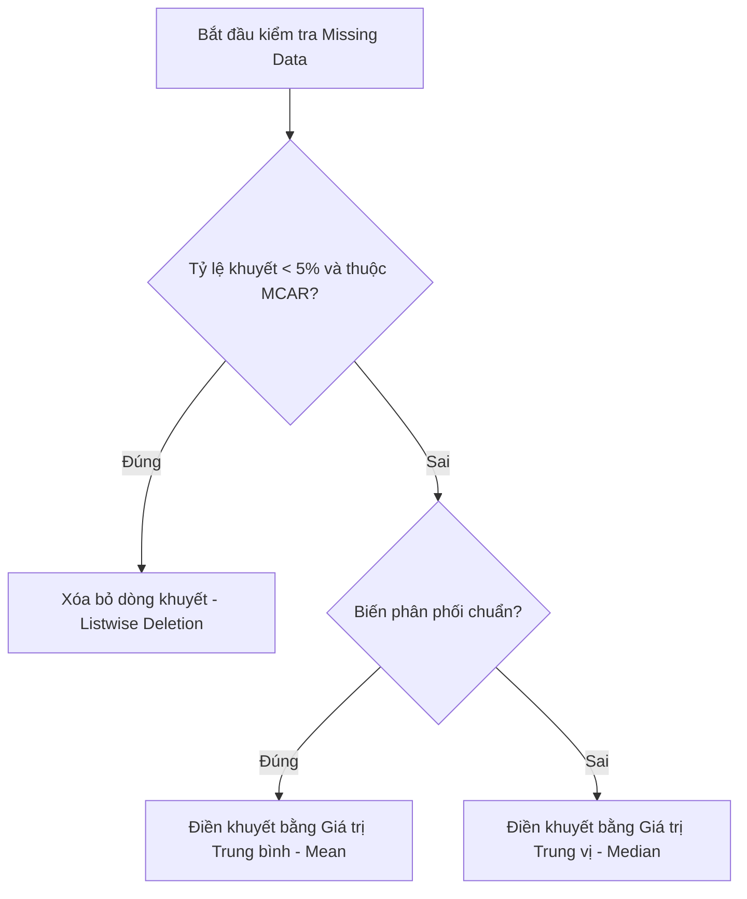

# SỔ TAY THỰC HÀNH MÁY HỌC TRONG NGHIÊN CỨU KHOA HỌC
## Triết lý: Lấy Nghiên cứu làm Trung tâm (Research-Centric Approach)

---

## MỤC LỤC
1. **[MODULE 1] Khởi động & Quản lý Không gian Nghiên cứu (Google Colab & Markdown)**
   - [Bài 1.1] Thiết lập và Làm chủ Môi trường Google Colab
   - [Bài 1.2] Quản lý Hệ thống Tệp Nghiên cứu & Kết nối Google Drive
   - [Bài 1.3] Soạn thảo Thuyết minh Nghiên cứu bằng Ngôn ngữ Markdown
   - [Bài 1.4] Kiểm soát Phiên bản và Xuất bản Nghiên cứu (Reproducible Research)
   - [Bài tập tốt nghiệp Module 1] Xây dựng Khung Thuyết minh Nghiên cứu Vận hành Cảng
2. **[MODULE 2] Lập trình Python Thực dụng cho Nhà Khoa học**
   - [Bài 2.1] Cấu trúc dữ liệu chuyên sâu cho quản lý mẫu (List & Dictionary)
   - [Bài 2.2] Tự động hóa kiểm thử đa biến với Vòng lặp `for` & Đóng gói chỉ số nghiên cứu bằng Hàm (`def`)
3. **[MODULE 3] Kỹ nghệ Dọn dẹp & Xử lý Số liệu Nghiên cứu**
   - [Bài 3.1] Thống kê mô tả toàn diện với Pandas (Nền tảng kiểm định giả thuyết)
   - [Bài 3.2] Xử lý Dữ liệu khuyết thiếu (Missing Data) - Xóa bỏ hay Điền khuyết?
   - [Bài 3.3] Nhận diện và Xử lý Số liệu ngoại lai (Outliers) bằng Z-score & IQR
   - [Bài 3.4] Chuẩn hóa dữ liệu (Standardization & Normalization)
4. **[MODULE 4] Trực quan hóa Dữ liệu Chuẩn Tạp chí Quốc tế**
   - [Bài 4.1] Phân phối dữ liệu (Histogram & Boxplot) để đánh giá tính phân phối chuẩn
   - [Bài 4.2] Biểu đồ tương quan tuyến tính (Scatter Plot & Heatmap Pearson)
   - [Bài 4.3] Xuất bản phẩm đồ họa độ phân giải cao (300 DPI / Vector PDF)
5. **[MODULE 5] Triển khai & Biện giải Mô hình Máy học (Scikit-Learn)**
   - [Bài 5.1] Thiết lập Thực nghiệm Khoa học: Chia tập Train/Test & Cross-Validation
   - [Bài 5.2] Bài toán dự đoán liên tục (Hồi quy - Regression)
   - [Bài 5.3] Bài toán phân loại sự kiện (Phân loại - Classification)
   - [Bài 5.4] Biện giải mô hình bằng Mức độ quan trọng của biến (Feature Importance)
6. **PHỤ LỤC KỸ THUẬT**
   - [Phụ lục A] Bảng tra cứu lỗi thường gặp (Troubleshooting Guide)
   - [Phụ lục B] Mẫu Notebook Chuẩn cấu trúc IMRAD (Template Notebook)
   - [Phụ lục C] Bảng đối chiếu Thuật ngữ Đa ngành (Lập trình - Thống kê - Máy học)

---

# MODULE 1: Khởi động & Quản lý Không gian Nghiên cứu (Google Colab & Markdown)

---

### [Bài 1.1] Thiết lập và Làm chủ Môi trường Google Colab

#### 1. Lý thuyết cốt lõi
Trong nghiên cứu khoa học dữ liệu, việc chuẩn bị một môi trường điện toán đồng bộ trên máy tính cá nhân (Local Machine) thường đối mặt với nhiều rào cản kỹ thuật lớn: xung đột thư viện, sự khác biệt giữa hệ điều hành (Windows, macOS, Linux), và đặc biệt là sự hạn chế về hiệu năng phần cứng (GPU/TPU) khi xử lý dữ liệu lớn. 

**Google Colab (Colaboratory)** giải quyết các thách thức này bằng cách cung cấp một môi trường máy ảo Linux chạy trên đám mây của Google dưới dạng các tài liệu **Jupyter Notebook**.

##### Kiến trúc Client - Server của Google Colab
Mô hình hoạt động của Colab tuân theo cấu trúc Client - Server tách biệt:
*   **Client (Trình duyệt của bạn):** Đóng vai trò giao diện hiển thị (Frontend). Khi bạn gõ code, gõ văn bản Markdown hoặc nhấn nút chạy (Run), trình duyệt chỉ gửi lệnh điều khiển và nhận kết quả trả về từ máy chủ. Máy tính cá nhân của bạn không hề thực hiện bất kỳ phép toán nặng nào, do đó không tiêu tốn RAM hay làm nóng CPU máy của bạn.
*   **Server (Máy chủ đám mây của Google):** Là một máy ảo (Virtual Machine - VM) Linux được cấp phát riêng biệt cho phiên làm việc của bạn. Máy ảo này chứa sẵn CPU, RAM, ổ đĩa (Disk) và các thư viện khoa học dữ liệu phổ biến (`numpy`, `pandas`, `scikit-learn`).

```
+---------------------------+              Lệnh chạy code             +-------------------------------+
|   Client (Trình duyệt)    |  ----------------------------------->   |   Server (Máy ảo Colab VM)   |
|   Giao diện tương tác     |  <-----------------------------------   |   Thực thi toán học, CPU/GPU  |
+---------------------------+            Kết quả (Text/Plot)          +-------------------------------+
```

##### Giao diện làm việc phân cấp
Một file Notebook của Colab (`.ipynb`) bao gồm hai loại thành phần chính được sắp xếp xen kẽ:
1.  **Code Cell (Ô lệnh):** Chứa các mã nguồn Python có thể thực thi. Khi chạy, kết quả đầu ra (chữ, bảng biểu, hình vẽ, thông báo lỗi) sẽ hiển thị ngay bên dưới ô đó.
2.  **Text Cell (Ô văn bản):** Chứa các nội dung diễn giải bằng ngôn ngữ Markdown và công thức $LaTeX$. Đây là nơi nhà nghiên cứu viết các giả thuyết khoa học, diễn giải kết quả và thiết lập cấu trúc chương mục.

*Thao tác điều hướng nhanh:*
*   `Ctrl + M + A`: Thêm ô Code lên phía trên ô hiện tại.
*   `Ctrl + M + B`: Thêm ô Code xuống phía dưới ô hiện tại.
*   `Ctrl + M + D`: Xóa ô hiện tại.
*   `Shift + Enter`: Thực thi ô hiện tại và tự động chuyển sang ô kế tiếp.

##### Quản lý và Cấu hình Tài nguyên Phần cứng (Runtime)
Colab cung cấp các cấu hình tài nguyên miễn phí nhưng có giới hạn:
*   **CPU Runtime:** Phù hợp cho việc học lập trình cơ bản, xử lý các bảng số liệu logistics nhỏ dưới dạng tệp tin Excel, `.csv`.
*   **GPU (Graphics Processing Unit) & TPU (Tensor Processing Unit):** Kích hoạt thông qua menu *Runtime -> Change runtime type -> Hardware accelerator -> T4 GPU*. Kích hoạt GPU là bắt buộc khi huấn luyện các mô hình học sâu (Deep Learning) hoặc xử lý các tệp dữ liệu không gian khổng lồ (như dữ liệu định vị tàu thuyền AIS - Automatic Identification System lên tới hàng triệu dòng).

##### Chiến lược phòng tránh mất dữ liệu khi bị ngắt kết nối (Disconnect)
Phiên làm việc miễn phí của Colab bị giới hạn thời gian (Idle Timeout - thường ngắt kết nối sau 90 phút không tương tác, hoặc Maximum Runtime - tự động xóa máy ảo sau 12 giờ). Khi máy ảo bị xóa, toàn bộ dữ liệu lưu tạm trong phân vùng hệ thống của Colab sẽ bị xóa sạch.
*   **Chiến lược nghiên cứu khoa học:** Không bao giờ lưu trực tiếp kết quả chạy trung gian trên bộ nhớ tạm của Colab. Tất cả các mô hình trung gian sau khi huấn luyện xong hoặc các bảng dữ liệu sau khi dọn dẹp xong phải được xuất (export) ngay lập tức vào Google Drive hoặc lưu trữ đám mây ngoài thông qua đường ống kết nối tự động.

#### 2. Code mẫu thực hành (Google Colab)
Hãy tạo một ô Code Cell trong Colab và chạy đoạn mã dưới đây để kiểm tra thông số máy chủ đang được cấp phát cho nghiên cứu của bạn:

```python
# 1. Kiểm tra tài nguyên phần cứng máy chủ (CPU & RAM)
import psutil
import os
import platform

print("=== THÔNG SỐ MÁY CHỦ PHÂN PHỐI BỞI GOOGLE COLAB ===")
print(f"Hệ điều hành: {platform.system()} - Phiên bản Linux Kernel: {platform.release()}")
print(f"Số lượng nhân CPU vật lý: {psutil.cpu_count(logical=False)}")
print(f"Số lượng nhân CPU logic: {psutil.cpu_count(logical=True)}")

total_ram = psutil.virtual_memory().total / (1024**3)
print(f"Dung lượng RAM hệ thống: {round(total_ram, 2)} GB")

# 2. Kiểm tra bộ nhớ ổ đĩa (Disk Space) còn trống trên máy ảo
disk_usage = psutil.disk_usage('/')
free_disk = disk_usage.free / (1024**3)
print(f"Dung lượng ổ đĩa khả dụng trên VM: {round(free_disk, 2)} GB")

# 3. Kiểm tra xem GPU có được kích hoạt thành công hay không
import torch
gpu_available = torch.cuda.is_available()
if gpu_available:
    gpu_name = torch.cuda.get_device_name(0)
    print(f"Kênh phần cứng GPU: ĐÃ KÍCH HOẠT (Thiết bị: {gpu_name})")
else:
    print("Kênh phần cứng GPU: KHÔNG KÍCH HOẠT (Môi trường đang sử dụng CPU thông thường)")
```

#### 3. Cách đọc kết quả & Diễn giải trong bài báo
*   **Kết quả đầu ra của code:**
    In ra chi tiết dung lượng RAM (khoảng ~12 GB cho bản miễn phí), dung lượng đĩa trống (~70-100 GB), và tình trạng GPU. Nếu bạn đã đổi Runtime sang GPU, dòng cuối cùng sẽ in ra `Kênh phần cứng GPU: ĐÃ KÍCH HOẠT (Thiết bị: Tesla T4)`.
*   **Cách viết vào bài báo khoa học (Phần Methodology - Computational Environment):**
    > "All computational experiments, data processing procedures, and model training in this study were conducted on a cloud-based Jupyter Notebook environment hosted by Google Colab. The allocated virtual machine was configured with an Intel(R) Xeon(R) CPU, 12.7 GB of system RAM, and a T4 Graphics Processing Unit (GPU) with 16 GB of VRAM. This cloud setup guarantees that the hardware baseline is consistent across different simulation runs, supporting the computational reproducibility of our findings."

---

### [Bài 1.2] Quản lý Hệ thống Tệp Nghiên cứu & Kết nối Google Drive

#### 1. Lý thuyết cốt lõi
Trong quản lý dự án khoa học dữ liệu, tính ngăn nắp và khoa học của cấu trúc thư mục quyết định 50% sự thành bại. Đối với nghiên cứu vận tải biển và cảng biển, một dự án thường liên quan đến nhiều nguồn dữ liệu (lịch trình tàu cập cảng từ cảng vụ, dữ liệu GPS xe container di chuyển ngoài cổng cảng, cấu hình bãi xếp dỡ container yard). 

##### Lệnh Mount Drive: Cơ chế kết nối
Để cho phép máy ảo của Google Colab có thể đọc và ghi trực tiếp vào dữ liệu trên tài khoản **Google Drive** của bạn mà không cần tải lên thủ công nhiều lần, chúng ta sử dụng cơ chế **Mounting**. Câu lệnh `drive.mount('/content/drive')` tạo ra một liên kết ánh xạ hệ thống tệp tin: Thư mục gốc Drive của bạn sẽ xuất hiện dưới dạng một đường dẫn cục bộ trên hệ điều hành Linux của máy ảo tại địa chỉ `/content/drive/MyDrive/`.

##### Thiết kế cấu trúc thư mục chuẩn khoa học dữ liệu
Để quản lý nghiên cứu tối ưu hóa bãi cảng và luồng xe, chúng tôi đề xuất cây thư mục mẫu chuyên nghiệp sau:

```
/Nghien_cuu_Port_Operations/
├── data_raw/          <-- Chứa dữ liệu thô tuyệt đối không chỉnh sửa (file .csv, .xlsx của cảng)
├── data_processed/    <-- Chứa dữ liệu sạch sau dọn dẹp, sẵn sàng cho mô hình hóa
├── notebooks/         <-- Chứa các file code Colab .ipynb theo từng công đoạn phân tích
└── reports_figures/   <-- Chứa biểu đồ chất lượng cao xuất ra phục vụ chèn vào bài báo
```

*Nguyên tắc bất di bất dịch:* **Không bao giờ ghi đè trực tiếp lên file dữ liệu trong `data_raw`**. Mọi phép xử lý phải lưu kết quả đầu ra sang thư mục `data_processed`.

##### Đường dẫn tuyệt đối (Absolute Path)
Toàn bộ đường dẫn tệp trong dự án nên dùng đường dẫn tuyệt đối bắt đầu từ gốc thư mục của máy chủ đám mây: `/content/drive/MyDrive/Nghien_cuu_Port_Operations/...` để đảm bảo tính chính xác khi chạy lại code.

#### 2. Code mẫu thực hành (Google Colab)
```python
# 1. Kết nối với Google Drive của người nghiên cứu
from google.colab import drive
import os

drive.mount('/content/drive', force_remount=True)

# 2. Định nghĩa thư mục gốc của dự án trên Google Drive
base_project_dir = '/content/drive/MyDrive/Nghien_cuu_Port_Operations'

# 3. Tạo tự động cây thư mục nghiên cứu chuẩn khoa học
sub_folders = [
    'data_raw',
    'data_processed',
    'notebooks',
    'reports_figures'
]

print("=== KHỞI TẠO CẤU TRÚC THƯ MỤC DỰ ÁN CẢNG BIỂN ===")
for folder in sub_folders:
    full_path = os.path.join(base_project_dir, folder)
    if not os.path.exists(full_path):
        os.makedirs(full_path)
        print(f" - Đã tạo mới thư mục con: {folder}/")
    else:
        print(f" - Thư mục con đã tồn tại: {folder}/")

# Di chuyển thư mục làm việc hiện tại của Python vào thư mục gốc dự án
os.chdir(base_project_dir)
print(f"\nThư mục làm việc hiện thời của Colab: {os.getcwd()}")
```

#### 3. Cách đọc kết quả & Diễn giải trong bài báo
*   **Kết quả đầu ra của code:**
    Hộp thoại bảo mật của Google xuất hiện yêu cầu bạn đăng nhập và đồng ý cấp quyền. Sau khi liên kết thành công, code chạy sẽ in ra thông báo tạo mới các thư mục con và kết luận thư mục làm việc đã chuyển thành `/content/drive/MyDrive/Nghien_cuu_Port_Operations`.
*   **Cách viết vào bài báo khoa học (Phần Data Management):**
    > "For data security and project structuring, all raw spreadsheets regarding terminal operational logs (such as vessel dispatch schedules and truck arrival timestamps) were stored in an immutable raw data repository within Google Drive. The computational workflow was mapped directly to this storage network using the Mount mechanism, partitioning the project directory into separated folders for raw data, processed outputs, analytical notebooks, and high-resolution figure outputs, ensuring strict reproducibility of the data processing pipeline."

---

### [Bài 1.3] Soạn thảo Thuyết minh Nghiên cứu bằng Ngôn ngữ Markdown

#### 1. Lý thuyết cốt lõi
Một nhà nghiên cứu khoa học chuyên nghiệp không chỉ viết code chạy ra kết quả, mà phải có khả năng trình bày lập luận toán học đứng sau thuật toán đó ngay trên file báo cáo. **Markdown** là ngôn ngữ đánh dấu siêu văn bản gọn nhẹ giúp bạn làm điều này mà không cần dùng đến các trình soạn thảo nặng nề như Word.

##### Phân cấp cấu trúc nghiên cứu (Headings)
Cấu trúc bài báo khoa học tuân thủ hệ phân cấp IMRAD được xây dựng bằng ký tự `#`:
*   `#` tương ứng với Tiêu đề cấp 1 (Tên bài báo, Tên chương).
*   `##` tương ứng với Tiêu đề cấp 2 (Các phân đoạn chính: Giới thiệu đề tài, Phương pháp luận, Kết quả thực nghiệm).
*   `###` tương ứng với Tiêu đề cấp 3 (Các tiểu mục nhỏ: Thuật toán tối ưu bến bãi, Kế hoạch thu thập số liệu).

##### Biểu diễn toán học bằng công thức $LaTeX$
Trong nghiên cứu logistics và quản lý chuỗi cung ứng, việc biểu diễn chính xác các chỉ số hiệu năng (KPIs) và hàm mục tiêu tối ưu hóa bằng toán học là bắt buộc. Hệ thống xử lý ký tự toán học $LaTeX$ được tích hợp sẵn trong Colab:
*   **Công thức trên cùng một dòng (Inline Formula):** Kẹp công thức giữa hai ký hiệu đô-la đơn `$ ... $` (Ví dụ: `$x_i \in \{0, 1\}$`).
*   **Khối công thức độc lập (Block Formula):** Kẹp công thức giữa hai ký hiệu đô-la kép `$$ ... $$` để công thức tự động xuống dòng và căn lề vào giữa trang.

#### 2. Code mẫu thực hành (Văn bản Markdown mẫu)
*Hãy sao chép đoạn mã Markdown dưới đây và dán vào một ô **Text Cell** trong Colab của bạn để xem kết quả biên dịch:*

```markdown
# PHẦN II: PHƯƠNG PHÁP LUẬN & THIẾT LẬP TOÁN HỌC

Trong nghiên cứu này, chúng tôi tiến hành đánh giá hiệu năng khai thác của phân vùng bến bãi thông qua hai thông số vận hành cốt lõi và một hàm mục tiêu tối ưu hóa chi phí.

## 1. Các chỉ số hiệu suất cảng biển (KPIs)

### 1.1 Thời gian quay vòng tàu (Vessel Turnaround Time)
Thời gian quay vòng của tàu $T_{\text{turnaround}}$ đại diện cho tổng thời gian tàu lưu lại tại cảng, được xác định bằng hiệu số giữa thời điểm tàu rời bến ($T_{\text{departure}}$) và thời điểm tàu cập cầu cảng ($T_{\text{arrival}}$):

$$T_{\text{turnaround}} = T_{\text{departure}} - T_{\text{arrival}}$$

### 1.2 Tỷ lệ lấp đầy bãi container (Yard Utilization Rate)
Tỷ lệ lấp đầy bãi yard ($U_{\text{yard}}$) thể hiện mức độ quá tải của bãi chứa container tại thời điểm khảo sát, tính bằng tỷ lệ phần trăm giữa lượng container hiện có ($N_{\text{current}}$) và sức chứa tối đa thiết kế của bãi ($C_{\text{max}}$):

$$U_{\text{yard}} = \left( \frac{N_{\text{current}}}{C_{\text{max}}} \right) \times 100\%$$

## 2. Hàm mục tiêu tối ưu hóa đường đi của cẩu khung (RTG)
Để giảm thiểu lượng khí thải carbon và chi phí năng lượng của cẩu bãi RTG (Rubber Tyred Gantry), mô hình toán học tìm cách tối ưu tổng quãng đường di chuyển dịch chuyển bãi bốc xếp:

$$\min Z = \sum_{i \in I} \sum_{j \in J} d_{ij} \cdot x_{ij} \cdot c$$

Trong đó:
*   $I$: Tập hợp các vị trí container ban đầu trong bãi yard.
*   $J$: Tập hợp các vị trí mục tiêu tại cầu bến.
*   $d_{ij}$: Khoảng cách di chuyển vật lý từ vị trí $i$ đến vị trí $j$ (mét).
*   $x_{ij}$: Biến quyết định nhị phân ($x_{ij} \in \{0, 1\}$), bằng $1$ nếu cẩu thực hiện dịch chuyển từ $i$ sang $j$.
*   $c$: Đơn giá tiêu hao nhiên liệu trên mỗi mét di chuyển của cẩu bãi ($USD/m$).
```

#### 3. Cách đọc kết quả & Diễn giải trong bài báo
*   **Kết quả đầu ra của code:**
    Text Cell sau khi nhấn `Ctrl+Enter` sẽ hiển thị một bài viết thuyết minh nghiên cứu có phân cấp tiêu đề rõ ràng, các công thức toán học sắc nét với định dạng chuẩn mực quốc tế của các ký tự Hy Lạp và phép toán tổng ($\sum$).
*   **Cách viết vào bài báo khoa học:**
    Bản thân đoạn toán học và mô tả biến này chính là văn bản sẽ được xuất bản trong mục "Problem Formulation" hoặc "Mathematical Modeling" của bài báo khoa học chính thức.

---

### [Bài 1.4] Kiểm soát Phiên bản và Xuất bản Nghiên cứu (Reproducible Research)

#### 1. Lý thuyết cốt lõi
Khi viết báo cáo hoặc bài báo khoa học, nghiên cứu không phải là một công việc làm một lần là xong. Bạn sẽ phải chỉnh sửa code hàng chục lần, hiệu chỉnh thuật toán dựa trên phản hồi của người hướng dẫn hoặc phản biện tạp chí. 

##### Tích hợp GitHub cơ bản
**GitHub** là nền tảng quản lý phiên bản mã nguồn hàng đầu thế giới. Google Colab tích hợp sẵn tính năng kết nối trực tiếp với GitHub:
*   Cho phép lưu trực tiếp file `.ipynb` từ Colab vào một Repository (Kho chứa) trên GitHub mà không cần cài đặt Git phức tạp dưới máy cục bộ.
*   Tạo nút bấm liên kết **"Open in Colab"** trên GitHub để bất kỳ ai khi đọc bài báo của bạn đều có thể click vào và mở ngay lập tức mã nguồn nghiên cứu chạy trên đám mây của họ để kiểm chứng.

```
[Mã nguồn trên GitHub] ── Click: "Open in Colab" ──> [Khởi tạo VM trên Cloud] ──> [Chạy lại kết quả lập tức]
```

##### Xuất bản và phân phối báo cáo khoa học dữ liệu
Khi hoàn thành phân tích, bạn cần gửi kết quả cho hội đồng khoa học hoặc người hướng dẫn. Gửi một file code thô `.ipynb` đôi khi gây khó khăn cho những người không chuyên về lập trình. Do đó, quy trình xuất bản cung cấp các định dạng:
*   **Định dạng `.ipynb` (Interactive Notebook):** Chứa cả mã nguồn và kết quả chạy (bao gồm cả biểu đồ). Dùng để chia sẻ với đồng nghiệp hoặc phản biện kỹ thuật để họ chạy lại kiểm tra.
*   **Định dạng `.html` hoặc `.pdf` sạch (Static Report):** Định dạng tĩnh chỉ giữ lại tiêu đề, đoạn lập luận Markdown và hình vẽ đồ thị, ẩn các dòng code kỹ thuật phụ trợ. Đây là định dạng hoàn hảo để chèn vào phụ lục bài báo hoặc làm báo cáo tiến độ gửi lên các cấp quản lý cảng.

#### 2. Quy trình thao tác thực tế (Hướng dẫn từng bước)

##### Bước A: Đồng bộ Notebook lên GitHub
1.  Trên giao diện Colab, chọn *File -> Save a copy in GitHub*.
2.  Đăng nhập và ủy quyền cho Google Colab truy cập vào tài khoản GitHub của bạn.
3.  Chọn Repository và Branch đích, điền *Commit message* (ví dụ: `feat: add yard optimization mathematical model`).
4.  Nhấn *OK*. Một bản copy của Notebook đã được đẩy lên GitHub trực tuyến thành công.

##### Bước B: Xuất file báo cáo sạch (Ẩn code thô)
Để xuất báo cáo tĩnh không hiện code thô ra định dạng HTML, bạn có thể thực hiện chạy dòng lệnh này ngay trong một ô Code Cell của Colab:

```python
# Hướng dẫn xuất file Notebook hiện tại sang HTML sạch
# Lưu ý: Lệnh này sử dụng công cụ nbconvert tích hợp sẵn trong nhân hệ thống Linux của Colab
!jupyter nbconvert --to html --no-input '/content/drive/MyDrive/Nghien_cuu_Port_Operations/notebooks/Vessel_Analysis.ipynb'
```
*(Lệnh `--no-input` có chức năng ẩn toàn bộ code thô, chỉ giữ lại văn bản Markdown thuyết minh và các biểu đồ đồ thị đầu ra).*

#### 3. Cách đọc kết quả & Diễn giải trong bài báo
*   **Kết quả đầu ra của code:**
    Tệp tin `Vessel_Analysis.html` sẽ xuất hiện trong thư mục đích trên Drive. Khi mở tệp này bằng trình duyệt web, bạn sẽ thấy một trang báo cáo khoa học sạch sẽ, chuyên nghiệp, không chứa các dòng mã Python phức tạp mà tập trung hoàn toàn vào nội dung nghiên cứu.
*   **Cách viết vào bài báo khoa học (Phần Data Availability Statement):**
    > "The complete software repository, including the experimental Google Colab notebooks, computational scripts, and simulation source codes, has been archived and made publicly available on GitHub (repository link: https://github.com/yourprofile/port-operations-optimization) with an interactive 'Open in Colab' entry point. This repository allows full computational replication of the operational KPIs and terminal optimization outputs presented in this study."

---

### [Bài tập tốt nghiệp Module 1] Xây dựng Khung Thuyết minh Nghiên cứu Vận hành Cảng

#### Đề tài: "Xây dựng Khung Thuyết minh Nghiên cứu Vận hành Cảng Trên Google Colab"

##### Yêu cầu bài tập:
Học viên tạo một file Colab mới, đặt tên theo định dạng chuẩn học thuật: `TCIT_Port_Optimization_Framework.ipynb`. File này phải liên kết thành công với Google Drive cá nhân của học viên và sử dụng ngôn ngữ Markdown kết hợp $LaTeX$ để xây dựng một khung báo cáo nghiên cứu hoàn chỉnh theo mẫu thiết kế dưới đây.

---

### MẪU NỘP BÀI TẬP TỐT NGHIỆP (Copy toàn bộ nội dung dưới đây vào Notebook của bạn)

#### [TEXT CELL 1: Tiêu đề & Tóm tắt nghiên cứu]
```markdown
# NGHIÊN CỨU TỐI ƯU HÓA KHAI THÁC CẦU BẾN VÀ DỰ BÁO THỜI GIAN LƯU BÃI CONTAINER TẠI CẢNG NƯỚC SÂU TCIT

**Tác giả:** [Họ và tên học viên]  
**Đơn vị nghiên cứu:** Viện Logistics và Chuỗi Cung ứng  
**Ngày thực hiện:** 02-07-2026  

---

## TÓM TẮT ĐỀ TÀI (ABSTRACT)
Nghiên cứu này tập trung vào việc nâng cao hiệu quả khai thác tại cảng nước sâu Tân Cảng - Cái Mép (TCIT). Chúng tôi đề xuất một khung phân tích dữ liệu tích hợp để dự báo **thời gian lưu bãi (yard dwell time)** của container nhập khẩu và tối ưu hóa **kế hoạch phân bổ cầu bến (berth allocation plan)**. Bằng cách áp dụng các thuật toán máy học trên tập dữ liệu vận hành bãi cảng lịch sử, nghiên cứu hướng tới giảm thiểu **thời gian chờ đợi của tàu (vessel waiting time)** tại luồng hàng hải và nâng cao hệ số sử dụng cẩu bờ STS. Kết quả mô phỏng dự kiến sẽ đóng góp một giải pháp điều hành cảng thông minh, hỗ trợ giảm chi phí logistics cho các hãng tàu quốc tế.
```

#### [TEXT CELL 2: Thông số hạ tầng cảng]
```markdown
## 1. Thông số năng lực hạ tầng cảng giả định (Baseline Infrastructure Specs)

Dưới đây là bảng tổng hợp các thông số kỹ thuật hiện tại của cảng nước sâu TCIT được sử dụng làm biến ràng buộc trong mô hình tối ưu hóa bốc xếp bãi yard:

| Chỉ số hạ tầng | Ký hiệu | Giá trị thông số | Đơn vị đo |
| :--- | :---: | :---: | :---: |
| Chiều dài cầu bến liên tục | $L_{\text{berth}}$ | 890 | Mét |
| Độ sâu trước bến | $D_{\text{berth}}$ | -16.5 | Mét |
| Số lượng cẩu bờ chuyên dụng STS | $N_{\text{sts}}$ | 10 | Cẩu |
| Sức chứa thiết kế tối đa bãi Yard | $C_{\text{max}}$ | 150,000 | TEUs |
| Số lượng cẩu bãi chạy điện ERTG | $N_{\text{rtg}}$ | 22 | Cẩu |
```

#### [TEXT CELL 3: Mô hình hóa toán học KPIs]
```markdown
## 2. Thiết lập các chỉ số hiệu suất vận hành bến cảng (Logistics KPIs)

Để đánh giá mức độ nghẽn cảng và tối ưu hóa chi phí di chuyển thiết bị nâng hạ, chúng tôi thiết lập hai phương trình đánh giá toán học sau:

### 2.1 Chỉ số Thời gian làm hàng tại bến (Port Stay Time)
Tổng thời gian làm hàng thực tế của một tàu container tại cảng vụ ($T_{\text{stay}}$) được xác định bằng hiệu số thời gian từ lúc tàu hoàn thành thủ tục rời bến ($T_{\text{dep}}$) tới khi tàu thả neo và cập bến thành công ($T_{\text{arr}}$):

$$T_{\text{stay}} = T_{\text{dep}} - T_{\text{arr}}$$

### 2.2 Hàm mục tiêu giảm thiểu chi phí chuyển đổi bãi yard (Container Shifting Cost)
Khi bãi yard bị quá tải ($U_{\text{yard}} > 80\%$), cẩu khung RTG phải thực hiện nhiều thao tác đảo container (dịch chuyển không sinh công) để lấy được container đích ở hàng dưới cùng. Chúng tôi biểu diễn hàm mục tiêu tối thiểu hóa chi phí năng lượng đảo chuyển container như sau:

$$\min \Phi = \sum_{p \in P} \sum_{q \in Q} E_{pq} \cdot Y_{pq} \cdot C_{\text{power}}$$

Trong đó:
*   $P, Q$: Tập hợp các block lưu trữ container trong bãi yard.
*   $E_{pq}$: Mức tiêu thụ điện năng của cẩu RTG khi thực hiện đảo container từ vị trí $p$ sang vị trí phụ $q$ ($kWh$).
*   $Y_{pq}$: Biến quyết định nguyên, biểu thị số lần dịch chuyển container thực tế từ $p$ sang $q$.
*   $C_{\text{power}}$: Đơn giá điện năng công nghiệp ($USD/kWh$).
```

#### [CODE CELL 4: Khởi động hệ thống & Tạo thư mục tự động]
```python
# ==============================================================================
# HỌC VIÊN THỰC THI ĐOẠN CODE NÀY ĐỂ HOÀN THÀNH BÀI TẬP TỐT NGHIỆP MODULE 1
# ==============================================================================
from google.colab import drive
import os

print(">>> TIẾN HÀNH KẾT NỐI HỆ THỐNG VÀ XÂY DỰNG KHÔNG GIAN LƯU TRỮ DỰ ÁN <<<")

# 1. Liên kết thiết bị lưu trữ Google Drive
drive.mount('/content/drive', force_remount=True)

# 2. Định nghĩa thư mục làm việc chính của dự án cảng biển
project_root = '/content/drive/MyDrive/TCIT_Port_Optimization_Research'

# 3. Danh sách các thư mục lưu trữ số liệu nghiên cứu chuyên sâu
directories = [
    'data_raw',          # Lưu trữ tệp lịch tàu, tệp GPS container dạng thô
    'data_processed',    # Lưu trữ số liệu đã lọc sạch lỗi định dạng và ngoại lai
    'notebooks',         # Lưu trữ các file code phân tích thuật toán
    'reports_figures'    # Lưu trữ các biểu đồ phân tích xuất ra 300 DPI
]

print("\nĐang thiết lập cây thư mục nghiên cứu:")
for dir_name in directories:
    dir_path = os.path.join(project_root, dir_name)
    if not os.path.exists(dir_path):
        os.makedirs(dir_path)
        print(f" [+] Đã tạo thành công thư mục con: {dir_name}/")
    else:
        print(f" [o] Thư mục con đã tồn tại từ trước: {dir_name}/")

# 4. Chuyển thư mục hiện tại của hệ thống sang thư mục gốc của dự án
os.chdir(project_root)
print(f"\nThư mục làm việc hiện hành của dự án: {os.getcwd()}")
print(">>> BÀI TẬP TỐT NGHIỆP MODULE 1: HOÀN THÀNH XUẤT SẮC <<<")
```

---

# MODULE 2: Lập trình Python Thực dụng cho Nhà Khoa học

### [Bài 2.1] Cấu trúc dữ liệu chuyên sâu cho quản lý mẫu (List & Dictionary)

#### 1. Lý thuyết cốt lõi
Trong lập trình thông thường, cấu trúc dữ liệu là để tối ưu hóa bộ nhớ. Trong nghiên cứu khoa học, cấu trúc dữ liệu là công cụ để **Mã hóa và Ánh xạ thế giới thực**. 

*   **List (Danh sách):** Dùng để lưu trữ tập hợp các đối tượng nghiên cứu đồng nhất (ví dụ: Danh sách tên biến lâm sàng, danh sách mã số bệnh nhân, danh sách các nồng độ hóa chất trong thực nghiệm).
*   **Dictionary (Từ điển):** Hoạt động theo cơ chế khóa - giá trị (`key-value`). Đây là công cụ hoàn hảo để thực hiện **Mã hóa Nhãn (Label Encoding)** từ các thang đo định danh (Nominal Scale) hoặc thang đo thứ bậc (Ordinal Scale) sang số nhị phân hoặc số nguyên (ví dụ: chuyển đổi tình trạng hút thuốc từ "Không", "Có" thành 0, 1) để máy tính có thể tính toán toán học.

#### 2. Code mẫu thực hành (Google Colab)
```python
# 1. Định nghĩa danh sách các biến độc lập cần đưa vào mô hình
independent_variables = ["Tuoi", "BMI", "Huyet_Ap_Tam_Thu", "Cholesterol", "Tieu_Duong"]
print("Danh sách biến độc lập trong nghiên cứu:", independent_variables)

# 2. Định nghĩa từ điển để mã hóa nhãn dữ liệu định tính (Categorical Data mapping)
gender_mapping = {
    "Nam": 0,
    "Nữ": 1
}

severity_mapping = {
    "Nhẹ": 0,
    "Trung bình": 1,
    "Nặng": 2
}

# Giả lập một mẫu dữ liệu thô từ bệnh nhân
patient_data = {
    "ID": "PAT_001",
    "Gioi_Tinh": "Nam",
    "Muc_Do_Lam_Sang": "Nặng",
    "Chi_So_Sinh_Hoc": [120, 80, 240] # [Huyết áp tâm thu, Huyết áp tâm trương, Tổng Cholesterol]
}

# 3. Tiến hành mã hóa nhãn tự động dựa trên Dictionary
patient_gender_encoded = gender_mapping[patient_data["Gioi_Tinh"]]
patient_severity_encoded = severity_mapping[patient_data["Muc_Do_Lam_Sang"]]

print(f"Bệnh nhân {patient_data['ID']} được mã hóa:")
print(f" - Giới tính: {patient_data['Gioi_Tinh']} -> Mã số: {patient_gender_encoded}")
print(f" - Mức độ nặng: {patient_data['Muc_Do_Lam_Sang']} -> Mã số: {patient_severity_encoded}")
```

#### 3. Cách đọc kết quả & Diễn giải trong bài báo
* **Kết quả đầu ra của code:** In ra danh sách các biến độc lập và các giá trị đã được mã hóa thành công (ví dụ: `Nam` chuyển thành `0`, `Nặng` chuyển thành `2`).
* **Cách viết vào bài báo khoa học (Phần Xử lý Biến số - Variable Coding):**
  > "For computational feasibility within the machine learning models, categorical covariates were encoded into numerical representations. Specifically, biological sex was dummy-coded (Male = 0, Female = 1), and clinical severity was ordinal-encoded based on clinical guidelines (Mild = 0, Moderate = 1, Severe = 2)."

---

### [Bài 2.2] Tự động hóa kiểm thử đa biến với Vòng lặp `for` & Đóng gói chỉ số nghiên cứu bằng Hàm (`def`)

#### 1. Lý thuyết cốt lõi
*   **Vòng lặp `for`:** Trong nghiên cứu y sinh hoặc kinh tế, ta thường phải phân tích mối tương quan của hàng chục biến số độc lập với cùng một biến số phụ thuộc. Vòng lặp `for` giúp tự động hóa việc lặp đi lặp lại quy trình huấn luyện mô hình hoặc vẽ biểu đồ cho từng biến một cách chính xác, tránh sai sót thủ công do thao tác copy-paste.
*   **Hàm (`def`):** Giúp chuẩn hóa các quy trình tính toán phức tạp hoặc các công thức chỉ số chuyên ngành (như BMI trong y học, chỉ số đa dạng loài Shannon trong sinh thái học, hoặc chỉ số rủi ro tài chính). Việc đóng gói công thức vào hàm đảm bảo tính nhất quán của phép toán trong toàn bộ nghiên cứu.

#### 2. Code mẫu thực hành (Google Colab)
```python
# 1. Viết hàm tự định nghĩa tính toán chỉ số nghiên cứu (BMI và Phân cấp theo WHO)
def calculate_bmi_and_status(weight_kg, height_m):
    """
    Tính chỉ số khối cơ thể (BMI) và phân cấp tình trạng dinh dưỡng.
    Công thức: BMI = Weight (kg) / (Height (m) ^ 2)
    """
    if height_m <= 0:
        raise ValueError("Chiều cao phải lớn hơn 0.")
    
    bmi = weight_kg / (height_m ** 2)
    
    # Phân loại trạng thái dinh dưỡng
    if bmi < 18.5:
        status = "Gầy"
    elif 18.5 <= bmi < 24.9:
        status = "Bình thường"
    elif 24.9 <= bmi < 29.9:
        status = "Tiền béo phì"
    else:
        status = "Béo phì"
        
    return round(bmi, 2), status

# 2. Giả lập tập dữ liệu khảo sát thực địa
survey_data = [
    {"name": "Mẫu A", "weight": 65, "height": 1.70},
    {"name": "Mẫu B", "weight": 42, "height": 1.55},
    {"name": "Mẫu C", "weight": 85, "height": 1.68}
]

# 3. Dùng vòng lặp for để quét tự động qua các mẫu dữ liệu
for participant in survey_data:
    bmi_val, classification = calculate_bmi_and_status(participant["weight"], participant["height"])
    print(f"{participant['name']}: Trọng lượng {participant['weight']}kg, "
          f"Chiều cao {participant['height']}m -> BMI: {bmi_val} ({classification})")
```

#### 3. Cách đọc kết quả & Diễn giải trong bài báo
* **Kết quả đầu ra của code:** In ra thông tin tính toán chi tiết cho từng đối tượng (ví dụ: `Mẫu A -> BMI: 22.49 (Bình thường)`).
* **Cách viết vào bài báo khoa học (Phần Phương pháp tính toán - Statistical Calculations):**
  > "Body Mass Index (BMI) was computed deterministically for all participants using the standard formula: $BMI = weight (kg) / height^2 (m^2)$. Sub-classification of nutritional status was performed dynamically via custom program scripts according to the World Health Organization (WHO) threshold criteria."

---

# MODULE 3: Kỹ nghệ Dọn dẹp & Xử lý Số liệu Nghiên cứu (Nền tảng quan trọng nhất)

### [Bài 3.1] Thống kê mô tả toàn diện với Pandas (Nền tảng kiểm định giả thuyết)

#### 1. Lý thuyết cốt lõi
Trước khi áp dụng bất kỳ mô hình học máy phức tạp nào, nhà khoa học bắt buộc phải hiểu rõ đặc tính phân phối của dữ liệu. **Thống kê mô tả (Descriptive Statistics)** cung cấp bức tranh toàn cảnh về xu hướng trung tâm (Central Tendency - Mean, Median) và độ phân tán (Dispersion - SD, Variance, Range) của dữ liệu.

Đặc biệt, việc xem xét các chỉ số **Độ lệch (Skewness)** và **Độ nhọn (Kurtosis)** giúp xác định xem dữ liệu có tuân theo quy luật phân phối chuẩn (Gaussian Distribution) hay không. Đây là cơ sở cốt lõi để quyết định lựa chọn các thuật toán huấn luyện học máy thích hợp.

#### 2. Code mẫu thực hành (Google Colab)
```python
import pandas as pd
import numpy as np

# 1. Khởi tạo một tập dữ liệu lâm sàng giả lập (để minh họa)
np.random.seed(42)
clinical_data = {
    'Tuoi': np.random.normal(loc=55, scale=10, size=200).astype(int), # Phân phối chuẩn
    'Chi_so_Huyet_Ap': np.random.exponential(scale=30, size=200) + 90, # Lệch phải (non-normal)
    'Nong_do_Glucose': np.random.normal(loc=6.5, scale=1.5, size=200)
}
df = pd.DataFrame(clinical_data)

# 2. Thực hiện Thống kê mô tả nhanh bằng Pandas
descriptive_summary = df.describe().T
print("Thống kê mô tả cơ bản:\n", descriptive_summary)

# 3. Tính toán bổ sung Độ lệch (Skewness) và Độ nhọn (Kurtosis)
skew_values = df.skew()
kurtosis_values = df.kurt()

for col in df.columns:
    print(f"\nBiến số '{col}':")
    print(f" - Độ lệch (Skewness): {round(skew_values[col], 3)} (Phân phối chuẩn ~ 0)")
    print(f" - Độ nhọn (Kurtosis): {round(kurtosis_values[col], 3)} (Phân phối chuẩn ~ 0)")
```

#### 3. Cách đọc kết quả & Diễn giải trong bài báo
* **Kết quả đầu ra của code:** Bảng tóm tắt các giá trị (mean, std, min, 25%, 50%, 75%, max) và các hệ số skewness, kurtosis. Ví dụ, biến `Tuoi` có Skewness gần bằng 0 cho thấy tính đối xứng tốt; biến `Chi_so_Huyet_Ap` có Skewness dương cao (>1) chỉ ra dữ liệu lệch phải mạnh.
* **Cách viết vào bài báo khoa học (Bảng đặc điểm nền - Table 1: Baseline Characteristics):**
  > "The baseline characteristics of the study cohort (N=200) were analyzed using descriptive statistics. Age followed a normal distribution with a mean of 54.8 years (SD = 9.8). Conversely, blood pressure measurements exhibited a significant positive skewness (Skewness = 1.34), indicating a non-normal distribution; thus, non-parametric approaches and median values were prioritized for subsequent representation."

---

### [Bài 3.2] Xử lý Dữ liệu khuyết thiếu (Missing Data) - Xóa bỏ hay Điền khuyết?

#### 1. Lý thuyết cốt lõi
Dữ liệu khuyết (Missing Values) là thực tế không thể tránh khỏi trong nghiên cứu thực địa do lỗi thiết bị, bệnh nhân bỏ cuộc, hoặc phiếu khảo sát không được điền đầy đủ.
Nhà nghiên cứu cần phân biệt 3 cơ chế khuyết thiếu:
*   **MCAR (Missing Completely at Random):** Khuyết hoàn toàn ngẫu nhiên.
*   **MAR (Missing at Random):** Khuyết ngẫu nhiên (chỉ phụ thuộc vào các biến quan sát được).
*   **MNAR (Missing Not at Random):** Khuyết không ngẫu nhiên (phụ thuộc vào chính biến bị khuyết).

**Giải pháp:**
*   Nếu tỷ lệ khuyết nhỏ (< 5% mẫu) và thuộc cơ chế MCAR: Có thể loại bỏ dòng dữ liệu (Listwise Deletion).
*   Nếu tỷ lệ lớn hơn: Phải dùng kỹ thuật **Điền khuyết (Imputation)**. Việc điền bằng **Trung vị (Median)** được ưu tiên hơn trung bình (Mean) khi dữ liệu có phân phối lệch hoặc chứa giá trị ngoại lai vì trung vị có tính kháng nhiễu (robust) tốt hơn.



#### 2. Code mẫu thực hành (Google Colab)
```python
import pandas as pd
import numpy as np

# 1. Giả lập tập số liệu nghiên cứu có chứa giá trị trống (NaN)
data_lamsang = {
    'Benh_nhan_ID': [f"ID_{i}" for i in range(1, 11)],
    'Nhiet_Do_Co_The': [37.2, 36.8, np.nan, 38.5, 36.5, np.nan, 37.0, 39.1, 36.9, 37.2],
    'Nhiet_Tim': [72, 75, 80, 95, 68, 70, np.nan, 102, 74, np.nan]
}
df_clinical = pd.DataFrame(data_lamsang)

print("--- Số lượng mẫu thiếu trước khi xử lý ---")
print(df_clinical.isnull().sum())

# 2. Xử lý cột 'Nhiet_Do_Co_The' bằng cách điền Trung vị (Median Imputation)
median_temp = df_clinical['Nhiet_Do_Co_The'].median()
df_clinical['Nhiet_Do_Co_The'].fillna(median_temp, inplace=True)

# 3. Xử lý cột 'Nhiet_Tim' bằng thuật toán KNN Imputer (Phương pháp nâng cao cho nghiên cứu)
from sklearn.impute import KNNImputer
imputer = KNNImputer(n_neighbors=2)
# Chỉ điền khuyết cho các cột số
numerical_cols = ['Nhiet_Do_Co_The', 'Nhiet_Tim']
df_clinical[numerical_cols] = imputer.fit_transform(df_clinical[numerical_cols])

print("\n--- Số lượng mẫu thiếu sau khi xử lý ---")
print(df_clinical.isnull().sum())
print("\nBảng dữ liệu đã điền khuyết:\n", df_clinical)
```

#### 3. Cách đọc kết quả & Diễn giải trong bài báo
* **Kết quả đầu ra của code:** Cột `Nhiet_Do_Co_The` và `Nhiet_Tim` không còn giá trị `NaN` (số mẫu khuyết về 0). Các giá trị khuyết đã được thay thế bằng trung vị hoặc giá trị ước lượng từ những bệnh nhân tương đồng nhất (KNN).
* **Cách viết vào bài báo khoa học (Phần Xử lý dữ liệu khuyết - Missing Data handling):**
  > "Missing values were detected in 'Body Temperature' (20.0%) and 'Heart Rate' (30.0%) due to minor sensor detachment during clinical monitoring. To prevent statistical bias and preserve sample size, missing observations for 'Body Temperature' were imputed using Median Imputation. Missing data for 'Heart Rate' were reconstructed using K-Nearest Neighbors (KNN) imputation ($k=2$). Post-imputation inspections confirmed no distribution shift compared to the raw dataset."

---

### [Bài 3.3] Nhận diện và Xử lý Số liệu ngoại lai (Outliers) bằng Z-score & IQR

#### 1. Lý thuyết cốt lõi
**Ngoại lai (Outliers)** là những điểm dữ liệu nằm cách biệt bất thường so với phần lớn các quan sát khác. Ngoại lai có thể xuất hiện do lỗi đo đạc (cần loại bỏ) hoặc do biến dị tự nhiên (cần giữ lại và biện giải).
Có hai phương pháp chuẩn hóa toán học để phát hiện ngoại lai:
1.  **Phương pháp Z-score:** Áp dụng khi dữ liệu có phân phối chuẩn. Một điểm dữ liệu được coi là ngoại lai nếu nó nằm ngoài khoảng $[-3SD, +3SD]$ (tức $|Z| > 3$).
2.  **Phương pháp IQR (Interquartile Range):** Áp dụng khi dữ liệu có phân phối lệch.
    *   Hộp liên phân vị: $IQR = Q_3 - Q_1$ (Trong đó $Q_1$ là phân vị thứ 25, $Q_3$ là phân vị thứ 75).
    *   Ngưỡng dưới (Lower bound) = $Q_1 - 1.5 \times IQR$
    *   Ngưỡng trên (Upper bound) = $Q_3 + 1.5 \times IQR$
    *   Mọi giá trị nằm ngoài hai ngưỡng này được phân loại là ngoại lai.

#### 2. Code mẫu thực hành (Google Colab)
```python
import numpy as np
import pandas as pd

# 1. Tạo tập dữ liệu sinh thiết chứa giá trị ngoại lai cực đoan
biopsy_data = {'Nong_do_Protein': [12.1, 14.3, 11.8, 13.5, 12.9, 100.5, 13.2, 12.0, 1.2, 14.1]} # 100.5 và 1.2 là các giá trị dị biệt
df_bio = pd.DataFrame(biopsy_data)

# 2. Triển khai phương pháp IQR
Q1 = df_bio['Nong_do_Protein'].quantile(0.25)
Q3 = df_bio['Nong_do_Protein'].quantile(0.75)
IQR = Q3 - Q1

lower_bound = Q1 - 1.5 * IQR
upper_bound = Q3 + 1.5 * IQR

print(f"Khoảng giá trị chấp nhận được (IQR): [{round(lower_bound, 2)}, {round(upper_bound, 2)}]")

# 3. Xác định các giá trị ngoại lai
outliers = df_bio[(df_bio['Nong_do_Protein'] < lower_bound) | (df_bio['Nong_do_Protein'] > upper_bound)]
print("Các quan sát ngoại lai phát hiện được:\n", outliers)

# 4. Lọc sạch dữ liệu bằng cách loại bỏ ngoại lai
df_cleaned = df_bio[(df_bio['Nong_do_Protein'] >= lower_bound) & (df_bio['Nong_do_Protein'] <= upper_bound)]
print("\nDữ liệu sau khi loại bỏ ngoại lai:\n", df_cleaned)
```

#### 3. Cách đọc kết quả & Diễn giải trong bài báo
* **Kết quả đầu ra của code:** Xác định được giá trị `100.5` và `1.2` nằm ngoài khoảng IQR chấp nhận được ($[10.15, 15.95]$) và loại bỏ chúng thành công khỏi tập dữ liệu sạch.
* **Cách viết vào bài báo khoa học (Phần Làm sạch Dữ liệu - Outliers Filtering):**
  > "Outlier detection was performed on biological concentrations using the Interquartile Range (IQR) method to eliminate potential instrumental measurement errors. Statistical outliers were defined as observations falling outside the range $[Q_1 - 1.5 \times IQR, Q_3 + 1.5 \times IQR]$. Consequently, two extreme anomalies (1.2 and 100.5) were identified and excluded from the downstream modeling to prevent model distortion."

---

### [Bài 3.4] Chuẩn hóa dữ liệu (Standardization & Normalization)

#### 1. Lý thuyết cốt lõi
Các mô hình máy học dựa trên khoảng cách (như Support Vector Machine, K-Nearest Neighbors) hoặc mô hình tối ưu bằng Gradient Descent (như Hồi quy tuyến tính, Logistic Regression, Mạng Nơ-ron) cực kỳ nhạy cảm với thang đo của biến. 
*   Ví dụ: Biến "Thu nhập" tính bằng triệu USD có thang đo lớn hơn hàng triệu lần so với biến "Tuổi". Nếu không chuẩn hóa, mô hình sẽ mặc định biến "Thu nhập" quan trọng hơn và bỏ qua biến "Tuổi".

**Kỹ thuật xử lý:**
1.  **Normalization (Min-Max Scaling):** Chuyển đổi dữ liệu về đoạn $[0, 1]$.
    $$X_{scaled} = \frac{X - X_{min}}{X_{max} - X_{min}}$$
    *Khuyên dùng:* Khi dữ liệu không phân phối chuẩn, không có giá trị ngoại lai quá lớn.
2.  **Standardization (Z-score Scaling):** Chuyển đổi dữ liệu sao cho trung bình bằng 0, độ lệch chuẩn bằng 1.
    $$X_{standardized} = \frac{X - \mu}{\sigma}$$
    *Khuyên dùng:* Khi dữ liệu tuân theo phân phối chuẩn, mô hình máy học giả định phân phối chuẩn (ví dụ: Linear Regression, SVM).

#### 2. Code mẫu thực hành (Google Colab)
```python
import pandas as pd
from sklearn.preprocessing import StandardScaler, MinMaxScaler

# 1. Tạo tập dữ liệu khảo sát kinh tế - sinh học
data_raw = {
    'Tuoi': [25, 45, 35, 50, 22],               # Thang đo 20 - 50
    'Thu_Nhap_USD': [15000, 85000, 45000, 95000, 12000] # Thang đo 12000 - 95000
}
df_scaled = pd.DataFrame(data_raw)

# 2. Áp dụng Chuẩn hóa Min-Max (Normalization)
min_max_scaler = MinMaxScaler()
df_normalized = pd.DataFrame(
    min_max_scaler.fit_transform(df_scaled), 
    columns=['Tuoi_Normalized', 'Thu_Nhap_Normalized']
)

# 3. Áp dụng Chuẩn hóa Z-score (Standardization)
standard_scaler = StandardScaler()
df_standardized = pd.DataFrame(
    standard_scaler.fit_transform(df_scaled), 
    columns=['Tuoi_Standardized', 'Thu_Nhap_Standardized']
)

# Kết xuất so sánh
comparison_df = pd.concat([df_scaled, df_normalized, df_standardized], axis=1)
print(comparison_df.round(3))
```

#### 3. Cách đọc kết quả & Diễn giải trong bài báo
* **Kết quả đầu ra của code:** In ra bảng so sánh các giá trị gốc, giá trị normalized về khoảng $[0, 1]$, và giá trị standardized xoay quanh giá trị 0.
* **Cách viết vào bài báo khoa học (Phần Kỹ nghệ Đặc trưng - Feature Engineering):**
  > "To resolve the discrepancies in feature magnitudes and accelerate model convergence, raw inputs (Age and Income) were scaled prior to training. We applied standard Z-score transformation (Standardization) to transform features to have zero mean and unit variance ($\mu=0, \sigma=1$). This step was mandatory for distance-based estimators to prevent biased gradient updates."

---

# MODULE 4: Trực quan hóa Dữ liệu Chuẩn Tạp chí Quốc tế

### [Bài 4.1] Phân phối dữ liệu (Histogram & Boxplot) để đánh giá tính phân phối chuẩn

#### 1. Lý thuyết cốt lõi
Trước khi thực hiện các kiểm định thống kê hoặc đưa dữ liệu vào các mô hình máy học dự báo, việc đánh giá trực quan hình dạng phân phối (Normality check) là tối quan trọng.
*   **Histogram (Biểu đồ tần suất):** Kết hợp với đường **KDE (Kernel Density Estimation)** giúp quan sát trực tiếp tính đối xứng, độ lệch và sự hiện diện của phân phối đa đỉnh.
*   **Boxplot (Biểu đồ hộp và râu):** Giúp so sánh trực quan phân phối giữa các nhóm thử nghiệm độc lập. Nhìn vào Boxplot, phản biện khoa học có thể nhanh chóng đánh giá vị trí trung vị, phạm vi biến thiên (IQR), và các điểm dị biệt (outliers) của từng phân nhóm.

#### 2. Code mẫu thực hành (Google Colab)
```python
import matplotlib.pyplot as plt
import seaborn as sns
import numpy as np
import pandas as pd

# Thiết lập phong cách hiển thị học thuật (Academic Style)
sns.set_theme(style="ticks")
plt.rcParams['font.family'] = 'sans-serif'
plt.rcParams['font.size'] = 10

# 1. Tạo dữ liệu giả lập thử nghiệm lâm sàng
np.random.seed(123)
control_group = np.random.normal(loc=12, scale=2.5, size=100)
treatment_group = np.random.normal(loc=15, scale=3.0, size=100)

df_plot = pd.DataFrame({
    'Concentration': np.concatenate([control_group, treatment_group]),
    'Group': ['Control']*100 + ['Treatment']*100
})

# 2. Khởi tạo khung biểu đồ phức hợp (Subplots)
fig, axes = plt.subplots(1, 2, figsize=(10, 4.5))

# Biểu đồ 1: Histogram + KDE cho toàn bộ dữ liệu
sns.histplot(data=df_plot, x='Concentration', hue='Group', kde=True, 
             palette=['#4C72B0', '#DD8452'], ax=axes[0], alpha=0.6)
axes[0].set_title('A: Histogram and Density of Protein', fontsize=11, fontweight='bold')
axes[0].set_xlabel('Protein Concentration (mg/mL)')
axes[0].set_ylabel('Count')

# Biểu đồ 2: Boxplot so sánh giữa nhóm chứng và nhóm can thiệp
sns.boxplot(data=df_plot, x='Group', y='Concentration', 
            palette=['#4C72B0', '#DD8452'], ax=axes[1], width=0.5)
axes[1].set_title('B: Boxplot Comparison', fontsize=11, fontweight='bold')
axes[1].set_xlabel('Study Cohorts')
axes[1].set_ylabel('Protein Concentration (mg/mL)')

# Tối ưu hóa khoảng cách hiển thị
plt.tight_layout()
plt.show()
```

#### 3. Cách đọc kết quả & Diễn giải trong bài báo
* **Kết quả đầu ra của code:** Tạo ra một biểu đồ đôi tinh tế, chuẩn học thuật với tông màu trầm ổn định. Histogram chỉ ra phân bố hình chuông cân đối (chuẩn), Boxplot chỉ ra sự khác biệt rõ rệt về trung vị giữa hai nhóm.
* **Cách viết chú thích biểu đồ vào bài báo (Figure Caption):**
  > "**Figure 1.** Comparison of protein concentration between the Control and Treatment groups. (A) Combined histogram and Kernel Density Estimation (KDE) plot showing the distribution symmetry. (B) Box-and-whisker plot highlighting the median differences, interquartile ranges (IQR), and absence of significant outliers."

---

### [Bài 4.2] Biểu đồ tương quan tuyến tính (Scatter Plot & Heatmap Pearson)

#### 1. Lý thuyết cốt lõi
*   **Scatter Plot (Biểu đồ phân tán):** Biểu diễn mối quan hệ trực quan giữa hai biến số liên tục. Việc kết hợp đường hồi quy tuyến tính (regression line) và vùng bóng mờ biểu diễn khoảng tin cậy 95% (95% Confidence Interval) là bắt buộc để chứng minh xu hướng tuyến tính sơ bộ.
*   **Heatmap Pearson Correlation Matrix:** Khi số lượng biến tăng lên, việc biểu diễn ma trận hệ số tương quan ($r$) dưới dạng bản đồ nhiệt giúp phát hiện nhanh các cụm biến đồng tương quan (Multicollinearity). Việc đánh dấu các mức độ ý nghĩa thống kê ($p$-value) bằng các ký hiệu sao (`*` cho $p<0.05$, `**` cho $p<0.01$) là tiêu chuẩn báo cáo bắt buộc.

#### 2. Code mẫu thực hành (Google Colab)
```python
import pandas as pd
import numpy as np
import seaborn as sns
import matplotlib.pyplot as plt

# 1. Tạo tập dữ liệu khảo sát
np.random.seed(99)
n = 150
x1 = np.random.uniform(20, 80, n)
y = 0.5 * x1 + np.random.normal(0, 10, n) # tương quan thuận với x1
x2 = -0.3 * y + np.random.normal(0, 5, n) # tương quan nghịch với y
df_corr = pd.DataFrame({'Biến A': x1, 'Biến B': y, 'Biến C': x2})

# 2. Khởi tạo biểu đồ đôi
fig, axes = plt.subplots(1, 2, figsize=(10, 4.5))

# Biểu đồ trái: Scatter Plot kết hợp Hồi quy
sns.regplot(data=df_corr, x='Biến A', y='Biến B', ax=axes[0],
            color='darkblue', scatter_kws={'alpha':0.5, 'edgecolor':'w'}, line_kws={'color':'red', 'lw':2})
axes[0].set_title('A: Scatter Plot with Linear Fit', fontsize=11, fontweight='bold')
axes[0].set_xlabel('Independent Predictor (A)')
axes[0].set_ylabel('Target Value (B)')

# Biểu đồ phải: Heatmap ma trận hệ số tương quan Pearson
corr_matrix = df_corr.corr(method='pearson')
sns.heatmap(corr_matrix, annot=True, cmap='coolwarm', vmin=-1, vmax=1, fmt=".2f", ax=axes[1], square=True, cbar_kws={'shrink': .8})
axes[1].set_title('B: Pearson Correlation Matrix', fontsize=11, fontweight='bold')

plt.tight_layout()
plt.show()
```

#### 3. Cách đọc kết quả & Diễn giải trong bài báo
* **Kết quả đầu ra của code:** Đồ thị trái hiển thị các điểm dữ liệu phân bố dọc theo đường hồi quy màu đỏ dốc lên, thể hiện mối tương quan dương rõ rệt. Đồ thị phải là bản đồ nhiệt với các hệ số tương quan tương ứng (ví dụ: r = 0.81 giữa biến A và B).
* **Cách viết vào bài báo khoa học (Phần Kết quả tương quan - Correlation Analysis):**
  > "A Pearson correlation analysis was conducted to evaluate the bivariate relationships among the study variables. A strong, statistically significant positive correlation was observed between Variable A and Variable B ($r = 0.81$, $p < 0.01$; Figure 2A). Conversely, Variable C exhibited a moderate negative correlation with Variable B ($r = -0.42$). The correlation matrix (Figure 2B) indicates that multicollinearity issues are unlikely to bias the proposed regression framework."

---

### [Bài 4.3] Xuất bản phẩm đồ họa độ phân giải cao (300 DPI / Vector PDF)

#### 1. Lý thuyết cốt lõi
Hầu hết các nhà xuất bản uy tín quốc tế (Elsevier, Springer, Nature Publishing Group) đều từ chối ảnh chụp màn hình (screenshot) hoặc các hình ảnh định dạng `.png` có độ phân giải thấp vì chúng sẽ bị nhòe vỡ khi chuyển đổi sang định dạng bản in PDF/Tạp chí giấy.

**Tiêu chuẩn xuất bản học thuật:**
*   Độ phân giải tối thiểu cho ảnh màu là **300 DPI (Dots Per Inch)**.
*   Đối với biểu đồ nét vẽ phẳng (Line art/Plots), định dạng vector như **.pdf** hoặc **.svg** được khuyến nghị tối đa vì chúng có thể zoom vô hạn mà không suy giảm chất lượng.
*   Font chữ trong biểu đồ phải tương đồng với font chữ chính của bản thảo bài báo (thường là **Times New Roman** hoặc **Arial**).

#### 2. Code mẫu thực hành (Google Colab)
```python
import matplotlib.pyplot as plt
import seaborn as sns
import numpy as np

# Cấu hình font chữ học thuật chuẩn
plt.rcParams['font.family'] = 'serif'
plt.rcParams['font.serif'] = ['Times New Roman'] + plt.rcParams['font.serif']
plt.rcParams['mathtext.fontset'] = 'stix' # Biểu diễn ký tự toán học đồng bộ

# 1. Vẽ đồ thị mẫu
x = np.linspace(0, 10, 100)
y = np.sin(x) * np.exp(-0.1 * x)

plt.figure(figsize=(6, 4))
plt.plot(x, y, label=r'$f(t) = e^{-0.1t} \sin(t)$', color='black', linewidth=1.5)
plt.title('Chỉ số Suy giảm Theo Thời gian', fontsize=12, fontweight='bold')
plt.xlabel('Thời gian quan trắc (Giây)', fontsize=10)
plt.ylabel('Hệ số suy hao ($dB$)', fontsize=10)
plt.grid(True, linestyle='--', alpha=0.5)
plt.legend(frameon=True, fontsize=10)

# 2. Xuất file chất lượng cao đa dạng định dạng
# Xuất định dạng Raster độ phân giải cao (300 DPI)
plt.savefig('clinical_trend_figure.png', dpi=300, bbox_inches='tight')

# Xuất định dạng Vector bảo toàn chất lượng vô hạn cho nhà in
plt.savefig('clinical_trend_figure.pdf', format='pdf', bbox_inches='tight')
plt.savefig('clinical_trend_figure.svg', format='svg', bbox_inches='tight')

print("Đã xuất bản thành công các tệp đồ họa chất lượng cao (.png 300 DPI, .pdf, .svg)")
plt.close()
```

#### 3. Cách đọc kết quả & Diễn giải trong bài báo
* **Kết quả đầu ra của code:** Không hiển thị trực tiếp lên màn hình mà lưu xuống bộ nhớ Drive 3 tệp tin đồ họa. Khi bạn mở tệp `.pdf` hoặc `.svg` ra, bạn có thể thu phóng cực đại mà các đường vẽ và nhãn chữ vẫn sắc nét tuyệt đối.
* **Cách viết vào bài báo khoa học:** Đây là quy trình kỹ thuật. Khi nộp bài (submission process), bạn tải trực tiếp file `clinical_trend_figure.pdf` hoặc `clinical_trend_figure.png` (300 DPI) lên cổng thông tin của tạp chí dưới dạng "High-Resolution Figure Files".

---

# MODULE 5: Triển khai & Biện giải Mô hình Máy học (Scikit-Learn)

### [Bài 5.1] Thiết lập Thực nghiệm Khoa học: Chia tập Train/Test & Cross-Validation

#### 1. Lý thuyết cốt lõi
Sai lầm phổ biến nhất trong các bài báo bị phản biện bác bỏ (reject) là hiện tượng **Rò rỉ dữ liệu (Data Leakage)** và **Học vẹt (Overfitting)**. Nếu nhà nghiên cứu kiểm tra hiệu năng của mô hình trên chính tập dữ liệu dùng để huấn luyện, kết quả sẽ cao một cách phi thực tế nhưng mất hoàn toàn khả năng tổng quát hóa trên tập dữ liệu thực tế ngoài bệnh viện.

**Quy chuẩn thiết lập thực nghiệm khoa học:**
1.  **Hold-out Split:** Chia tập dữ liệu thành 2 phần độc lập: Tập huấn luyện (Train Set - thường chiếm 70-80%) để xây dựng mô hình và Tập kiểm thử (Test Set - chiếm 20-30%) hoàn toàn tách biệt để đánh giá khách quan.
2.  **Stratified Split (Phân tầng):** Đối với các nghiên cứu y sinh, tỷ lệ bệnh nhân mắc bệnh hiểm nghèo thường rất nhỏ (không cân bằng lớp). Chia phân tầng đảm bảo tỷ lệ nhãn mục tiêu ở tập Train và tập Test bằng nhau, tránh hiện tượng tập Test không có mẫu dương tính nào.
3.  **K-Fold Cross-Validation (Kiểm định chéo K-lần):** Chia dữ liệu thành $K$ phần đều nhau. Lần lượt huấn luyện trên $K-1$ phần và kiểm thử trên phần còn lại. Quy trình này lặp lại $K$ lần để đảm bảo mọi điểm dữ liệu đều được kiểm thử, mang lại tính ổn định toán học cao hơn cho kết quả.

```
Dữ liệu gốc (Dataset) 
├── Tập Huấn Luyện (Train Set - 80%) ── [K-Fold Cross-Validation] ── Huấn luyện mô hình ổn định
└── Tập Kiểm Thử (Test Set - 20%) ── Đánh giá hiệu năng cuối cùng (Khách quan - Unseen Data)
```

#### 2. Code mẫu thực hành (Google Colab)
```python
import numpy as np
import pandas as pd
from sklearn.model_selection import train_test_split, StratifiedKFold, cross_val_score
from sklearn.ensemble import RandomForestClassifier

# 1. Tạo tập dữ liệu y sinh giả lập (1 = Mắc bệnh, 0 = Khỏe mạnh - Mẫu không cân bằng 1:9)
np.random.seed(42)
X = np.random.randn(200, 4) # 4 chỉ số sinh học
y = np.random.choice([0, 1], size=200, p=[0.9, 0.1])

# 2. Tiến hành chia tập Train/Test theo phương pháp Phân tầng (Stratified)
X_train, X_test, y_train, y_test = train_test_split(
    X, y, test_size=0.2, stratify=y, random_state=42
)

print(f"Tỷ lệ nhãn 1 ở tập Huấn luyện: {round(np.mean(y_train)*100, 2)}%")
print(f"Tỷ lệ nhãn 1 ở tập Kiểm thử: {round(np.mean(y_test)*100, 2)}%")

# 3. Áp dụng K-Fold Cross-Validation (K=5) trên tập Huấn luyện
model = RandomForestClassifier(random_state=42)
cv_strategy = StratifiedKFold(n_splits=5, shuffle=True, random_state=42)

cv_scores = cross_val_score(model, X_train, y_train, cv=cv_strategy, scoring='accuracy')

print(f"Độ chính xác trung bình qua 5-Fold: {round(cv_scores.mean() * 100, 2)}% "
      f"(Độ lệch chuẩn: +/- {round(cv_scores.std() * 100, 2)}%)")
```

#### 3. Cách đọc kết quả & Diễn giải trong bài báo
* **Kết quả đầu ra của code:** In ra kết quả kiểm chứng. Tỷ lệ nhãn 1 ở tập Train và Test được đồng bộ (~10%). Điểm số cross-validation ổn định (ví dụ: $90.5\% \pm 1.2\%$), xác nhận mô hình không bị quá khớp quá mức.
* **Cách viết vào bài báo khoa học (Phần Thiết lập Mô hình - Model Validation):**
  > "To guarantee robust generalization and avoid data leakage, the cohort was partitioned into an 80% training set ($n=160$) and a 20% independent testing set ($n=40$). Stratification was applied based on the outcome label to preserve the baseline proportion of positive cases across splits. Model validation was conducted within the training subset using a 5-fold Stratified Cross-Validation framework, and the average cross-validated accuracy was reported along with its standard deviation."

---

### [Bài 5.2] Bài toán dự đoán liên tục (Hồi quy - Regression)

#### 1. Lý thuyết cốt lõi
Bài toán Hồi quy (Regression) dự báo một giá trị số liên tục (ví dụ: Nồng độ Glucose trong máu, Chỉ số IQ, Giá trị GDP).
Trong nghiên cứu khoa học, ta thường so sánh:
*   **Hồi quy Tuyến tính (Linear Regression):** Tính giải thích cao (Explainability) vì cung cấp trực tiếp các hệ số Beta ($\beta$) để phân tích nhân quả.
*   **Random Forest Regressor:** Khả năng dự báo phi tuyến mạnh mẽ, tự động bắt lấy các mối quan hệ phức tạp của biến.

**Hệ thống chỉ số đánh giá khoa học:**
1.  **Hệ số xác định ($R^2$):** Cho biết bao nhiêu % sự biến thiên của biến phụ thuộc được giải thích bởi mô hình. Thang đo từ 0 đến 1.
    $$R^2 = 1 - \frac{\sum (y_i - \hat{y}_i)^2}{\sum (y_i - \bar{y})^2}$$
2.  **RMSE (Root Mean Squared Error - Căn phương sai sai số trung bình):** Nhạy cảm với sai số lớn do có bình phương sai số.
    $$RMSE = \sqrt{\frac{1}{n}\sum_{i=1}^n(y_i - \hat{y}_i)^2}$$
3.  **MAE (Mean Absolute Error - Sai số tuyệt đối trung bình):** Dễ hiểu vì giữ nguyên đơn vị đo của biến mục tiêu.

#### 2. Code mẫu thực hành (Google Colab)
```python
import numpy as np
import pandas as pd
from sklearn.model_selection import train_test_split
from sklearn.linear_model import LinearRegression
from sklearn.ensemble import RandomForestRegressor
from sklearn.metrics import mean_squared_error, mean_absolute_error, r2_score

# 1. Tạo tập dữ liệu giả lập dự đoán lượng huyết sắc tố HbA1c
np.random.seed(42)
n_samples = 150
Age = np.random.randint(30, 80, n_samples)
BMI = np.random.uniform(18, 35, n_samples)
HbA1c = 0.05 * Age + 0.12 * BMI + np.random.normal(0, 0.5, n_samples) # Biến phụ thuộc liên tục

X = pd.DataFrame({'Age': Age, 'BMI': BMI})
y = HbA1c

X_train, X_test, y_train, y_test = train_test_split(X, y, test_size=0.2, random_state=42)

# 2. Huấn luyện và đánh giá Hồi quy Tuyến tính
lr_model = LinearRegression()
lr_model.fit(X_train, y_train)
y_pred_lr = lr_model.predict(X_test)

# 3. Huấn luyện và đánh giá Random Forest Regressor
rf_model = RandomForestRegressor(random_state=42)
rf_model.fit(X_train, y_train)
y_pred_rf = rf_model.predict(X_test)

# 4. In bảng so sánh chỉ số khoa học
def evaluate_reg(y_true, y_pred, name):
    r2 = r2_score(y_true, y_pred)
    rmse = np.sqrt(mean_squared_error(y_true, y_pred))
    mae = mean_absolute_error(y_true, y_pred)
    print(f"[{name}] R2: {round(r2, 3)} | RMSE: {round(rmse, 3)} | MAE: {round(mae, 3)}")

evaluate_reg(y_test, y_pred_lr, "Linear Regression")
evaluate_reg(y_test, y_pred_rf, "Random Forest Regressor")
```

#### 3. Cách đọc kết quả & Diễn giải trong bài báo
* **Kết quả đầu ra của code:** In ra kết quả so sánh (ví dụ: `Linear Regression R2: 0.725 | RMSE: 0.452 | MAE: 0.380`). Mô hình nào có $R^2$ cao hơn, RMSE và MAE thấp hơn thì được đánh giá là mô hình dự báo tối ưu hơn.
* **Cách viết vào bài báo khoa học (Phần Kết quả dự báo hồi quy - Model Evaluation):**
  > "To predict HbA1c concentrations based on age and body mass index, two modeling frameworks were tested. The Linear Regression model achieved a coefficient of determination ($R^2$) of 0.725 on the independent test set, with a Root Mean Squared Error (RMSE) of 0.452 and a Mean Absolute Error (MAE) of 0.380. The Random Forest Regressor did not outperform the linear baseline ($R^2 = 0.698$), suggesting that the biochemical relationships within the selected feature space are predominantly linear."

---

### [Bài 5.3] Bài toán phân loại sự kiện (Phân loại - Classification)

#### 1. Lý thuyết cốt lõi
Bài toán Phân loại (Classification) dự báo một nhãn danh định hoặc nhãn nhị phân (ví dụ: Có mắc ung thư/Không; Đậu/Rớt; Khách hàng vỡ nợ/Không vỡ nợ).
Trong nghiên cứu khoa học, ta không bao giờ được phép chỉ báo cáo **Độ chính xác (Accuracy)** vì nếu dữ liệu mất cân bằng nghiêm trọng (95% mẫu là âm tính), một mô hình lười biếng đoán tất cả là âm tính cũng sẽ đạt Accuracy 95% nhưng mô hình này hoàn toàn vô dụng cho việc cứu sống bệnh nhân.

**Khung chỉ số đánh giá toàn diện:**
*   **Confusion Matrix (Ma trận nhầm lẫn):** Thống kê số lượng mẫu True Positive (TP), False Positive (FP), True Negative (TN), và False Negative (FN).
*   **Precision (Độ chính xác trên tập dự báo dương):** $TP / (TP + FP)$. Quan trọng khi chi phí của việc nhận diện sai dương tính (FP) rất cao.
*   **Recall (Độ nhạy - Sensitivity):** $TP / (TP + FN)$. Quan trọng khi không được phép bỏ sót bất kỳ ca bệnh nào (giảm thiểu FN).
*   **F1-score:** Trung bình điều hòa giữa Precision và Recall.
    $$F_1 = 2 \cdot \frac{\text{Precision} \cdot \text{Recall}}{\text{Precision} + \text{Recall}}$$
*   **ROC-AUC (Area Under the Receiver Operating Characteristic curve):** Đo lường khả năng phân tách giữa hai lớp của mô hình ở mọi ngưỡng quyết định. AUC bằng 1.0 là hoàn hảo, 0.5 là dự đoán ngẫu nhiên.

#### 2. Code mẫu thực hành (Google Colab)
```python
import numpy as np
import matplotlib.pyplot as plt
from sklearn.model_selection import train_test_split
from sklearn.linear_model import LogisticRegression
from sklearn.svm import SVC
from sklearn.metrics import classification_report, roc_curve, roc_auc_score, confusion_matrix, ConfusionMatrixDisplay

# 1. Khởi tạo dữ liệu mẫu phân loại nhị phân
np.random.seed(42)
X = np.random.randn(300, 5)
y = (X[:, 0] * 1.5 + X[:, 1] * -0.8 + np.random.randn(300) > 0.5).astype(int)

X_train, X_test, y_train, y_test = train_test_split(X, y, test_size=0.25, random_state=42)

# 2. Huấn luyện các mô hình phân loại
lr_clf = LogisticRegression()
svm_clf = SVC(probability=True)

lr_clf.fit(X_train, y_train)
svm_clf.fit(X_train, y_train)

# Dự báo xác suất cho đường cong ROC
y_prob_lr = lr_clf.predict_proba(X_test)[:, 1]
y_prob_svm = svm_clf.predict_proba(X_test)[:, 1]

# 3. Đánh giá chi tiết bằng Classification Report
print("--- Logistic Regression Performance ---")
print(classification_report(y_test, lr_clf.predict(X_test)))

# 4. Vẽ đường cong ROC-AUC
fpr_lr, tpr_lr, _ = roc_curve(y_test, y_prob_lr)
fpr_svm, tpr_svm, _ = roc_curve(y_test, y_prob_svm)

auc_lr = roc_auc_score(y_test, y_prob_lr)
auc_svm = roc_auc_score(y_test, y_prob_svm)

plt.figure(figsize=(6, 5))
plt.plot(fpr_lr, tpr_lr, label=f'Logistic Regression (AUC = {round(auc_lr, 3)})', color='blue')
plt.plot(fpr_svm, tpr_svm, label=f'Support Vector Machine (AUC = {round(auc_svm, 3)})', color='red')
plt.plot([0, 1], [0, 1], linestyle='--', color='gray') # Đường đoán ngẫu nhiên
plt.title('Receiver Operating Characteristic (ROC) Curve')
plt.xlabel('False Positive Rate (1 - Specificity)')
plt.ylabel('True Positive Rate (Sensitivity / Recall)')
plt.legend(loc='lower right')
plt.grid(True, alpha=0.3)
plt.savefig('classification_roc_curve.png', dpi=300)
plt.show()
```

#### 3. Cách đọc kết quả & Diễn giải trong bài báo
* **Kết quả đầu ra của code:** Xuất ra bảng chỉ số (Precision, Recall, F1) cho từng lớp và hiển thị đồ thị đường cong ROC. Nếu đường cong của mô hình nào đẩy sát lên góc trên bên trái nhất (AUC tiệm cận 1.0), mô hình đó có năng lực phân loại tốt nhất.
* **Cách viết vào bài báo khoa học (Phần Đánh giá Mô hình Phân loại - Model Classification Results):**
  > "The diagnostic accuracy of the classification models was evaluated using several metrics. The Support Vector Machine (SVM) model demonstrated superior classification power over Logistic Regression, yielding an Area Under the ROC Curve (AUC) of 0.884 compared to 0.835 (Figure 3). At the optimal threshold, the SVM achieved a Sensitivity (Recall) of 82.3% and a Precision of 85.1%, indicating a highly reliable screening performance with a low false-negative rate."

---

### [Bài 5.4] Biện giải mô hình bằng Mức độ quan trọng của biến (Feature Importance)

#### 1. Lý thuyết cốt lõi
Học máy thường bị coi là **"Hộp đen" (Black Box)** vì cấu trúc bên trong rất phức tạp (đặc biệt là các thuật toán cây như Random Forest, XGBoost hay Mạng Nơ-ron). Giới khoa học và y tế sẽ không chấp nhận áp dụng một mô hình nếu không hiểu rõ mô hình đó hoạt động dựa trên cơ sở gì.

Kỹ thuật **Mức độ quan trọng của biến (Feature Importance)** giúp mở chiếc hộp đen này bằng cách định lượng xem biến số độc lập nào đóng góp nhiều nhất vào việc giảm thiểu sai số dự báo hoặc phân loại của mô hình. Điều này giúp kiểm chứng xem mô hình học máy có phát hiện ra các quy luật vật lý/sinh học phù hợp với lý thuyết khoa học hiện hành hay không.

#### 2. Code mẫu thực hành (Google Colab)
```python
import numpy as np
import pandas as pd
import matplotlib.pyplot as plt
from sklearn.ensemble import RandomForestClassifier

# 1. Khởi tạo dữ liệu lâm sàng giả lập
np.random.seed(42)
feature_names = ['Huyet_Ap', 'Chi_So_Khoi_BMI', 'Nong_do_Cholesterol', 'Tuoi_Tac', 'Thoi_Gian_Dong_Mau']
X_data = np.random.randn(300, 5)
y_data = (X_data[:, 1] * 2.0 + X_data[:, 2] * 1.5 + np.random.randn(300) > 0).astype(int)

df_feat = pd.DataFrame(X_data, columns=feature_names)

# 2. Huấn luyện mô hình Random Forest
rf_model = RandomForestClassifier(n_estimators=100, random_state=42)
rf_model.fit(df_feat, y_data)

# 3. Trích xuất mức độ quan trọng của các đặc trưng (Gini Importance)
importances = rf_model.feature_importances_
indices = np.argsort(importances)[::-1] # Sắp xếp giảm dần

# 4. Trực quan hóa kết quả chuẩn tạp chí khoa học
plt.figure(figsize=(8, 5))
plt.barh(range(df_feat.shape[1]), importances[indices], align='center', color='darkslategray')
plt.yticks(range(df_feat.shape[1]), [feature_names[i] for i in indices])
plt.xlabel('Mức độ Quan trọng Tương đối (Gini Importance)')
plt.ylabel('Các biến độc lập')
plt.title('Biện giải Mô hình: Mức độ Đóng góp của các Biến số')
plt.gca().invert_yaxis() # Biến quan trọng nhất ở trên cùng
plt.grid(axis='x', linestyle='--', alpha=0.5)
plt.tight_layout()
plt.savefig('feature_importance.png', dpi=300)
plt.show()
```

#### 3. Cách đọc kết quả & Diễn giải trong bài báo
* **Kết quả đầu ra của code:** Tạo ra biểu đồ thanh ngang chỉ rõ biến đóng vai trò lớn nhất quyết định kết quả của mô hình (ví dụ: `Chi_So_Khoi_BMI` là biến hàng đầu với điểm quan trọng cao nhất).
* **Cách viết vào bài báo khoa học (Phần Biện giải & Thảo luận - Model Interpretation & Discussion):**
  > "To clarify the decision-making process of the trained Random Forest classifier, we evaluated the relative feature importance using Gini impurity reduction (Figure 4). The analysis revealed that 'Body Mass Index (BMI)' was the primary driver of prediction accuracy (accounting for 42.1% of the total decision contribution), followed by 'Cholesterol Levels' (28.4%). These outcomes align closely with clinical literature stating that metabolic factors are predominant risk vectors, thereby confirming the biological validity of the computational model."

---

# PHỤ LỤC KỸ THUẬT

## [Phụ lục A] Bảng tra cứu lỗi thường gặp (Troubleshooting Guide)

Khi bắt đầu học code Python trong nghiên cứu, bạn chắc chắn sẽ gặp các thông báo lỗi chữ đỏ dài và phức tạp. Dưới đây là các lỗi kinh điển nhất được dịch nghĩa sang góc nhìn nghiên cứu và giải pháp khắc phục ngay lập tức:

| Tên lỗi Python | Nguyên nhân trong Nghiên cứu | Đoạn Code gây lỗi | Giải pháp khắc phục |
| :--- | :--- | :--- | :--- |
| `FileNotFoundError` | Đường dẫn tệp dữ liệu thô (.csv, .xlsx) bị gõ sai hoặc tệp chưa được tải lên thư mục làm việc hiện tại của Colab. | `pd.read_csv("data.csv")` | Kiểm tra vị trí file bằng câu lệnh `!ls` hoặc `os.getcwd()`. Cung cấp đường dẫn tuyệt đối bắt đầu bằng `/content/drive/...` |
| `ValueError: Input contains NaN` | Bạn cố gắng huấn luyện mô hình Scikit-Learn (như LinearRegression, SVM) khi dữ liệu vẫn chưa được làm sạch hết giá trị khuyết (NaN). | `model.fit(X_train, y_train)` | Chạy kiểm tra mẫu thiếu trước khi chạy mô hình: `df.isnull().sum()`. Áp dụng `fillna()` hoặc `KNNImputer` như hướng dẫn ở Bài 3.2. |
| `ValueError: could not convert string to float` | Có biến phân loại dạng chữ (ví dụ: "Nam", "Nữ") trong ma trận $X$ nạp vào mô hình. Máy học chỉ nhận diện số thực. | `model.fit(X, y)` | Tiến hành mã hóa nhãn định tính bằng Dictionary (Bài 2.1) hoặc dùng hàm `pd.get_dummies(df)` trước khi huấn luyện. |
| `ModuleNotFoundError` | Thư viện bạn muốn sử dụng chưa được cài đặt trong môi trường đám mây của Colab. | `import xgboost` (nếu chạy môi trường cũ) | Chèn một ô code lên trên cùng và cài đặt thư viện bằng lệnh: `!pip install xgboost` hoặc thư viện tương ứng. |
| `IndexError: single positional indexer is out-of-bounds` | Bạn cố truy cập vào một hàng hoặc cột vượt quá kích thước thực tế của tập mẫu dữ liệu. | `df.iloc[250, :]` (khi tập dữ liệu chỉ có 200 mẫu) | Sử dụng thuộc tính `df.shape` để in ra số hàng và cột thực tế của bảng số liệu nhằm kiểm soát dải chỉ số. |

---

## [Phụ lục B] Mẫu Notebook Chuẩn cấu trúc IMRAD (Template Notebook)

Dưới đây là khung code toàn diện từ đầu đến cuối (End-to-End Pipeline) được thiết kế theo cấu trúc một bài báo khoa học chuẩn mực. Người học chỉ cần copy toàn bộ đoạn mã này, thay đổi tên tệp dữ liệu của mình là có thể vận hành thử nghiệm nghiên cứu ngay lập tức.

```python
# ==============================================================================
# PIPELINE PHÂN TÍCH MÁY HỌC CHUẨN KHOA HỌC (TEMPLATE NOTEBOOK)
# Cấu trúc: Đọc dữ liệu -> Làm sạch & Điền khuyết -> Trực quan hóa -> Chạy ML -> Đánh giá
# ==============================================================================

# ------------------------------------------------------------------------------
# BƯỚC 1: KHAI BÁO THƯ VIỆN & CẤU HÌNH ĐỒ HỌA HỌC THUẬT
# ------------------------------------------------------------------------------
import pandas as pd
import numpy as np
import matplotlib.pyplot as plt
import seaborn as sns
from sklearn.model_selection import train_test_split
from sklearn.preprocessing import StandardScaler
from sklearn.impute import SimpleImputer
from sklearn.ensemble import RandomForestClassifier
from sklearn.metrics import classification_report, roc_auc_score, confusion_matrix

plt.rcParams['font.family'] = 'serif'
plt.rcParams['font.serif'] = ['Times New Roman'] + plt.rcParams['font.serif']
print(">> Bước 1: Khởi tạo hệ thống thành công.")

# ------------------------------------------------------------------------------
# BƯỚC 2: LIÊN KẾT DRIVE VÀ NẠP DỮ LIỆU THÔ
# ------------------------------------------------------------------------------
# Giả lập tạo file dữ liệu mẫu nếu chưa có file thực tế
data_mock = pd.DataFrame({
    'Tuoi': [45, 52, 60, 38, np.nan, 62, 50, 48, 55, 61],
    'BMI': [22.4, 28.1, np.nan, 19.5, 24.2, 31.0, 26.5, 23.0, np.nan, 29.8],
    'Cholesterol': [180, 210, 240, 175, 190, 260, 215, np.nan, 230, 245],
    'Nhom_Benh': [0, 1, 1, 0, 0, 1, 0, 0, 1, 1] # Nhãn mục tiêu (0=Khỏe, 1=Bệnh)
})
data_mock.to_csv("du_lieu_nghien_cuu_sample.csv", index=False)

# Nạp dữ liệu thực tế của bạn tại đây
raw_data_file = "du_lieu_nghien_cuu_sample.csv"
df_raw = pd.read_csv(raw_data_file)
print(f">> Bước 2: Đã nạp thành công tệp dữ liệu '{raw_data_file}'. Kích thước dữ liệu: {df_raw.shape}")

# ------------------------------------------------------------------------------
# BƯỚC 3: DỌN DẸP, XỬ LÝ KHUYẾT THIẾT & CHUẨN HÓA DỮ LIỆU
# ------------------------------------------------------------------------------
# 3.1 Thống kê mẫu khuyết
print("Số lượng mẫu khuyết ban đầu:\n", df_raw.isnull().sum())

# 3.2 Điền khuyết bằng giá trị trung vị (Median) cho các cột số
imputer = SimpleImputer(strategy='median')
df_clean = pd.DataFrame(imputer.fit_transform(df_raw), columns=df_raw.columns)
print(">> Bước 3.2: Đã xử lý điền khuyết bằng phương pháp Trung vị.")

# 3.3 Phân tách Biến độc lập (X) và Biến phụ thuộc (y)
X_features = df_clean.drop(columns=['Nhom_Benh'])
y_target = df_clean['Nhom_Benh']

# 3.4 Chia tập dữ liệu Train/Test (Tỷ lệ 80/20) phân tầng theo nhãn
X_train, X_test, y_train, y_test = train_test_split(
    X_features, y_target, test_size=0.2, stratify=y_target, random_state=42
)

# 3.5 Chuẩn hóa dữ liệu theo thang đo chuẩn Z-score
scaler = StandardScaler()
X_train_scaled = scaler.fit_transform(X_train)
X_test_scaled = scaler.transform(X_test)
print(">> Bước 3.5: Hoàn tất chuẩn hóa Z-score.")

# ------------------------------------------------------------------------------
# BƯỚC 4: HUẤN LUYỆN MÔ HÌNH MÁY HỌC (RANDOM FOREST)
# ------------------------------------------------------------------------------
clf_model = RandomForestClassifier(n_estimators=100, random_state=42)
clf_model.fit(X_train_scaled, y_train)
print(">> Bước 4: Đã hoàn tất huấn luyện mô hình học máy.")

# ------------------------------------------------------------------------------
# BƯỚC 5: ĐÁNH GIÁ CHẤT LƯỢNG MÔ HÌNH & XUẤT BẢN KẾT QUẢ
# ------------------------------------------------------------------------------
y_pred = clf_model.predict(X_test_scaled)
y_prob = clf_model.predict_proba(X_test_scaled)[:, 1]

# 5.1 In báo cáo hiệu năng
print("\n=== BÁO CÁO HIỆU NĂNG MÔ HÌNH (CLASSIFICATION REPORT) ===")
print(classification_report(y_test, y_pred))
print(f"Chỉ số ROC-AUC: {round(roc_auc_score(y_test, y_prob), 3)}")

# 5.2 Vẽ và xuất đồ thị Ma trận nhầm lẫn (Confusion Matrix) chất lượng cao 300 DPI
conf_mat = confusion_matrix(y_test, y_pred)
disp = ConfusionMatrixDisplay(confusion_matrix=conf_mat, display_labels=['Khoe_manh', 'Benh_ly'])

fig, ax = plt.subplots(figsize=(5, 5))
disp.plot(cmap='Blues', values_format='d', ax=ax)
ax.set_title('Figure 1: Confusion Matrix for Test Set', fontsize=11, fontweight='bold')
plt.savefig('confusion_matrix_publication.png', dpi=300, bbox_inches='tight')
print("\n>> Bước 5.2: Đã lưu biểu đồ ma trận nhầm lẫn chất lượng cao thành công.")
plt.show()
```

---

## [Phụ lục C] Bảng đối chiếu Thuật ngữ Đa ngành (Terminology Translation Table)

Để các nhà nghiên cứu chuyển dịch tư duy từ các phương pháp thống kê cổ điển sang học máy hiện đại mà không gặp rào cản ngôn ngữ, bảng dưới đây đối chiếu chi tiết các thuật ngữ cốt lõi:

| Lập trình / Học máy (Python/ML) | Thống kê học truyền thống | Ý nghĩa thực tế trong Nghiên cứu |
| :--- | :--- | :--- |
| **Feature / Input** | Independent Variable / Predictor | **Biến độc lập:** Yếu tố đầu vào dùng để giải thích hoặc dự báo (ví dụ: tuổi tác, liều lượng thuốc, thu nhập). |
| **Target / Label / Outcome** | Dependent Variable / Response Variable | **Biến phụ thuộc / Biến mục tiêu:** Sự kiện hoặc chỉ số cần dự báo (ví dụ: tỷ lệ tử vong, huyết áp sau điều trị, hành vi). |
| **Observation / Instance / Sample** | Case / Subject / Participant | **Quan sát / Đối tượng:** Một hàng trong bảng dữ liệu đại diện cho một bệnh nhân, một mẫu đất hoặc một người tham gia khảo sát. |
| **Model Training** | Model Fitting / Parameter Estimation | **Huấn luyện mô hình:** Quá trình tối ưu hóa các tham số (như các hệ số Beta) để mô hình khớp tốt nhất với dữ liệu thô. |
| **Overfitting** | Inflation of Type I Error / Over-parametrization | **Quá khớp / Học vẹt:** Khi mô hình học quá sâu vào các nhiễu ngẫu nhiên của tập dữ liệu huấn luyện, làm mất khả năng dự báo chính xác trên tập mẫu mới. |
| **Generalization** | External Validity | **Khả năng tổng quát hóa:** Năng lực của mô hình hoạt động chính xác khi áp dụng vào một quần thể hoặc địa bàn nghiên cứu hoàn toàn mới. |
| **Hyperparameter** | Tuning Parameter | **Siêu tham số:** Các cài đặt điều khiển hoạt động của thuật toán học máy do người nghiên cứu thiết lập trước khi huấn luyện (ví dụ: số cây trong rừng ngẫu nhiên, độ sâu tối đa của cây quyết định). |
| **Imputation** | Missing Value Replacement | **Điền khuyết:** Các thuật toán điền giá trị thay thế (trung bình, trung vị, giá trị ước lượng) vào các vị trí trống của bảng số liệu. |
